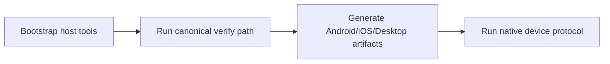
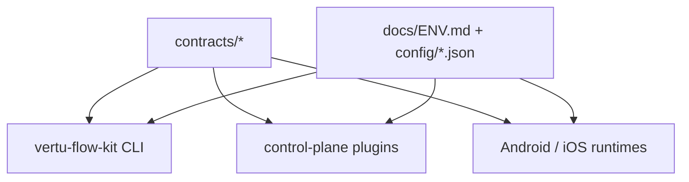

# Development Guide

[English](#english) · [中文](#中文)

Last updated: 2026-03-06

## English

This file is the developer runbook for local setup, verification, and platform prerequisites.
It does not duplicate service architecture or env catalogs. Those remain in:

- [docs/README.md](docs/README.md)
- [docs/SYSTEM_ARCHITECTURE_TRACE.md](docs/SYSTEM_ARCHITECTURE_TRACE.md)
- [docs/FLOW_REFERENCE.md](docs/FLOW_REFERENCE.md)
- [docs/ENV.md](docs/ENV.md)
- [docs/CAPABILITY_AUDIT.md](docs/CAPABILITY_AUDIT.md)
- [docs/DEVICE_AI_GAP_AUDIT.md](docs/DEVICE_AI_GAP_AUDIT.md)

## Local workflow



## Canonical commands

### Bootstrap

Use the repo bootstrap and doctor paths instead of ad-hoc setup:

```bash
./scripts/dev_doctor.sh
bun run --cwd tooling/vertu-flow-kit src/cli.ts bootstrap
```

The typed Bun CLI owns bootstrap; the shell wrapper is convenience only:

```bash
./scripts/dev_bootstrap.sh
```

### Verify

The typed Bun CLI is the single owner for repo-wide verification:

```bash
bun run --cwd tooling/vertu-flow-kit src/cli.ts verify all
```

`verify all` now fails when the control-plane database contains plaintext provider credentials, unreadable encrypted credentials, or encrypted credentials without a valid `VERTU_ENCRYPTION_KEY`.

Wrapper:

```bash
./scripts/verify_all.sh
```

### Audit provider credential integrity

```bash
bun run --cwd tooling/vertu-flow-kit src/cli.ts audit provider-credentials
```

### Build application artifacts

```bash
bun run --cwd tooling/vertu-flow-kit src/cli.ts build matrix
```

Wrapper:

```bash
./scripts/run_app_build_matrix.sh
```

The canonical matrix now emits Android, iOS, and desktop results from one typed report.

### Download the pinned device-AI model

```bash
bun run --cwd tooling/vertu-flow-kit src/cli.ts device-ai download-model
```

Wrapper:

```bash
./scripts/download_device_ai_model.sh
```

### Run the native device protocol

```bash
bun run --cwd tooling/vertu-flow-kit src/cli.ts device-ai run-protocol
```

Direct wrapper:

```bash
./scripts/run_device_ai_protocol.sh
```

Or as part of full verification:

```bash
VERTU_VERIFY_DEVICE_AI_PROTOCOL=1 \
  bun run --cwd tooling/vertu-flow-kit src/cli.ts verify all
```

The full Android+iOS device gate requires a macOS host with simulator/device targets available.
When `VERTU_VERIFY_DEVICE_AI_PROTOCOL=1` is set, the verifier now fails fast before the long pipeline if required host prerequisites are missing, including:

- `HF_TOKEN` or `HUGGINGFACE_HUB_TOKEN`
- `adb` for the Android protocol (resolved from `PATH` or Android SDK roots such as `ANDROID_SDK_ROOT/platform-tools/adb`)
- `xcrun` and `xcrun simctl` on macOS for the iOS protocol

The native device protocol now installs the latest canonical Android/iOS build artifacts from `.artifacts/app-builds/latest.json` before launching the native runners, so preinstalling the generated apps is no longer the expected workflow.

## Platform requirements

### Bun / TypeScript

- Bun `1.3.*`
- strict TypeScript

### Android

- Java 21
- Android SDK with:
  - `platform-tools`
  - `platforms;android-35`
  - `build-tools;35.0.0`

The repo scripts already resolve Java 21 and Android SDK through:

- [shared/host-tooling.ts](shared/host-tooling.ts)

`vertu-flow build android` is now the canonical Android build owner. It includes one automatic recovery retry for known Kotlin/KAPT incremental cache corruption signatures and clears Kotlin build caches before retrying; `scripts/run_android_build.sh` is a thin wrapper over that typed command.
`vertu-flow build ios` is now the canonical iOS build owner. It resolves Xcode toolchains, validates shared schemes and destinations, builds the host app or SwiftPM package, packages the artifact as ZIP, and emits typed artifact metadata; `scripts/run_ios_build.sh` is a thin wrapper over that typed command.

### iOS

- macOS host
- Xcode installed
- required iOS simulator/device runtimes installed

Native iOS app packaging cannot be completed on Linux or Windows. Those hosts can still run the shared verification subset and Android paths.

## Hugging Face OAuth and model access

Android OAuth setup uses a Hugging Face developer app.

1. Create an OAuth app in [Hugging Face settings](https://huggingface.co/settings/applications).
2. Set redirect URL to `comvertuedge://callback` unless your local branding overrides it.
3. Put the client ID in `Android/src/vertu.local.properties`:
   - `VERTU_HF_CLIENT_ID=...`
4. Ensure the redirect values match:
   - `VERTU_HF_REDIRECT_URI=comvertuedge://callback`
   - `VERTU_HF_REDIRECT_SCHEME=comvertuedge`

For gated or rate-limited model downloads, set one of:

- `HF_TOKEN`
- `HUGGINGFACE_HUB_TOKEN`

## Platform-specific entrypoints

### Android

```bash
cd Android/src
./gradlew :app:assembleDebug
./gradlew :app:installDebug
./gradlew :app:testDebugUnitTest
```

### iOS

```bash
cd iOS/VertuEdge
swift test
ruby ../../scripts/generate_ios_host_project.rb
open VertuEdge.xcworkspace
```

The generated `VertuEdgeHost` app is the runnable shell. XCTest-backed automation remains isolated in `VertuEdgeDriverXCTest`.

## Contracts and single sources of truth



Treat these as the canonical sources of truth:

- contracts:
  - [contracts/flow-contracts.ts](contracts/flow-contracts.ts)
  - [contracts/device-ai-protocol.ts](contracts/device-ai-protocol.ts)
- control-plane route schemas:
  - [control-plane/src/contracts/http.ts](control-plane/src/contracts/http.ts)
- runtime config:
  - [control-plane/src/config.ts](control-plane/src/config.ts)
  - [control-plane/src/config/env.ts](control-plane/src/config/env.ts)
  - [control-plane/src/config/device-ai-profile.ts](control-plane/src/config/device-ai-profile.ts)
  - [control-plane/config/device-ai-profile.json](control-plane/config/device-ai-profile.json)

## Documentation usage rules

- Update architecture ownership in [docs/SYSTEM_ARCHITECTURE_TRACE.md](docs/SYSTEM_ARCHITECTURE_TRACE.md) when modules move.
- Update route/capability coverage in [docs/CAPABILITY_AUDIT.md](docs/CAPABILITY_AUDIT.md) when behavior changes.
- Update API and flow behavior in [docs/FLOW_REFERENCE.md](docs/FLOW_REFERENCE.md).
- Update environment variables in [docs/ENV.md](docs/ENV.md).
- Update device-runtime gaps in [docs/DEVICE_AI_GAP_AUDIT.md](docs/DEVICE_AI_GAP_AUDIT.md).

## Documentation verification tools

- Use Context7 for framework/runtime documentation before changing architecture.
- Use DaisyUI Blueprint before changing control-plane component structure or interaction patterns.

## Minimum local acceptance bar

Before handing off work, run:

```bash
bun run typecheck
bun run lint
bun run test
bun run audit:code-practices
bun run audit:capability-gaps
```

If the task touches build/distribution paths, also run:

```bash
bun run --cwd tooling/vertu-flow-kit src/cli.ts verify all
```

---

## 中文

本文件为本地环境、验证与平台依赖的开发者操作手册。

### 规范命令

```bash
./scripts/dev_doctor.sh
bun run --cwd tooling/vertu-flow-kit src/cli.ts bootstrap
bun run --cwd tooling/vertu-flow-kit src/cli.ts verify all
bun run --cwd tooling/vertu-flow-kit src/cli.ts build matrix
bun run --cwd tooling/vertu-flow-kit src/cli.ts device-ai download-model
```

### 平台要求

- **Bun/TypeScript**: Bun 1.3.*，严格 TypeScript
- **Android**: Java 21，Android SDK（platform-tools、android-35、build-tools 35.0.0）
- **iOS**: macOS、Xcode、iOS 模拟器/设备运行时

### 文档入口

- 文档索引：[docs/README.md](docs/README.md)
- 架构追踪：[docs/SYSTEM_ARCHITECTURE_TRACE.md](docs/SYSTEM_ARCHITECTURE_TRACE.md)
- 流程参考：[docs/FLOW_REFERENCE.md](docs/FLOW_REFERENCE.md)
- 环境变量：[docs/ENV.md](docs/ENV.md)
- 能力审计：[docs/CAPABILITY_AUDIT.md](docs/CAPABILITY_AUDIT.md)
- Device AI 缺口：[docs/DEVICE_AI_GAP_AUDIT.md](docs/DEVICE_AI_GAP_AUDIT.md)

### 最低验收标准

提交前运行：

```bash
bun run typecheck
bun run lint
bun run test
bun run audit:code-practices
bun run audit:capability-gaps
```
