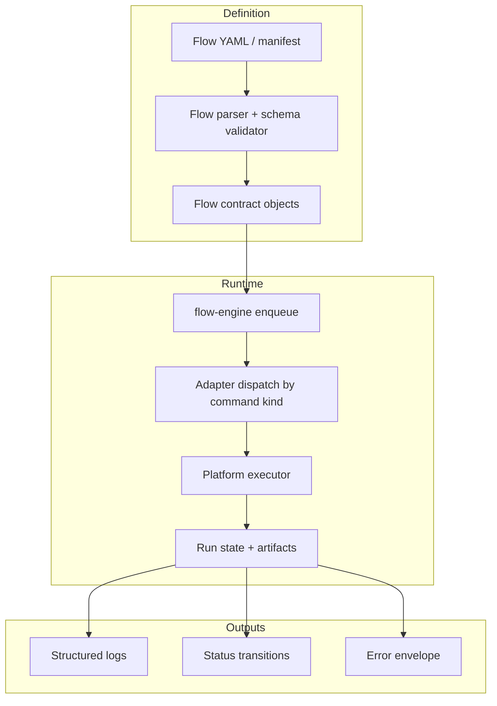
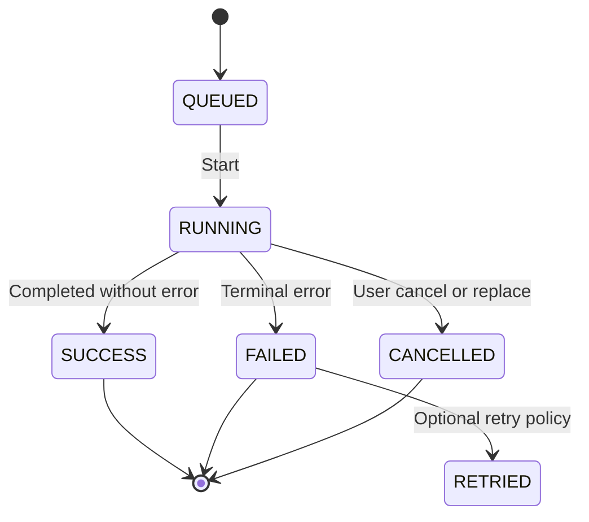
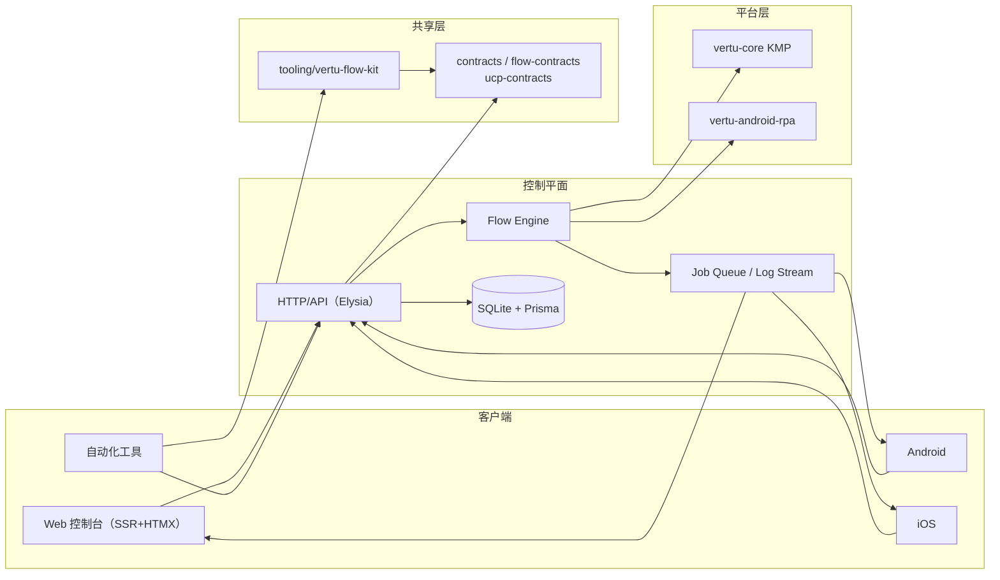
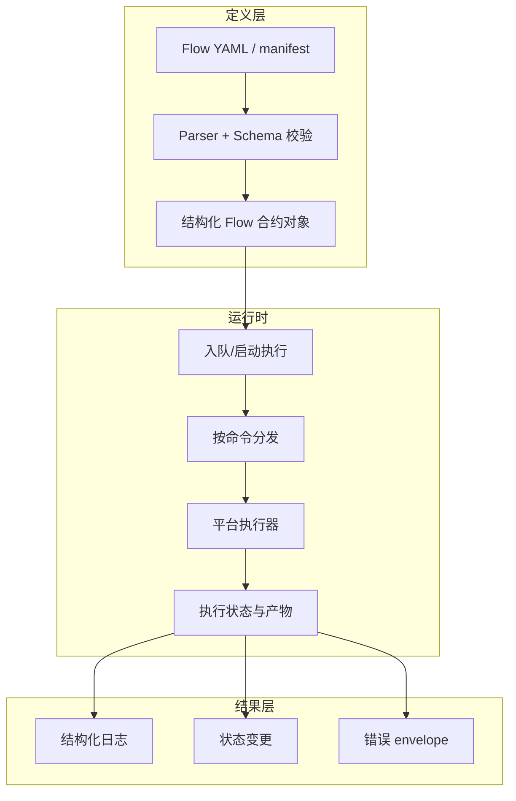
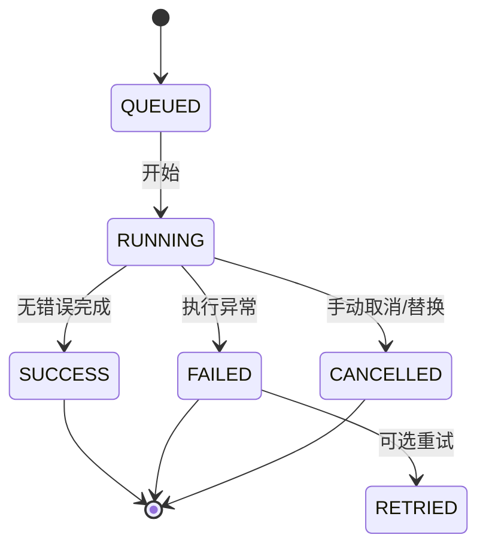

# Vertu Edge

[English](#english) · [中文](#中文)

## English

Vertu Edge is a full-stack, contract-first platform for **AI flow orchestration, model lifecycle operations, and cross-platform control/automation clients**.  
The repository brings together:

- A Bun + Elysia control-plane with SSR pages (`htmx`, `daisyUI`) and model/flow APIs.
- Shared TypeScript contracts for API and execution schema consistency.
- Kotlin/Swift native clients and a KMP core for Android/iOS integration.
- Kotlin-based Android RPA utilities and client-side tooling for validating or compiling flow manifests.

## Repository map

| Path | Purpose |
|---|---|
| `control-plane/` | Main backend service: APIs, UI rendering, flow execution engine, model pull/build job handling, logging stream, persistence. |
| `contracts/` | Shared contracts used by control-plane, tooling, and native clients (flow + UCP contracts). |
| `tooling/vertu-flow-kit/` | CLI for flow validation/compilation and manifest checks. |
| `vertu-core/` | Kotlin Multiplatform source for flow contract/parsing/domain utilities shared by Android/iOS. |
| `Android/` | Native Android app and Android-specific integration points. |
| `iOS/VertuEdge/` | Swift package surface for iOS usage (core + driver/client wrapper). |
| `vertu-android-rpa/` | Android RPA module (UiAutomator + manifest integration). |
| `docs/` | Setup, architecture references, capability audits, flow references, environment matrix docs. |

## Technology profile

- Runtime: `Bun` (`1.3.*` pinned in repository expectations).
- Language: `TypeScript` in strict mode for backend/tooling.
- Frontend: `HTMX` with server-side rendering.
- Styles/ui: `Tailwind CSS 4.x` + `daisyUI 5.x`.
- Backend/API: `Elysia`.
- Persistence: `Prisma`/SQLite-backed DB in control-plane.
- Native: Kotlin Multiplatform + Swift packages.

## Control-plane

The `control-plane` service is the main operational brain:

- Parses and serves flow definitions.
- Exposes REST-ish API endpoints for:
  - flow CRUD and execution control
  - model operations (pull/build/status)
  - UCP discovery and registry-like metadata
  - job logs and status streaming
  - health checks and diagnostics
- Implements an execution engine (`flow-engine.ts`) that resolves command handlers through adapter abstraction.
- Renders server pages and handles HTMX partial interactions by default (SSR-first).
- Uses a typed `error envelope` for deterministic failures and typed responses.

### File anchors in control-plane

- `control-plane/src/app.ts` — app composition, API routes, page routes, SSE-like log streaming helpers.
- `control-plane/src/config.ts` — environment and runtime defaults.
- `control-plane/src/contracts/http.ts` — HTTP contract/schema boundary definitions.
- `control-plane/src/flow-engine.ts` — flow command execution core.
- `control-plane/src/db.ts` — persistence definitions for async jobs/models/preferences.
- `control-plane/src/index.ts` — bootstrap.

## Shared contracts

Shared contracts are the source of truth for both backend and clients:

- `contracts/flow-contracts.ts`
- `contracts/ucp-contracts.ts`

They define:

- canonical request/response types,
- flow schema/command structure,
- shared metadata conventions used by drivers and clients.

Any API or runtime behavior changing these contracts should be propagated via both runtime and client implementations to avoid drift.

## Tooling (`vertu-flow-kit`)

`tooling/vertu-flow-kit` is a helper package that operationalizes flow contracts before runtime:

- `validate` — validate flow definitions.
- `compile` — preprocess/compile flows into runtime-ready structures.
- `validate-model-manifest` — schema checks for model metadata.
- `doctor` — environment/tooling sanity checks.

Use this CLI in CI and before publishing/consuming flow bundles.

## Cross-platform clients

### Android

The Android surface includes:

- `Android/src/app/src/main/java/com/google/ai/edge/gallery/data/ControlPlaneClient.kt` for control-plane API calls.
- model management and storage helpers (`HuggingFaceModelManager`, `Model`, worker-based download orchestration).
- app bootstrap + configuration in `GalleryApp`.

### KMP core

`vertu-core` holds shared Kotlin abstractions:

- flow contract models,
- parser utilities (`FlowYamlParser`),
- manifest/domain models (`ModelManifestV2`),
- execution state primitives shared across platforms.

### iOS

`iOS/VertuEdge` wraps control-plane and contract-facing APIs in Swift:

- `FlowV1` and execution-state types,
- `ControlPlaneClient` for request + envelope handling.

### Android RPA

`vertu-android-rpa` provides a dedicated UiAutomator driver layer with manifest integration for Android automation flows.

## Data path: flow execution

1. Author flow YAML / JSON-like flow input.
2. Parse via flow contract parser and schema validators.
3. Persist/submit execution request in control-plane.
4. The flow engine resolves each command into adapter-driven execution.
5. Command output and logs are returned as structured run records.
6. Clients poll or consume status and surface run progress.

## Operational architecture (Mermaid)

```mermaid
flowchart LR
  subgraph Clients["Clients"]
    A[Web Console (SSR+HTMX)]
    B[Android App]
    C[iOS App]
    D[Automation/External Tooling]
  end

  subgraph Edge["Control Plane"]
    E[HTTP/API Layer<br/>Elysia]
    F[Flow Engine]
    G[(SQLite + Prisma)]
    H[Job Queue + Log Stream]
  end

  subgraph Shared["Shared"]
    I["contracts/flow-contracts<br/>ucp-contracts"]
    J[tooling/vertu-flow-kit]
  end

  subgraph Platform["Platform"]
    K[vertu-core KMP]
    L[vertu-android-rpa]
  end

  A --> E
  B --> E
  C --> E
  D --> J
  D --> E
  E --> I
  J --> I
  E --> F
  F --> K
  F --> L
  E --> G
  F --> H
  H --> A
  H --> B
  H --> C
```

## Flow execution pipeline (Mermaid)



## Async job lifecycle (Mermaid)



## Configuration

- Environment and deploy options are documented in `docs/ENV.md`.
- Runtime docs reference capabilities and known limits in:
  - `docs/CAPABILITY_AUDIT.md`
  - `docs/FLOW_REFERENCE.md`
  - `docs/SYSTEM_ARCHITECTURE_TRACE.md`
- Control-plane-specific behavior and conventions are also tracked in `control-plane/README.md`.

## Operational conventions

- Contract-first and typed: avoid implicit JSON shapes.
- Error responses should follow the shared envelope pattern.
- Keep secrets out of clients; keep defaults centralized and env-driven.
- Prefer shared core logic (`contracts`, `vertu-core`) over duplicated platform branching.

## Contributing

- Run format/lint/type/build checks for touched areas before opening PRs.
- Keep API changes aligned with `contracts/*` and corresponding native clients.
- Add regression coverage for schema or execution changes (tooling, APIs, and at least one platform client integration path).

## 中文

Vertu Edge 是一个面向 **AI Flow 调度、模型生命周期管理、跨端控制与自动化客户端** 的全栈平台。  
仓库由以下核心部分组成：

- 使用 Bun + Elysia 的控制平面（后端），同时提供基于 SSR 的 Web 控制台（`htmx` + `daisyUI`）；
- 共享的 TypeScript 合约（Flow / UCP）保证服务端与客户端的接口一致；
- Android / iOS 原生与 KMP 共享模块的执行能力；
- Kotlin Android RPA 与命令行工具链，提供 flow 校验、编译和模型清单检查。

## 代码库结构

| 路径 | 作用 |
|---|---|
| `control-plane/` | 控制平面：API、模型与 flow 管理、作业状态、日志流、页面渲染。 |
| `contracts/` | 供服务端、工具、原生端共享的接口与模型定义。 |
| `tooling/vertu-flow-kit/` | 流程工具：`validate`、`compile`、`validate-model-manifest`、`doctor`。 |
| `vertu-core/` | Kotlin Multiplatform 公用代码（模型清单、Flow 解析、领域模型）。 |
| `Android/` | Android 端 App 与 API 客户端/模型管理。 |
| `iOS/VertuEdge/` | iOS 端 SDK 核心与控制平面客户端。 |
| `vertu-android-rpa/` | Android RPA / UiAutomator 执行层。 |
| `docs/` | 环境变量、流程能力、架构追踪与系统文档。 |

## 技术栈

- 运行时：`Bun 1.3.*`（仓库约定）
- 语言：`TypeScript`（严格模式）
- 前端：`HTMX` + SSR
- 样式：`Tailwind CSS 4.x` + `daisyUI 5.x`
- 后端：`Elysia`
- 持久化：`Prisma` + SQLite
- 原生：Kotlin Multiplatform、Swift

## 控制平面说明

`control-plane` 负责执行以下职责：

- Flow 的读取、校验与执行提交；
- 模型拉取/构建任务编排；
- 流程与模型相关的 API；
- UCP 相关信息发现/上报；
- 日志与作业状态上报（含流式输出）。

核心文件：

- `control-plane/src/app.ts`：路由、页面、流日志/错误处理入口；
- `control-plane/src/config.ts`：环境变量与运行时配置；
- `control-plane/src/contracts/http.ts`：HTTP 边界 schema；
- `control-plane/src/flow-engine.ts`：Flow 命令执行引擎；
- `control-plane/src/db.ts`：任务、模型、偏好等持久化模型；
- `control-plane/src/index.ts`：启动入口。

## 合约驱动

`contracts/flow-contracts.ts` 与 `contracts/ucp-contracts.ts` 是跨端约束层，定义：

- 流程结构与命令模型；
- API 入参出参；
- 共享元数据与校验约定。  

这使服务端/客户端在升级时更容易保持兼容。

## 流程执行路径

1. 编写或生成 flow 配置。
2. 合约 parser 与校验器进行结构化解析；
3. 控制平面接收并入队执行；
4. `flow-engine` 按命令类型分发到适配器；
5. 适配器与平台驱动执行具体动作；
6. 记录执行态、日志和错误并返回标准化结果。

## 架构关系图（Mermaid）



## 流程执行图（Mermaid）



## 异步任务状态机（Mermaid）



## 运行与配置入口

- 环境变量和运行配置：`docs/ENV.md`
- 能力和边界：`docs/CAPABILITY_AUDIT.md`、`docs/FLOW_REFERENCE.md`
- 系统行为追踪：`docs/SYSTEM_ARCHITECTURE_TRACE.md`
- 运行细节与服务说明：`control-plane/README.md`

## 开发与协作建议

- 修改接口先改契约，再改服务与客户端实现，避免漂移。
- 使用 `vertu-flow-kit` 做离线校验（CI 中建议强制执行）。
- 平台端实现尽量共享 `vertu-core` 与 `contracts`，减少重复逻辑。
- 错误统一走 envelope，避免不一致的临时返回结构。

## 许可

请以当前仓库中的许可证文件与组织规范为准。


## Current local codebase inventory (source workspace snapshot)

- Snapshot date: 2026-03-05
- Scope: repository files excluding generated artifacts and tool cache directories (`build`, `.gradle`, `.idea`, `node_modules`)
- Total files: 382

<details>
<summary>Expand complete source file list</summary>

```text
Android/README.md
Android/src/app/build.gradle.kts
Android/src/app/proguard-rules.pro
Android/src/app/src/main/AndroidManifest.xml
Android/src/app/src/main/assets/tinygarden/04B_03.ttf
Android/src/app/src/main/assets/tinygarden/atlas.png
Android/src/app/src/main/assets/tinygarden/blue_svg.svg
Android/src/app/src/main/assets/tinygarden/check_status.mp3
Android/src/app/src/main/assets/tinygarden/close.mp3
Android/src/app/src/main/assets/tinygarden/daisy.png
Android/src/app/src/main/assets/tinygarden/dirt.mp3
Android/src/app/src/main/assets/tinygarden/error.mp3
Android/src/app/src/main/assets/tinygarden/gallery.svg
Android/src/app/src/main/assets/tinygarden/gallery_with_border.svg
Android/src/app/src/main/assets/tinygarden/goal.mp3
Android/src/app/src/main/assets/tinygarden/goal_gallery.mp3
Android/src/app/src/main/assets/tinygarden/green_svg.svg
Android/src/app/src/main/assets/tinygarden/index.html
Android/src/app/src/main/assets/tinygarden/inventory.mp3
Android/src/app/src/main/assets/tinygarden/main-K5DSW5YL.js
Android/src/app/src/main/assets/tinygarden/media/04B_03-VT65MRZF.ttf
Android/src/app/src/main/assets/tinygarden/plop.mp3
Android/src/app/src/main/assets/tinygarden/plop2.mp3
Android/src/app/src/main/assets/tinygarden/plop3.mp3
Android/src/app/src/main/assets/tinygarden/red_svg.svg
Android/src/app/src/main/assets/tinygarden/rose.png
Android/src/app/src/main/assets/tinygarden/styles-63IRQW2E.css
Android/src/app/src/main/assets/tinygarden/watering.mp3
Android/src/app/src/main/assets/tinygarden/whip.mp3
Android/src/app/src/main/assets/tinygarden/yellow_svg.svg
Android/src/app/src/main/bundle_config.pb.json
Android/src/app/src/main/java/com/google/ai/edge/gallery/Analytics.kt
Android/src/app/src/main/java/com/google/ai/edge/gallery/BenchmarkResultsSerializer.kt
Android/src/app/src/main/java/com/google/ai/edge/gallery/CutoutsSerializer.kt
Android/src/app/src/main/java/com/google/ai/edge/gallery/GalleryApp.kt
Android/src/app/src/main/java/com/google/ai/edge/gallery/GalleryAppTopBar.kt
Android/src/app/src/main/java/com/google/ai/edge/gallery/GalleryApplication.kt
Android/src/app/src/main/java/com/google/ai/edge/gallery/GalleryLifecycleProvider.kt
Android/src/app/src/main/java/com/google/ai/edge/gallery/MainActivity.kt
Android/src/app/src/main/java/com/google/ai/edge/gallery/SettingsSerializer.kt
Android/src/app/src/main/java/com/google/ai/edge/gallery/UserDataSerializer.kt
Android/src/app/src/main/java/com/google/ai/edge/gallery/common/ProjectConfig.kt
Android/src/app/src/main/java/com/google/ai/edge/gallery/common/Types.kt
Android/src/app/src/main/java/com/google/ai/edge/gallery/common/Utils.kt
Android/src/app/src/main/java/com/google/ai/edge/gallery/common/VertuRuntimeConfig.kt
Android/src/app/src/main/java/com/google/ai/edge/gallery/customtasks/common/CustomTask.kt
Android/src/app/src/main/java/com/google/ai/edge/gallery/customtasks/common/CustomTaskData.kt
Android/src/app/src/main/java/com/google/ai/edge/gallery/customtasks/examplecustomtask/ExampleCustomTask.kt
Android/src/app/src/main/java/com/google/ai/edge/gallery/customtasks/examplecustomtask/ExampleCustomTaskModule.kt
Android/src/app/src/main/java/com/google/ai/edge/gallery/customtasks/examplecustomtask/ExampleCustomTaskScreen.kt
Android/src/app/src/main/java/com/google/ai/edge/gallery/customtasks/examplecustomtask/ExampleCustomTaskViewModel.kt
Android/src/app/src/main/java/com/google/ai/edge/gallery/customtasks/mobileactions/Actions.kt
Android/src/app/src/main/java/com/google/ai/edge/gallery/customtasks/mobileactions/MobileActionsModule.kt
Android/src/app/src/main/java/com/google/ai/edge/gallery/customtasks/mobileactions/MobileActionsScreen.kt
Android/src/app/src/main/java/com/google/ai/edge/gallery/customtasks/mobileactions/MobileActionsTask.kt
Android/src/app/src/main/java/com/google/ai/edge/gallery/customtasks/mobileactions/MobileActionsTools.kt
Android/src/app/src/main/java/com/google/ai/edge/gallery/customtasks/mobileactions/MobileActionsViewModel.kt
Android/src/app/src/main/java/com/google/ai/edge/gallery/customtasks/mobileactions/VertuRpaFallbackExecutor.kt
Android/src/app/src/main/java/com/google/ai/edge/gallery/customtasks/tinygarden/ConversationHistoryPanel.kt
Android/src/app/src/main/java/com/google/ai/edge/gallery/customtasks/tinygarden/TinyGardenScreen.kt
Android/src/app/src/main/java/com/google/ai/edge/gallery/customtasks/tinygarden/TinyGardenTask.kt
Android/src/app/src/main/java/com/google/ai/edge/gallery/customtasks/tinygarden/TinyGardenTaskModule.kt
Android/src/app/src/main/java/com/google/ai/edge/gallery/customtasks/tinygarden/TinyGardenTools.kt
Android/src/app/src/main/java/com/google/ai/edge/gallery/customtasks/tinygarden/TinyGardenViewModel.kt
Android/src/app/src/main/java/com/google/ai/edge/gallery/data/AppBarAction.kt
Android/src/app/src/main/java/com/google/ai/edge/gallery/data/Categories.kt
Android/src/app/src/main/java/com/google/ai/edge/gallery/data/Config.kt
Android/src/app/src/main/java/com/google/ai/edge/gallery/data/ConfigValue.kt
Android/src/app/src/main/java/com/google/ai/edge/gallery/data/Consts.kt
Android/src/app/src/main/java/com/google/ai/edge/gallery/data/ControlPlaneClient.kt
Android/src/app/src/main/java/com/google/ai/edge/gallery/data/DataStoreRepository.kt
Android/src/app/src/main/java/com/google/ai/edge/gallery/data/DownloadRepository.kt
Android/src/app/src/main/java/com/google/ai/edge/gallery/data/HuggingFaceModelManager.kt
Android/src/app/src/main/java/com/google/ai/edge/gallery/data/Model.kt
Android/src/app/src/main/java/com/google/ai/edge/gallery/data/ModelAllowlist.kt
Android/src/app/src/main/java/com/google/ai/edge/gallery/data/Tasks.kt
Android/src/app/src/main/java/com/google/ai/edge/gallery/data/Types.kt
Android/src/app/src/main/java/com/google/ai/edge/gallery/di/AppModule.kt
Android/src/app/src/main/java/com/google/ai/edge/gallery/ui/benchmark/BenchmarkModelPicker.kt
Android/src/app/src/main/java/com/google/ai/edge/gallery/ui/benchmark/BenchmarkResultsViewer.kt
Android/src/app/src/main/java/com/google/ai/edge/gallery/ui/benchmark/BenchmarkScreen.kt
Android/src/app/src/main/java/com/google/ai/edge/gallery/ui/benchmark/BenchmarkValueSeriesViewer.kt
Android/src/app/src/main/java/com/google/ai/edge/gallery/ui/benchmark/BenchmarkViewModel.kt
Android/src/app/src/main/java/com/google/ai/edge/gallery/ui/common/Accordions.kt
Android/src/app/src/main/java/com/google/ai/edge/gallery/ui/common/AudioAnimation.kt
Android/src/app/src/main/java/com/google/ai/edge/gallery/ui/common/ClickableLink.kt
Android/src/app/src/main/java/com/google/ai/edge/gallery/ui/common/ColorUtils.kt
Android/src/app/src/main/java/com/google/ai/edge/gallery/ui/common/ConfigDialog.kt
Android/src/app/src/main/java/com/google/ai/edge/gallery/ui/common/DownloadAndTryButton.kt
Android/src/app/src/main/java/com/google/ai/edge/gallery/ui/common/EmptyState.kt
Android/src/app/src/main/java/com/google/ai/edge/gallery/ui/common/ErrorDialog.kt
Android/src/app/src/main/java/com/google/ai/edge/gallery/ui/common/GlitteringShapesLoader.kt
Android/src/app/src/main/java/com/google/ai/edge/gallery/ui/common/LiveCameraView.kt
Android/src/app/src/main/java/com/google/ai/edge/gallery/ui/common/MarkdownText.kt
Android/src/app/src/main/java/com/google/ai/edge/gallery/ui/common/MemoryWarning.kt
Android/src/app/src/main/java/com/google/ai/edge/gallery/ui/common/ModelPageAppBar.kt
Android/src/app/src/main/java/com/google/ai/edge/gallery/ui/common/ModelPicker.kt
Android/src/app/src/main/java/com/google/ai/edge/gallery/ui/common/ModelPickerChip.kt
Android/src/app/src/main/java/com/google/ai/edge/gallery/ui/common/RotationalLoader.kt
Android/src/app/src/main/java/com/google/ai/edge/gallery/ui/common/TaskIcon.kt
Android/src/app/src/main/java/com/google/ai/edge/gallery/ui/common/Utils.kt
Android/src/app/src/main/java/com/google/ai/edge/gallery/ui/common/chat/AudioPlaybackPanel.kt
Android/src/app/src/main/java/com/google/ai/edge/gallery/ui/common/chat/AudioRecorderPanel.kt
Android/src/app/src/main/java/com/google/ai/edge/gallery/ui/common/chat/BenchmarkConfigDialog.kt
Android/src/app/src/main/java/com/google/ai/edge/gallery/ui/common/chat/ChatMessage.kt
Android/src/app/src/main/java/com/google/ai/edge/gallery/ui/common/chat/ChatPanel.kt
Android/src/app/src/main/java/com/google/ai/edge/gallery/ui/common/chat/ChatView.kt
Android/src/app/src/main/java/com/google/ai/edge/gallery/ui/common/chat/ChatViewModel.kt
Android/src/app/src/main/java/com/google/ai/edge/gallery/ui/common/chat/DataCard.kt
Android/src/app/src/main/java/com/google/ai/edge/gallery/ui/common/chat/MessageActionButton.kt
Android/src/app/src/main/java/com/google/ai/edge/gallery/ui/common/chat/MessageBodyAudioClip.kt
Android/src/app/src/main/java/com/google/ai/edge/gallery/ui/common/chat/MessageBodyBenchmark.kt
Android/src/app/src/main/java/com/google/ai/edge/gallery/ui/common/chat/MessageBodyBenchmarkLlm.kt
Android/src/app/src/main/java/com/google/ai/edge/gallery/ui/common/chat/MessageBodyClassification.kt
Android/src/app/src/main/java/com/google/ai/edge/gallery/ui/common/chat/MessageBodyConfigUpdate.kt
Android/src/app/src/main/java/com/google/ai/edge/gallery/ui/common/chat/MessageBodyError.kt
Android/src/app/src/main/java/com/google/ai/edge/gallery/ui/common/chat/MessageBodyImage.kt
Android/src/app/src/main/java/com/google/ai/edge/gallery/ui/common/chat/MessageBodyImageWithHistory.kt
Android/src/app/src/main/java/com/google/ai/edge/gallery/ui/common/chat/MessageBodyInfo.kt
Android/src/app/src/main/java/com/google/ai/edge/gallery/ui/common/chat/MessageBodyLoading.kt
Android/src/app/src/main/java/com/google/ai/edge/gallery/ui/common/chat/MessageBodyPromptTemplates.kt
Android/src/app/src/main/java/com/google/ai/edge/gallery/ui/common/chat/MessageBodyText.kt
Android/src/app/src/main/java/com/google/ai/edge/gallery/ui/common/chat/MessageBodyWarning.kt
Android/src/app/src/main/java/com/google/ai/edge/gallery/ui/common/chat/MessageBubbleShape.kt
Android/src/app/src/main/java/com/google/ai/edge/gallery/ui/common/chat/MessageInputText.kt
Android/src/app/src/main/java/com/google/ai/edge/gallery/ui/common/chat/MessageLatency.kt
Android/src/app/src/main/java/com/google/ai/edge/gallery/ui/common/chat/MessageSender.kt
Android/src/app/src/main/java/com/google/ai/edge/gallery/ui/common/chat/ModelDownloadStatusInfoPanel.kt
Android/src/app/src/main/java/com/google/ai/edge/gallery/ui/common/chat/ModelDownloadingAnimation.kt
Android/src/app/src/main/java/com/google/ai/edge/gallery/ui/common/chat/ModelInitializationStatus.kt
Android/src/app/src/main/java/com/google/ai/edge/gallery/ui/common/chat/ModelNotDownloaded.kt
Android/src/app/src/main/java/com/google/ai/edge/gallery/ui/common/chat/ModelSelector.kt
Android/src/app/src/main/java/com/google/ai/edge/gallery/ui/common/chat/TextInputHistorySheet.kt
Android/src/app/src/main/java/com/google/ai/edge/gallery/ui/common/chat/ZoomableImage.kt
Android/src/app/src/main/java/com/google/ai/edge/gallery/ui/common/modelitem/ConfirmDeleteModelDialog.kt
Android/src/app/src/main/java/com/google/ai/edge/gallery/ui/common/modelitem/DeleteModelButton.kt
Android/src/app/src/main/java/com/google/ai/edge/gallery/ui/common/modelitem/DownloadModelPanel.kt
Android/src/app/src/main/java/com/google/ai/edge/gallery/ui/common/modelitem/ModelItem.kt
Android/src/app/src/main/java/com/google/ai/edge/gallery/ui/common/modelitem/ModelNameAndStatus.kt
Android/src/app/src/main/java/com/google/ai/edge/gallery/ui/common/modelitem/StatusIcon.kt
Android/src/app/src/main/java/com/google/ai/edge/gallery/ui/common/textandvoiceinput/HoldToDictate.kt
Android/src/app/src/main/java/com/google/ai/edge/gallery/ui/common/textandvoiceinput/HoldToDictateViewModel.kt
Android/src/app/src/main/java/com/google/ai/edge/gallery/ui/common/textandvoiceinput/TextAndVoiceInput.kt
Android/src/app/src/main/java/com/google/ai/edge/gallery/ui/common/textandvoiceinput/VoiceRecognizerOverlay.kt
Android/src/app/src/main/java/com/google/ai/edge/gallery/ui/common/tos/AppTosDialog.kt
Android/src/app/src/main/java/com/google/ai/edge/gallery/ui/common/tos/GemmaTermsOfUseDialog.kt
Android/src/app/src/main/java/com/google/ai/edge/gallery/ui/common/tos/TosViewModel.kt
Android/src/app/src/main/java/com/google/ai/edge/gallery/ui/home/HomeScreen.kt
Android/src/app/src/main/java/com/google/ai/edge/gallery/ui/home/MobileActionsChallengeDialog.kt
Android/src/app/src/main/java/com/google/ai/edge/gallery/ui/home/NewReleaseNotification.kt
Android/src/app/src/main/java/com/google/ai/edge/gallery/ui/home/SettingsDialog.kt
Android/src/app/src/main/java/com/google/ai/edge/gallery/ui/home/SquareDrawerItem.kt
Android/src/app/src/main/java/com/google/ai/edge/gallery/ui/icon/Deploy.kt
Android/src/app/src/main/java/com/google/ai/edge/gallery/ui/llmchat/LlmChatModelHelper.kt
Android/src/app/src/main/java/com/google/ai/edge/gallery/ui/llmchat/LlmChatScreen.kt
Android/src/app/src/main/java/com/google/ai/edge/gallery/ui/llmchat/LlmChatTaskModule.kt
Android/src/app/src/main/java/com/google/ai/edge/gallery/ui/llmchat/LlmChatViewModel.kt
Android/src/app/src/main/java/com/google/ai/edge/gallery/ui/llmsingleturn/LlmSingleTurnScreen.kt
Android/src/app/src/main/java/com/google/ai/edge/gallery/ui/llmsingleturn/LlmSingleTurnTaskModule.kt
Android/src/app/src/main/java/com/google/ai/edge/gallery/ui/llmsingleturn/LlmSingleTurnViewModel.kt
Android/src/app/src/main/java/com/google/ai/edge/gallery/ui/llmsingleturn/PromptTemplateConfigs.kt
Android/src/app/src/main/java/com/google/ai/edge/gallery/ui/llmsingleturn/PromptTemplatesPanel.kt
Android/src/app/src/main/java/com/google/ai/edge/gallery/ui/llmsingleturn/ResponsePanel.kt
Android/src/app/src/main/java/com/google/ai/edge/gallery/ui/llmsingleturn/SingleSelectButton.kt
Android/src/app/src/main/java/com/google/ai/edge/gallery/ui/llmsingleturn/VerticalSplitView.kt
Android/src/app/src/main/java/com/google/ai/edge/gallery/ui/modelmanager/GlobalModelManager.kt
Android/src/app/src/main/java/com/google/ai/edge/gallery/ui/modelmanager/ModelImportDialog.kt
Android/src/app/src/main/java/com/google/ai/edge/gallery/ui/modelmanager/ModelList.kt
Android/src/app/src/main/java/com/google/ai/edge/gallery/ui/modelmanager/ModelManager.kt
Android/src/app/src/main/java/com/google/ai/edge/gallery/ui/modelmanager/ModelManagerViewModel.kt
Android/src/app/src/main/java/com/google/ai/edge/gallery/ui/navigation/GalleryNavGraph.kt
Android/src/app/src/main/java/com/google/ai/edge/gallery/ui/theme/Color.kt
Android/src/app/src/main/java/com/google/ai/edge/gallery/ui/theme/Theme.kt
Android/src/app/src/main/java/com/google/ai/edge/gallery/ui/theme/ThemeSettings.kt
Android/src/app/src/main/java/com/google/ai/edge/gallery/ui/theme/Type.kt
Android/src/app/src/main/java/com/google/ai/edge/gallery/worker/AndroidManifest.xml
Android/src/app/src/main/java/com/google/ai/edge/gallery/worker/DownloadWorker.kt
Android/src/app/src/main/proto/benchmark.proto
Android/src/app/src/main/proto/settings.proto
Android/src/app/src/main/res/drawable/chat_spark.xml
Android/src/app/src/main/res/drawable/circle.xml
Android/src/app/src/main/res/drawable/double_circle.xml
Android/src/app/src/main/res/drawable/four_circle.xml
Android/src/app/src/main/res/drawable/ic_experiment.xml
Android/src/app/src/main/res/drawable/ic_launcher_background.xml
Android/src/app/src/main/res/drawable/ic_launcher_foreground.xml
Android/src/app/src/main/res/drawable/image_spark.xml
Android/src/app/src/main/res/drawable/logo.xml
Android/src/app/src/main/res/drawable/pantegon.xml
Android/src/app/src/main/res/drawable/splash_screen_animated_icon.xml
Android/src/app/src/main/res/drawable/text_spark.xml
Android/src/app/src/main/res/font/nunito_black.ttf
Android/src/app/src/main/res/font/nunito_bold.ttf
Android/src/app/src/main/res/font/nunito_extrabold.ttf
Android/src/app/src/main/res/font/nunito_extralight.ttf
Android/src/app/src/main/res/font/nunito_light.ttf
Android/src/app/src/main/res/font/nunito_medium.ttf
Android/src/app/src/main/res/font/nunito_regular.ttf
Android/src/app/src/main/res/font/nunito_semibold.ttf
Android/src/app/src/main/res/mipmap-anydpi-v26/ic_launcher.xml
Android/src/app/src/main/res/mipmap-hdpi/ic_launcher.png
Android/src/app/src/main/res/mipmap-hdpi/ic_launcher_background.png
Android/src/app/src/main/res/mipmap-hdpi/ic_launcher_foreground.png
Android/src/app/src/main/res/mipmap-hdpi/ic_launcher_monochrome.png
Android/src/app/src/main/res/mipmap-mdpi/ic_launcher.png
Android/src/app/src/main/res/mipmap-mdpi/ic_launcher_background.png
Android/src/app/src/main/res/mipmap-mdpi/ic_launcher_foreground.png
Android/src/app/src/main/res/mipmap-mdpi/ic_launcher_monochrome.png
Android/src/app/src/main/res/mipmap-xhdpi/ic_launcher.png
Android/src/app/src/main/res/mipmap-xhdpi/ic_launcher_background.png
Android/src/app/src/main/res/mipmap-xhdpi/ic_launcher_foreground.png
Android/src/app/src/main/res/mipmap-xhdpi/ic_launcher_monochrome.png
Android/src/app/src/main/res/mipmap-xxhdpi/ic_launcher.png
Android/src/app/src/main/res/mipmap-xxhdpi/ic_launcher_background.png
Android/src/app/src/main/res/mipmap-xxhdpi/ic_launcher_foreground.png
Android/src/app/src/main/res/mipmap-xxhdpi/ic_launcher_monochrome.png
Android/src/app/src/main/res/mipmap-xxxhdpi/ic_launcher.png
Android/src/app/src/main/res/mipmap-xxxhdpi/ic_launcher_background.png
Android/src/app/src/main/res/mipmap-xxxhdpi/ic_launcher_foreground.png
Android/src/app/src/main/res/mipmap-xxxhdpi/ic_launcher_monochrome.png
Android/src/app/src/main/res/values-es/strings.xml
Android/src/app/src/main/res/values-fr/strings.xml
Android/src/app/src/main/res/values-night/themes.xml
Android/src/app/src/main/res/values/dimens.xml
Android/src/app/src/main/res/values/ic_launcher_background.xml
Android/src/app/src/main/res/values/strings.xml
Android/src/app/src/main/res/values/themes.xml
Android/src/app/src/main/res/xml/backup_rules.xml
Android/src/app/src/main/res/xml/data_extraction_rules.xml
Android/src/app/src/main/res/xml/file_paths.xml
Android/src/build.gradle.kts
Android/src/gradle.properties
Android/src/gradle/libs.versions.toml
Android/src/gradle/wrapper/gradle-wrapper.jar
Android/src/gradle/wrapper/gradle-wrapper.properties
Android/src/gradlew
Android/src/gradlew.bat
Android/src/settings.gradle.kts
Android/src/vertu.local.properties
Android/src/vertu.local.properties.example
CONTRIBUTING.md
DEVELOPMENT.md
LICENSE
README.md
contracts/fixtures/contact-flow.yaml
contracts/flow-contracts.ts
contracts/flow-parser.ts
contracts/flow-v1.schema.json
contracts/model-manifest-v2.schema.json
contracts/ucp-contracts.ts
control-plane/CLAUDE.md
control-plane/README.md
control-plane/bun.lock
control-plane/config/model-pull-presets.json
control-plane/config/model-sources.json
control-plane/config/providers.json
control-plane/debug-dcda6d.log
control-plane/eslint.config.mjs
control-plane/fs-check.ts
control-plane/index.ts
control-plane/package.json
control-plane/path-check.ts
control-plane/public/brand-overrides.css
control-plane/public/control-plane.js
control-plane/public/daisyui.css
control-plane/public/htmx-ext-sse.min.js
control-plane/public/htmx.min.js
control-plane/public/tailwindcss-browser.js
control-plane/src/ai-keys.ts
control-plane/src/ai-providers.ts
control-plane/src/app-builds.ts
control-plane/src/app.ts
control-plane/src/artifact-metadata.ts
control-plane/src/cards/index.ts
control-plane/src/config.ts
control-plane/src/config/constants.ts
control-plane/src/config/index.ts
control-plane/src/contracts/commands.ts
control-plane/src/contracts/http.ts
control-plane/src/db.ts
control-plane/src/errors.ts
control-plane/src/flow-engine.ts
control-plane/src/flow-runs.ts
control-plane/src/flow-target-parser.ts
control-plane/src/hf-search.ts
control-plane/src/htmx-helpers.ts
control-plane/src/i18n.ts
control-plane/src/icons.ts
control-plane/src/index.ts
control-plane/src/layout.ts
control-plane/src/locales/en.json
control-plane/src/locales/es.json
control-plane/src/locales/fr.json
control-plane/src/locales/zh.json
control-plane/src/logger.ts
control-plane/src/model-jobs.ts
control-plane/src/model-manager.ts
control-plane/src/pages.ts
control-plane/src/renderers/index.ts
control-plane/src/runtime-constants.ts
control-plane/src/ucp-discovery.ts
control-plane/src/yaml-parser.ts
control-plane/test/ai-providers-huggingface.test.ts
control-plane/test/artifact-metadata.test.ts
control-plane/test/contracts.test.ts
control-plane/test/flow-capabilities.test.ts
control-plane/test/http-model-build-routes.test.ts
control-plane/test/i18n-locales.test.ts
control-plane/test/model-build-jobs.test.ts
control-plane/test/ucp-discovery.test.ts
control-plane/test/ui-state-model-build.test.ts
control-plane/tsconfig.json
control-plane/vertu.sqlite
docs/CAPABILITY_AUDIT.md
docs/ENV.md
docs/FLOW_REFERENCE.md
docs/SYSTEM_ARCHITECTURE_TRACE.md
iOS/VertuEdge/Package.swift
iOS/VertuEdge/README.md
iOS/VertuEdge/Sources/VertuEdgeCore/ControlPlaneRuntimeConfig.swift
iOS/VertuEdge/Sources/VertuEdgeCore/DriverExecutionConfig.swift
iOS/VertuEdge/Sources/VertuEdgeCore/FlowSafetyPolicy.swift
iOS/VertuEdge/Sources/VertuEdgeCore/FlowV1.swift
iOS/VertuEdge/Sources/VertuEdgeCore/FlowYamlParser.swift
iOS/VertuEdge/Sources/VertuEdgeDriver/ControlPlaneClient.swift
iOS/VertuEdge/Sources/VertuEdgeDriver/DriverAdapter.swift
iOS/VertuEdge/Sources/VertuEdgeDriver/IosXcTestDriver.swift
iOS/VertuEdge/Sources/VertuEdgeUI/FlowRunnerView.swift
iOS/VertuEdge/Sources/VertuEdgeUI/Resources/en.lproj/Localizable.strings
iOS/VertuEdge/Tests/VertuEdgeDriverTests/FlowSafetyPolicyTests.swift
iOS/VertuEdge/Tests/VertuEdgeDriverTests/FlowV1CodableTests.swift
iOS/VertuEdge/Tests/VertuEdgeDriverTests/FlowYamlParserTests.swift
iOS/VertuEdge/VertuEdge.xcworkspace/contents.xcworkspacedata
model_allowlist.json
model_allowlists/1_0_10.json
model_allowlists/1_0_4.json
model_allowlists/1_0_5.json
model_allowlists/1_0_6.json
model_allowlists/1_0_7.json
model_allowlists/1_0_8.json
model_allowlists/1_0_9.json
model_allowlists/ios_1_0_0.json
package.json
scripts/check-capability-gaps.ts
scripts/check-code-practices.ts
scripts/check-version-freshness.ts
scripts/control_plane_url.sh
scripts/dev_bootstrap.sh
scripts/dev_doctor.sh
scripts/lib/android_sdk.sh
scripts/lib/java21.sh
scripts/live_test_gate.sh
scripts/run_all.sh
scripts/run_android_build.sh
scripts/run_control_plane.sh
scripts/run_ios_build.sh
scripts/setup_hf_models.sh
scripts/vendor_control_plane_assets.sh
scripts/verify_all.sh
tooling/vertu-flow-kit/README.md
tooling/vertu-flow-kit/bun.lock
tooling/vertu-flow-kit/eslint.config.mjs
tooling/vertu-flow-kit/package.json
tooling/vertu-flow-kit/src/cli.ts
tooling/vertu-flow-kit/src/commands.ts
tooling/vertu-flow-kit/src/normalize.ts
tooling/vertu-flow-kit/src/schema.ts
tooling/vertu-flow-kit/src/types.ts
tooling/vertu-flow-kit/test/flow-cli.test.ts
tooling/vertu-flow-kit/tsconfig.json
vertu-android-rpa/build.gradle.kts
vertu-android-rpa/src/main/AndroidManifest.xml
vertu-android-rpa/src/main/kotlin/com/vertu/edge/rpa/android/AndroidUiAutomatorDriver.kt
vertu-android-rpa/src/test/kotlin/com/vertu/edge/rpa/android/SelectorPriorityResolverTest.kt
vertu-core/build.gradle.kts
vertu-core/src/commonMain/kotlin/com/vertu/edge/core/driver/DriverAdapter.kt
vertu-core/src/commonMain/kotlin/com/vertu/edge/core/error/ExecutionEnvelope.kt
vertu-core/src/commonMain/kotlin/com/vertu/edge/core/flow/FlowContract.kt
vertu-core/src/commonMain/kotlin/com/vertu/edge/core/flow/FlowYamlParser.kt
vertu-core/src/commonMain/kotlin/com/vertu/edge/core/model/ModelManifestV2.kt
vertu-core/src/commonTest/kotlin/com/vertu/edge/core/FlowYamlParserTest.kt
vertu-core/src/commonTest/kotlin/com/vertu/edge/core/ModelManifestV2Test.kt
```
</details>

## 当前本地代码库清单（源码工作区快照）

- 快照时间：2026-03-05
- 范围：排除生成物和工具缓存目录（`build`、`.gradle`、`.idea`、`node_modules`）后的仓库文件
- 文件总数：382

<details>
<summary>展开完整源码文件列表</summary>

```text
Android/README.md
Android/src/app/build.gradle.kts
Android/src/app/proguard-rules.pro
Android/src/app/src/main/AndroidManifest.xml
Android/src/app/src/main/assets/tinygarden/04B_03.ttf
Android/src/app/src/main/assets/tinygarden/atlas.png
Android/src/app/src/main/assets/tinygarden/blue_svg.svg
Android/src/app/src/main/assets/tinygarden/check_status.mp3
Android/src/app/src/main/assets/tinygarden/close.mp3
Android/src/app/src/main/assets/tinygarden/daisy.png
Android/src/app/src/main/assets/tinygarden/dirt.mp3
Android/src/app/src/main/assets/tinygarden/error.mp3
Android/src/app/src/main/assets/tinygarden/gallery.svg
Android/src/app/src/main/assets/tinygarden/gallery_with_border.svg
Android/src/app/src/main/assets/tinygarden/goal.mp3
Android/src/app/src/main/assets/tinygarden/goal_gallery.mp3
Android/src/app/src/main/assets/tinygarden/green_svg.svg
Android/src/app/src/main/assets/tinygarden/index.html
Android/src/app/src/main/assets/tinygarden/inventory.mp3
Android/src/app/src/main/assets/tinygarden/main-K5DSW5YL.js
Android/src/app/src/main/assets/tinygarden/media/04B_03-VT65MRZF.ttf
Android/src/app/src/main/assets/tinygarden/plop.mp3
Android/src/app/src/main/assets/tinygarden/plop2.mp3
Android/src/app/src/main/assets/tinygarden/plop3.mp3
Android/src/app/src/main/assets/tinygarden/red_svg.svg
Android/src/app/src/main/assets/tinygarden/rose.png
Android/src/app/src/main/assets/tinygarden/styles-63IRQW2E.css
Android/src/app/src/main/assets/tinygarden/watering.mp3
Android/src/app/src/main/assets/tinygarden/whip.mp3
Android/src/app/src/main/assets/tinygarden/yellow_svg.svg
Android/src/app/src/main/bundle_config.pb.json
Android/src/app/src/main/java/com/google/ai/edge/gallery/Analytics.kt
Android/src/app/src/main/java/com/google/ai/edge/gallery/BenchmarkResultsSerializer.kt
Android/src/app/src/main/java/com/google/ai/edge/gallery/CutoutsSerializer.kt
Android/src/app/src/main/java/com/google/ai/edge/gallery/GalleryApp.kt
Android/src/app/src/main/java/com/google/ai/edge/gallery/GalleryAppTopBar.kt
Android/src/app/src/main/java/com/google/ai/edge/gallery/GalleryApplication.kt
Android/src/app/src/main/java/com/google/ai/edge/gallery/GalleryLifecycleProvider.kt
Android/src/app/src/main/java/com/google/ai/edge/gallery/MainActivity.kt
Android/src/app/src/main/java/com/google/ai/edge/gallery/SettingsSerializer.kt
Android/src/app/src/main/java/com/google/ai/edge/gallery/UserDataSerializer.kt
Android/src/app/src/main/java/com/google/ai/edge/gallery/common/ProjectConfig.kt
Android/src/app/src/main/java/com/google/ai/edge/gallery/common/Types.kt
Android/src/app/src/main/java/com/google/ai/edge/gallery/common/Utils.kt
Android/src/app/src/main/java/com/google/ai/edge/gallery/common/VertuRuntimeConfig.kt
Android/src/app/src/main/java/com/google/ai/edge/gallery/customtasks/common/CustomTask.kt
Android/src/app/src/main/java/com/google/ai/edge/gallery/customtasks/common/CustomTaskData.kt
Android/src/app/src/main/java/com/google/ai/edge/gallery/customtasks/examplecustomtask/ExampleCustomTask.kt
Android/src/app/src/main/java/com/google/ai/edge/gallery/customtasks/examplecustomtask/ExampleCustomTaskModule.kt
Android/src/app/src/main/java/com/google/ai/edge/gallery/customtasks/examplecustomtask/ExampleCustomTaskScreen.kt
Android/src/app/src/main/java/com/google/ai/edge/gallery/customtasks/examplecustomtask/ExampleCustomTaskViewModel.kt
Android/src/app/src/main/java/com/google/ai/edge/gallery/customtasks/mobileactions/Actions.kt
Android/src/app/src/main/java/com/google/ai/edge/gallery/customtasks/mobileactions/MobileActionsModule.kt
Android/src/app/src/main/java/com/google/ai/edge/gallery/customtasks/mobileactions/MobileActionsScreen.kt
Android/src/app/src/main/java/com/google/ai/edge/gallery/customtasks/mobileactions/MobileActionsTask.kt
Android/src/app/src/main/java/com/google/ai/edge/gallery/customtasks/mobileactions/MobileActionsTools.kt
Android/src/app/src/main/java/com/google/ai/edge/gallery/customtasks/mobileactions/MobileActionsViewModel.kt
Android/src/app/src/main/java/com/google/ai/edge/gallery/customtasks/mobileactions/VertuRpaFallbackExecutor.kt
Android/src/app/src/main/java/com/google/ai/edge/gallery/customtasks/tinygarden/ConversationHistoryPanel.kt
Android/src/app/src/main/java/com/google/ai/edge/gallery/customtasks/tinygarden/TinyGardenScreen.kt
Android/src/app/src/main/java/com/google/ai/edge/gallery/customtasks/tinygarden/TinyGardenTask.kt
Android/src/app/src/main/java/com/google/ai/edge/gallery/customtasks/tinygarden/TinyGardenTaskModule.kt
Android/src/app/src/main/java/com/google/ai/edge/gallery/customtasks/tinygarden/TinyGardenTools.kt
Android/src/app/src/main/java/com/google/ai/edge/gallery/customtasks/tinygarden/TinyGardenViewModel.kt
Android/src/app/src/main/java/com/google/ai/edge/gallery/data/AppBarAction.kt
Android/src/app/src/main/java/com/google/ai/edge/gallery/data/Categories.kt
Android/src/app/src/main/java/com/google/ai/edge/gallery/data/Config.kt
Android/src/app/src/main/java/com/google/ai/edge/gallery/data/ConfigValue.kt
Android/src/app/src/main/java/com/google/ai/edge/gallery/data/Consts.kt
Android/src/app/src/main/java/com/google/ai/edge/gallery/data/ControlPlaneClient.kt
Android/src/app/src/main/java/com/google/ai/edge/gallery/data/DataStoreRepository.kt
Android/src/app/src/main/java/com/google/ai/edge/gallery/data/DownloadRepository.kt
Android/src/app/src/main/java/com/google/ai/edge/gallery/data/HuggingFaceModelManager.kt
Android/src/app/src/main/java/com/google/ai/edge/gallery/data/Model.kt
Android/src/app/src/main/java/com/google/ai/edge/gallery/data/ModelAllowlist.kt
Android/src/app/src/main/java/com/google/ai/edge/gallery/data/Tasks.kt
Android/src/app/src/main/java/com/google/ai/edge/gallery/data/Types.kt
Android/src/app/src/main/java/com/google/ai/edge/gallery/di/AppModule.kt
Android/src/app/src/main/java/com/google/ai/edge/gallery/ui/benchmark/BenchmarkModelPicker.kt
Android/src/app/src/main/java/com/google/ai/edge/gallery/ui/benchmark/BenchmarkResultsViewer.kt
Android/src/app/src/main/java/com/google/ai/edge/gallery/ui/benchmark/BenchmarkScreen.kt
Android/src/app/src/main/java/com/google/ai/edge/gallery/ui/benchmark/BenchmarkValueSeriesViewer.kt
Android/src/app/src/main/java/com/google/ai/edge/gallery/ui/benchmark/BenchmarkViewModel.kt
Android/src/app/src/main/java/com/google/ai/edge/gallery/ui/common/Accordions.kt
Android/src/app/src/main/java/com/google/ai/edge/gallery/ui/common/AudioAnimation.kt
Android/src/app/src/main/java/com/google/ai/edge/gallery/ui/common/ClickableLink.kt
Android/src/app/src/main/java/com/google/ai/edge/gallery/ui/common/ColorUtils.kt
Android/src/app/src/main/java/com/google/ai/edge/gallery/ui/common/ConfigDialog.kt
Android/src/app/src/main/java/com/google/ai/edge/gallery/ui/common/DownloadAndTryButton.kt
Android/src/app/src/main/java/com/google/ai/edge/gallery/ui/common/EmptyState.kt
Android/src/app/src/main/java/com/google/ai/edge/gallery/ui/common/ErrorDialog.kt
Android/src/app/src/main/java/com/google/ai/edge/gallery/ui/common/GlitteringShapesLoader.kt
Android/src/app/src/main/java/com/google/ai/edge/gallery/ui/common/LiveCameraView.kt
Android/src/app/src/main/java/com/google/ai/edge/gallery/ui/common/MarkdownText.kt
Android/src/app/src/main/java/com/google/ai/edge/gallery/ui/common/MemoryWarning.kt
Android/src/app/src/main/java/com/google/ai/edge/gallery/ui/common/ModelPageAppBar.kt
Android/src/app/src/main/java/com/google/ai/edge/gallery/ui/common/ModelPicker.kt
Android/src/app/src/main/java/com/google/ai/edge/gallery/ui/common/ModelPickerChip.kt
Android/src/app/src/main/java/com/google/ai/edge/gallery/ui/common/RotationalLoader.kt
Android/src/app/src/main/java/com/google/ai/edge/gallery/ui/common/TaskIcon.kt
Android/src/app/src/main/java/com/google/ai/edge/gallery/ui/common/Utils.kt
Android/src/app/src/main/java/com/google/ai/edge/gallery/ui/common/chat/AudioPlaybackPanel.kt
Android/src/app/src/main/java/com/google/ai/edge/gallery/ui/common/chat/AudioRecorderPanel.kt
Android/src/app/src/main/java/com/google/ai/edge/gallery/ui/common/chat/BenchmarkConfigDialog.kt
Android/src/app/src/main/java/com/google/ai/edge/gallery/ui/common/chat/ChatMessage.kt
Android/src/app/src/main/java/com/google/ai/edge/gallery/ui/common/chat/ChatPanel.kt
Android/src/app/src/main/java/com/google/ai/edge/gallery/ui/common/chat/ChatView.kt
Android/src/app/src/main/java/com/google/ai/edge/gallery/ui/common/chat/ChatViewModel.kt
Android/src/app/src/main/java/com/google/ai/edge/gallery/ui/common/chat/DataCard.kt
Android/src/app/src/main/java/com/google/ai/edge/gallery/ui/common/chat/MessageActionButton.kt
Android/src/app/src/main/java/com/google/ai/edge/gallery/ui/common/chat/MessageBodyAudioClip.kt
Android/src/app/src/main/java/com/google/ai/edge/gallery/ui/common/chat/MessageBodyBenchmark.kt
Android/src/app/src/main/java/com/google/ai/edge/gallery/ui/common/chat/MessageBodyBenchmarkLlm.kt
Android/src/app/src/main/java/com/google/ai/edge/gallery/ui/common/chat/MessageBodyClassification.kt
Android/src/app/src/main/java/com/google/ai/edge/gallery/ui/common/chat/MessageBodyConfigUpdate.kt
Android/src/app/src/main/java/com/google/ai/edge/gallery/ui/common/chat/MessageBodyError.kt
Android/src/app/src/main/java/com/google/ai/edge/gallery/ui/common/chat/MessageBodyImage.kt
Android/src/app/src/main/java/com/google/ai/edge/gallery/ui/common/chat/MessageBodyImageWithHistory.kt
Android/src/app/src/main/java/com/google/ai/edge/gallery/ui/common/chat/MessageBodyInfo.kt
Android/src/app/src/main/java/com/google/ai/edge/gallery/ui/common/chat/MessageBodyLoading.kt
Android/src/app/src/main/java/com/google/ai/edge/gallery/ui/common/chat/MessageBodyPromptTemplates.kt
Android/src/app/src/main/java/com/google/ai/edge/gallery/ui/common/chat/MessageBodyText.kt
Android/src/app/src/main/java/com/google/ai/edge/gallery/ui/common/chat/MessageBodyWarning.kt
Android/src/app/src/main/java/com/google/ai/edge/gallery/ui/common/chat/MessageBubbleShape.kt
Android/src/app/src/main/java/com/google/ai/edge/gallery/ui/common/chat/MessageInputText.kt
Android/src/app/src/main/java/com/google/ai/edge/gallery/ui/common/chat/MessageLatency.kt
Android/src/app/src/main/java/com/google/ai/edge/gallery/ui/common/chat/MessageSender.kt
Android/src/app/src/main/java/com/google/ai/edge/gallery/ui/common/chat/ModelDownloadStatusInfoPanel.kt
Android/src/app/src/main/java/com/google/ai/edge/gallery/ui/common/chat/ModelDownloadingAnimation.kt
Android/src/app/src/main/java/com/google/ai/edge/gallery/ui/common/chat/ModelInitializationStatus.kt
Android/src/app/src/main/java/com/google/ai/edge/gallery/ui/common/chat/ModelNotDownloaded.kt
Android/src/app/src/main/java/com/google/ai/edge/gallery/ui/common/chat/ModelSelector.kt
Android/src/app/src/main/java/com/google/ai/edge/gallery/ui/common/chat/TextInputHistorySheet.kt
Android/src/app/src/main/java/com/google/ai/edge/gallery/ui/common/chat/ZoomableImage.kt
Android/src/app/src/main/java/com/google/ai/edge/gallery/ui/common/modelitem/ConfirmDeleteModelDialog.kt
Android/src/app/src/main/java/com/google/ai/edge/gallery/ui/common/modelitem/DeleteModelButton.kt
Android/src/app/src/main/java/com/google/ai/edge/gallery/ui/common/modelitem/DownloadModelPanel.kt
Android/src/app/src/main/java/com/google/ai/edge/gallery/ui/common/modelitem/ModelItem.kt
Android/src/app/src/main/java/com/google/ai/edge/gallery/ui/common/modelitem/ModelNameAndStatus.kt
Android/src/app/src/main/java/com/google/ai/edge/gallery/ui/common/modelitem/StatusIcon.kt
Android/src/app/src/main/java/com/google/ai/edge/gallery/ui/common/textandvoiceinput/HoldToDictate.kt
Android/src/app/src/main/java/com/google/ai/edge/gallery/ui/common/textandvoiceinput/HoldToDictateViewModel.kt
Android/src/app/src/main/java/com/google/ai/edge/gallery/ui/common/textandvoiceinput/TextAndVoiceInput.kt
Android/src/app/src/main/java/com/google/ai/edge/gallery/ui/common/textandvoiceinput/VoiceRecognizerOverlay.kt
Android/src/app/src/main/java/com/google/ai/edge/gallery/ui/common/tos/AppTosDialog.kt
Android/src/app/src/main/java/com/google/ai/edge/gallery/ui/common/tos/GemmaTermsOfUseDialog.kt
Android/src/app/src/main/java/com/google/ai/edge/gallery/ui/common/tos/TosViewModel.kt
Android/src/app/src/main/java/com/google/ai/edge/gallery/ui/home/HomeScreen.kt
Android/src/app/src/main/java/com/google/ai/edge/gallery/ui/home/MobileActionsChallengeDialog.kt
Android/src/app/src/main/java/com/google/ai/edge/gallery/ui/home/NewReleaseNotification.kt
Android/src/app/src/main/java/com/google/ai/edge/gallery/ui/home/SettingsDialog.kt
Android/src/app/src/main/java/com/google/ai/edge/gallery/ui/home/SquareDrawerItem.kt
Android/src/app/src/main/java/com/google/ai/edge/gallery/ui/icon/Deploy.kt
Android/src/app/src/main/java/com/google/ai/edge/gallery/ui/llmchat/LlmChatModelHelper.kt
Android/src/app/src/main/java/com/google/ai/edge/gallery/ui/llmchat/LlmChatScreen.kt
Android/src/app/src/main/java/com/google/ai/edge/gallery/ui/llmchat/LlmChatTaskModule.kt
Android/src/app/src/main/java/com/google/ai/edge/gallery/ui/llmchat/LlmChatViewModel.kt
Android/src/app/src/main/java/com/google/ai/edge/gallery/ui/llmsingleturn/LlmSingleTurnScreen.kt
Android/src/app/src/main/java/com/google/ai/edge/gallery/ui/llmsingleturn/LlmSingleTurnTaskModule.kt
Android/src/app/src/main/java/com/google/ai/edge/gallery/ui/llmsingleturn/LlmSingleTurnViewModel.kt
Android/src/app/src/main/java/com/google/ai/edge/gallery/ui/llmsingleturn/PromptTemplateConfigs.kt
Android/src/app/src/main/java/com/google/ai/edge/gallery/ui/llmsingleturn/PromptTemplatesPanel.kt
Android/src/app/src/main/java/com/google/ai/edge/gallery/ui/llmsingleturn/ResponsePanel.kt
Android/src/app/src/main/java/com/google/ai/edge/gallery/ui/llmsingleturn/SingleSelectButton.kt
Android/src/app/src/main/java/com/google/ai/edge/gallery/ui/llmsingleturn/VerticalSplitView.kt
Android/src/app/src/main/java/com/google/ai/edge/gallery/ui/modelmanager/GlobalModelManager.kt
Android/src/app/src/main/java/com/google/ai/edge/gallery/ui/modelmanager/ModelImportDialog.kt
Android/src/app/src/main/java/com/google/ai/edge/gallery/ui/modelmanager/ModelList.kt
Android/src/app/src/main/java/com/google/ai/edge/gallery/ui/modelmanager/ModelManager.kt
Android/src/app/src/main/java/com/google/ai/edge/gallery/ui/modelmanager/ModelManagerViewModel.kt
Android/src/app/src/main/java/com/google/ai/edge/gallery/ui/navigation/GalleryNavGraph.kt
Android/src/app/src/main/java/com/google/ai/edge/gallery/ui/theme/Color.kt
Android/src/app/src/main/java/com/google/ai/edge/gallery/ui/theme/Theme.kt
Android/src/app/src/main/java/com/google/ai/edge/gallery/ui/theme/ThemeSettings.kt
Android/src/app/src/main/java/com/google/ai/edge/gallery/ui/theme/Type.kt
Android/src/app/src/main/java/com/google/ai/edge/gallery/worker/AndroidManifest.xml
Android/src/app/src/main/java/com/google/ai/edge/gallery/worker/DownloadWorker.kt
Android/src/app/src/main/proto/benchmark.proto
Android/src/app/src/main/proto/settings.proto
Android/src/app/src/main/res/drawable/chat_spark.xml
Android/src/app/src/main/res/drawable/circle.xml
Android/src/app/src/main/res/drawable/double_circle.xml
Android/src/app/src/main/res/drawable/four_circle.xml
Android/src/app/src/main/res/drawable/ic_experiment.xml
Android/src/app/src/main/res/drawable/ic_launcher_background.xml
Android/src/app/src/main/res/drawable/ic_launcher_foreground.xml
Android/src/app/src/main/res/drawable/image_spark.xml
Android/src/app/src/main/res/drawable/logo.xml
Android/src/app/src/main/res/drawable/pantegon.xml
Android/src/app/src/main/res/drawable/splash_screen_animated_icon.xml
Android/src/app/src/main/res/drawable/text_spark.xml
Android/src/app/src/main/res/font/nunito_black.ttf
Android/src/app/src/main/res/font/nunito_bold.ttf
Android/src/app/src/main/res/font/nunito_extrabold.ttf
Android/src/app/src/main/res/font/nunito_extralight.ttf
Android/src/app/src/main/res/font/nunito_light.ttf
Android/src/app/src/main/res/font/nunito_medium.ttf
Android/src/app/src/main/res/font/nunito_regular.ttf
Android/src/app/src/main/res/font/nunito_semibold.ttf
Android/src/app/src/main/res/mipmap-anydpi-v26/ic_launcher.xml
Android/src/app/src/main/res/mipmap-hdpi/ic_launcher.png
Android/src/app/src/main/res/mipmap-hdpi/ic_launcher_background.png
Android/src/app/src/main/res/mipmap-hdpi/ic_launcher_foreground.png
Android/src/app/src/main/res/mipmap-hdpi/ic_launcher_monochrome.png
Android/src/app/src/main/res/mipmap-mdpi/ic_launcher.png
Android/src/app/src/main/res/mipmap-mdpi/ic_launcher_background.png
Android/src/app/src/main/res/mipmap-mdpi/ic_launcher_foreground.png
Android/src/app/src/main/res/mipmap-mdpi/ic_launcher_monochrome.png
Android/src/app/src/main/res/mipmap-xhdpi/ic_launcher.png
Android/src/app/src/main/res/mipmap-xhdpi/ic_launcher_background.png
Android/src/app/src/main/res/mipmap-xhdpi/ic_launcher_foreground.png
Android/src/app/src/main/res/mipmap-xhdpi/ic_launcher_monochrome.png
Android/src/app/src/main/res/mipmap-xxhdpi/ic_launcher.png
Android/src/app/src/main/res/mipmap-xxhdpi/ic_launcher_background.png
Android/src/app/src/main/res/mipmap-xxhdpi/ic_launcher_foreground.png
Android/src/app/src/main/res/mipmap-xxhdpi/ic_launcher_monochrome.png
Android/src/app/src/main/res/mipmap-xxxhdpi/ic_launcher.png
Android/src/app/src/main/res/mipmap-xxxhdpi/ic_launcher_background.png
Android/src/app/src/main/res/mipmap-xxxhdpi/ic_launcher_foreground.png
Android/src/app/src/main/res/mipmap-xxxhdpi/ic_launcher_monochrome.png
Android/src/app/src/main/res/values-es/strings.xml
Android/src/app/src/main/res/values-fr/strings.xml
Android/src/app/src/main/res/values-night/themes.xml
Android/src/app/src/main/res/values/dimens.xml
Android/src/app/src/main/res/values/ic_launcher_background.xml
Android/src/app/src/main/res/values/strings.xml
Android/src/app/src/main/res/values/themes.xml
Android/src/app/src/main/res/xml/backup_rules.xml
Android/src/app/src/main/res/xml/data_extraction_rules.xml
Android/src/app/src/main/res/xml/file_paths.xml
Android/src/build.gradle.kts
Android/src/gradle.properties
Android/src/gradle/libs.versions.toml
Android/src/gradle/wrapper/gradle-wrapper.jar
Android/src/gradle/wrapper/gradle-wrapper.properties
Android/src/gradlew
Android/src/gradlew.bat
Android/src/settings.gradle.kts
Android/src/vertu.local.properties
Android/src/vertu.local.properties.example
CONTRIBUTING.md
DEVELOPMENT.md
LICENSE
README.md
contracts/fixtures/contact-flow.yaml
contracts/flow-contracts.ts
contracts/flow-parser.ts
contracts/flow-v1.schema.json
contracts/model-manifest-v2.schema.json
contracts/ucp-contracts.ts
control-plane/CLAUDE.md
control-plane/README.md
control-plane/bun.lock
control-plane/config/model-pull-presets.json
control-plane/config/model-sources.json
control-plane/config/providers.json
control-plane/debug-dcda6d.log
control-plane/eslint.config.mjs
control-plane/fs-check.ts
control-plane/index.ts
control-plane/package.json
control-plane/path-check.ts
control-plane/public/brand-overrides.css
control-plane/public/control-plane.js
control-plane/public/daisyui.css
control-plane/public/htmx-ext-sse.min.js
control-plane/public/htmx.min.js
control-plane/public/tailwindcss-browser.js
control-plane/src/ai-keys.ts
control-plane/src/ai-providers.ts
control-plane/src/app-builds.ts
control-plane/src/app.ts
control-plane/src/artifact-metadata.ts
control-plane/src/cards/index.ts
control-plane/src/config.ts
control-plane/src/config/constants.ts
control-plane/src/config/index.ts
control-plane/src/contracts/commands.ts
control-plane/src/contracts/http.ts
control-plane/src/db.ts
control-plane/src/errors.ts
control-plane/src/flow-engine.ts
control-plane/src/flow-runs.ts
control-plane/src/flow-target-parser.ts
control-plane/src/hf-search.ts
control-plane/src/htmx-helpers.ts
control-plane/src/i18n.ts
control-plane/src/icons.ts
control-plane/src/index.ts
control-plane/src/layout.ts
control-plane/src/locales/en.json
control-plane/src/locales/es.json
control-plane/src/locales/fr.json
control-plane/src/locales/zh.json
control-plane/src/logger.ts
control-plane/src/model-jobs.ts
control-plane/src/model-manager.ts
control-plane/src/pages.ts
control-plane/src/renderers/index.ts
control-plane/src/runtime-constants.ts
control-plane/src/ucp-discovery.ts
control-plane/src/yaml-parser.ts
control-plane/test/ai-providers-huggingface.test.ts
control-plane/test/artifact-metadata.test.ts
control-plane/test/contracts.test.ts
control-plane/test/flow-capabilities.test.ts
control-plane/test/http-model-build-routes.test.ts
control-plane/test/i18n-locales.test.ts
control-plane/test/model-build-jobs.test.ts
control-plane/test/ucp-discovery.test.ts
control-plane/test/ui-state-model-build.test.ts
control-plane/tsconfig.json
control-plane/vertu.sqlite
docs/CAPABILITY_AUDIT.md
docs/ENV.md
docs/FLOW_REFERENCE.md
docs/SYSTEM_ARCHITECTURE_TRACE.md
iOS/VertuEdge/Package.swift
iOS/VertuEdge/README.md
iOS/VertuEdge/Sources/VertuEdgeCore/ControlPlaneRuntimeConfig.swift
iOS/VertuEdge/Sources/VertuEdgeCore/DriverExecutionConfig.swift
iOS/VertuEdge/Sources/VertuEdgeCore/FlowSafetyPolicy.swift
iOS/VertuEdge/Sources/VertuEdgeCore/FlowV1.swift
iOS/VertuEdge/Sources/VertuEdgeCore/FlowYamlParser.swift
iOS/VertuEdge/Sources/VertuEdgeDriver/ControlPlaneClient.swift
iOS/VertuEdge/Sources/VertuEdgeDriver/DriverAdapter.swift
iOS/VertuEdge/Sources/VertuEdgeDriver/IosXcTestDriver.swift
iOS/VertuEdge/Sources/VertuEdgeUI/FlowRunnerView.swift
iOS/VertuEdge/Sources/VertuEdgeUI/Resources/en.lproj/Localizable.strings
iOS/VertuEdge/Tests/VertuEdgeDriverTests/FlowSafetyPolicyTests.swift
iOS/VertuEdge/Tests/VertuEdgeDriverTests/FlowV1CodableTests.swift
iOS/VertuEdge/Tests/VertuEdgeDriverTests/FlowYamlParserTests.swift
iOS/VertuEdge/VertuEdge.xcworkspace/contents.xcworkspacedata
model_allowlist.json
model_allowlists/1_0_10.json
model_allowlists/1_0_4.json
model_allowlists/1_0_5.json
model_allowlists/1_0_6.json
model_allowlists/1_0_7.json
model_allowlists/1_0_8.json
model_allowlists/1_0_9.json
model_allowlists/ios_1_0_0.json
package.json
scripts/check-capability-gaps.ts
scripts/check-code-practices.ts
scripts/check-version-freshness.ts
scripts/control_plane_url.sh
scripts/dev_bootstrap.sh
scripts/dev_doctor.sh
scripts/lib/android_sdk.sh
scripts/lib/java21.sh
scripts/live_test_gate.sh
scripts/run_all.sh
scripts/run_android_build.sh
scripts/run_control_plane.sh
scripts/run_ios_build.sh
scripts/setup_hf_models.sh
scripts/vendor_control_plane_assets.sh
scripts/verify_all.sh
tooling/vertu-flow-kit/README.md
tooling/vertu-flow-kit/bun.lock
tooling/vertu-flow-kit/eslint.config.mjs
tooling/vertu-flow-kit/package.json
tooling/vertu-flow-kit/src/cli.ts
tooling/vertu-flow-kit/src/commands.ts
tooling/vertu-flow-kit/src/normalize.ts
tooling/vertu-flow-kit/src/schema.ts
tooling/vertu-flow-kit/src/types.ts
tooling/vertu-flow-kit/test/flow-cli.test.ts
tooling/vertu-flow-kit/tsconfig.json
vertu-android-rpa/build.gradle.kts
vertu-android-rpa/src/main/AndroidManifest.xml
vertu-android-rpa/src/main/kotlin/com/vertu/edge/rpa/android/AndroidUiAutomatorDriver.kt
vertu-android-rpa/src/test/kotlin/com/vertu/edge/rpa/android/SelectorPriorityResolverTest.kt
vertu-core/build.gradle.kts
vertu-core/src/commonMain/kotlin/com/vertu/edge/core/driver/DriverAdapter.kt
vertu-core/src/commonMain/kotlin/com/vertu/edge/core/error/ExecutionEnvelope.kt
vertu-core/src/commonMain/kotlin/com/vertu/edge/core/flow/FlowContract.kt
vertu-core/src/commonMain/kotlin/com/vertu/edge/core/flow/FlowYamlParser.kt
vertu-core/src/commonMain/kotlin/com/vertu/edge/core/model/ModelManifestV2.kt
vertu-core/src/commonTest/kotlin/com/vertu/edge/core/FlowYamlParserTest.kt
vertu-core/src/commonTest/kotlin/com/vertu/edge/core/ModelManifestV2Test.kt
```
</details>

## Full local codebase inventory (including tracked generated files)

- Snapshot date: 2026-03-05
- Scope: all non-git files currently in the workspace
- Total files: 1025

<details>
<summary>Expand complete full-file list</summary>

```text
Android/README.md
Android/src/app/build.gradle.kts
Android/src/app/proguard-rules.pro
Android/src/app/src/main/AndroidManifest.xml
Android/src/app/src/main/assets/tinygarden/04B_03.ttf
Android/src/app/src/main/assets/tinygarden/atlas.png
Android/src/app/src/main/assets/tinygarden/blue_svg.svg
Android/src/app/src/main/assets/tinygarden/check_status.mp3
Android/src/app/src/main/assets/tinygarden/close.mp3
Android/src/app/src/main/assets/tinygarden/daisy.png
Android/src/app/src/main/assets/tinygarden/dirt.mp3
Android/src/app/src/main/assets/tinygarden/error.mp3
Android/src/app/src/main/assets/tinygarden/gallery.svg
Android/src/app/src/main/assets/tinygarden/gallery_with_border.svg
Android/src/app/src/main/assets/tinygarden/goal.mp3
Android/src/app/src/main/assets/tinygarden/goal_gallery.mp3
Android/src/app/src/main/assets/tinygarden/green_svg.svg
Android/src/app/src/main/assets/tinygarden/index.html
Android/src/app/src/main/assets/tinygarden/inventory.mp3
Android/src/app/src/main/assets/tinygarden/main-K5DSW5YL.js
Android/src/app/src/main/assets/tinygarden/media/04B_03-VT65MRZF.ttf
Android/src/app/src/main/assets/tinygarden/plop.mp3
Android/src/app/src/main/assets/tinygarden/plop2.mp3
Android/src/app/src/main/assets/tinygarden/plop3.mp3
Android/src/app/src/main/assets/tinygarden/red_svg.svg
Android/src/app/src/main/assets/tinygarden/rose.png
Android/src/app/src/main/assets/tinygarden/styles-63IRQW2E.css
Android/src/app/src/main/assets/tinygarden/watering.mp3
Android/src/app/src/main/assets/tinygarden/whip.mp3
Android/src/app/src/main/assets/tinygarden/yellow_svg.svg
Android/src/app/src/main/bundle_config.pb.json
Android/src/app/src/main/java/com/google/ai/edge/gallery/Analytics.kt
Android/src/app/src/main/java/com/google/ai/edge/gallery/BenchmarkResultsSerializer.kt
Android/src/app/src/main/java/com/google/ai/edge/gallery/CutoutsSerializer.kt
Android/src/app/src/main/java/com/google/ai/edge/gallery/GalleryApp.kt
Android/src/app/src/main/java/com/google/ai/edge/gallery/GalleryAppTopBar.kt
Android/src/app/src/main/java/com/google/ai/edge/gallery/GalleryApplication.kt
Android/src/app/src/main/java/com/google/ai/edge/gallery/GalleryLifecycleProvider.kt
Android/src/app/src/main/java/com/google/ai/edge/gallery/MainActivity.kt
Android/src/app/src/main/java/com/google/ai/edge/gallery/SettingsSerializer.kt
Android/src/app/src/main/java/com/google/ai/edge/gallery/UserDataSerializer.kt
Android/src/app/src/main/java/com/google/ai/edge/gallery/common/ProjectConfig.kt
Android/src/app/src/main/java/com/google/ai/edge/gallery/common/Types.kt
Android/src/app/src/main/java/com/google/ai/edge/gallery/common/Utils.kt
Android/src/app/src/main/java/com/google/ai/edge/gallery/common/VertuRuntimeConfig.kt
Android/src/app/src/main/java/com/google/ai/edge/gallery/customtasks/common/CustomTask.kt
Android/src/app/src/main/java/com/google/ai/edge/gallery/customtasks/common/CustomTaskData.kt
Android/src/app/src/main/java/com/google/ai/edge/gallery/customtasks/examplecustomtask/ExampleCustomTask.kt
Android/src/app/src/main/java/com/google/ai/edge/gallery/customtasks/examplecustomtask/ExampleCustomTaskModule.kt
Android/src/app/src/main/java/com/google/ai/edge/gallery/customtasks/examplecustomtask/ExampleCustomTaskScreen.kt
Android/src/app/src/main/java/com/google/ai/edge/gallery/customtasks/examplecustomtask/ExampleCustomTaskViewModel.kt
Android/src/app/src/main/java/com/google/ai/edge/gallery/customtasks/mobileactions/Actions.kt
Android/src/app/src/main/java/com/google/ai/edge/gallery/customtasks/mobileactions/MobileActionsModule.kt
Android/src/app/src/main/java/com/google/ai/edge/gallery/customtasks/mobileactions/MobileActionsScreen.kt
Android/src/app/src/main/java/com/google/ai/edge/gallery/customtasks/mobileactions/MobileActionsTask.kt
Android/src/app/src/main/java/com/google/ai/edge/gallery/customtasks/mobileactions/MobileActionsTools.kt
Android/src/app/src/main/java/com/google/ai/edge/gallery/customtasks/mobileactions/MobileActionsViewModel.kt
Android/src/app/src/main/java/com/google/ai/edge/gallery/customtasks/mobileactions/VertuRpaFallbackExecutor.kt
Android/src/app/src/main/java/com/google/ai/edge/gallery/customtasks/tinygarden/ConversationHistoryPanel.kt
Android/src/app/src/main/java/com/google/ai/edge/gallery/customtasks/tinygarden/TinyGardenScreen.kt
Android/src/app/src/main/java/com/google/ai/edge/gallery/customtasks/tinygarden/TinyGardenTask.kt
Android/src/app/src/main/java/com/google/ai/edge/gallery/customtasks/tinygarden/TinyGardenTaskModule.kt
Android/src/app/src/main/java/com/google/ai/edge/gallery/customtasks/tinygarden/TinyGardenTools.kt
Android/src/app/src/main/java/com/google/ai/edge/gallery/customtasks/tinygarden/TinyGardenViewModel.kt
Android/src/app/src/main/java/com/google/ai/edge/gallery/data/AppBarAction.kt
Android/src/app/src/main/java/com/google/ai/edge/gallery/data/Categories.kt
Android/src/app/src/main/java/com/google/ai/edge/gallery/data/Config.kt
Android/src/app/src/main/java/com/google/ai/edge/gallery/data/ConfigValue.kt
Android/src/app/src/main/java/com/google/ai/edge/gallery/data/Consts.kt
Android/src/app/src/main/java/com/google/ai/edge/gallery/data/ControlPlaneClient.kt
Android/src/app/src/main/java/com/google/ai/edge/gallery/data/DataStoreRepository.kt
Android/src/app/src/main/java/com/google/ai/edge/gallery/data/DownloadRepository.kt
Android/src/app/src/main/java/com/google/ai/edge/gallery/data/HuggingFaceModelManager.kt
Android/src/app/src/main/java/com/google/ai/edge/gallery/data/Model.kt
Android/src/app/src/main/java/com/google/ai/edge/gallery/data/ModelAllowlist.kt
Android/src/app/src/main/java/com/google/ai/edge/gallery/data/Tasks.kt
Android/src/app/src/main/java/com/google/ai/edge/gallery/data/Types.kt
Android/src/app/src/main/java/com/google/ai/edge/gallery/di/AppModule.kt
Android/src/app/src/main/java/com/google/ai/edge/gallery/ui/benchmark/BenchmarkModelPicker.kt
Android/src/app/src/main/java/com/google/ai/edge/gallery/ui/benchmark/BenchmarkResultsViewer.kt
Android/src/app/src/main/java/com/google/ai/edge/gallery/ui/benchmark/BenchmarkScreen.kt
Android/src/app/src/main/java/com/google/ai/edge/gallery/ui/benchmark/BenchmarkValueSeriesViewer.kt
Android/src/app/src/main/java/com/google/ai/edge/gallery/ui/benchmark/BenchmarkViewModel.kt
Android/src/app/src/main/java/com/google/ai/edge/gallery/ui/common/Accordions.kt
Android/src/app/src/main/java/com/google/ai/edge/gallery/ui/common/AudioAnimation.kt
Android/src/app/src/main/java/com/google/ai/edge/gallery/ui/common/ClickableLink.kt
Android/src/app/src/main/java/com/google/ai/edge/gallery/ui/common/ColorUtils.kt
Android/src/app/src/main/java/com/google/ai/edge/gallery/ui/common/ConfigDialog.kt
Android/src/app/src/main/java/com/google/ai/edge/gallery/ui/common/DownloadAndTryButton.kt
Android/src/app/src/main/java/com/google/ai/edge/gallery/ui/common/EmptyState.kt
Android/src/app/src/main/java/com/google/ai/edge/gallery/ui/common/ErrorDialog.kt
Android/src/app/src/main/java/com/google/ai/edge/gallery/ui/common/GlitteringShapesLoader.kt
Android/src/app/src/main/java/com/google/ai/edge/gallery/ui/common/LiveCameraView.kt
Android/src/app/src/main/java/com/google/ai/edge/gallery/ui/common/MarkdownText.kt
Android/src/app/src/main/java/com/google/ai/edge/gallery/ui/common/MemoryWarning.kt
Android/src/app/src/main/java/com/google/ai/edge/gallery/ui/common/ModelPageAppBar.kt
Android/src/app/src/main/java/com/google/ai/edge/gallery/ui/common/ModelPicker.kt
Android/src/app/src/main/java/com/google/ai/edge/gallery/ui/common/ModelPickerChip.kt
Android/src/app/src/main/java/com/google/ai/edge/gallery/ui/common/RotationalLoader.kt
Android/src/app/src/main/java/com/google/ai/edge/gallery/ui/common/TaskIcon.kt
Android/src/app/src/main/java/com/google/ai/edge/gallery/ui/common/Utils.kt
Android/src/app/src/main/java/com/google/ai/edge/gallery/ui/common/chat/AudioPlaybackPanel.kt
Android/src/app/src/main/java/com/google/ai/edge/gallery/ui/common/chat/AudioRecorderPanel.kt
Android/src/app/src/main/java/com/google/ai/edge/gallery/ui/common/chat/BenchmarkConfigDialog.kt
Android/src/app/src/main/java/com/google/ai/edge/gallery/ui/common/chat/ChatMessage.kt
Android/src/app/src/main/java/com/google/ai/edge/gallery/ui/common/chat/ChatPanel.kt
Android/src/app/src/main/java/com/google/ai/edge/gallery/ui/common/chat/ChatView.kt
Android/src/app/src/main/java/com/google/ai/edge/gallery/ui/common/chat/ChatViewModel.kt
Android/src/app/src/main/java/com/google/ai/edge/gallery/ui/common/chat/DataCard.kt
Android/src/app/src/main/java/com/google/ai/edge/gallery/ui/common/chat/MessageActionButton.kt
Android/src/app/src/main/java/com/google/ai/edge/gallery/ui/common/chat/MessageBodyAudioClip.kt
Android/src/app/src/main/java/com/google/ai/edge/gallery/ui/common/chat/MessageBodyBenchmark.kt
Android/src/app/src/main/java/com/google/ai/edge/gallery/ui/common/chat/MessageBodyBenchmarkLlm.kt
Android/src/app/src/main/java/com/google/ai/edge/gallery/ui/common/chat/MessageBodyClassification.kt
Android/src/app/src/main/java/com/google/ai/edge/gallery/ui/common/chat/MessageBodyConfigUpdate.kt
Android/src/app/src/main/java/com/google/ai/edge/gallery/ui/common/chat/MessageBodyError.kt
Android/src/app/src/main/java/com/google/ai/edge/gallery/ui/common/chat/MessageBodyImage.kt
Android/src/app/src/main/java/com/google/ai/edge/gallery/ui/common/chat/MessageBodyImageWithHistory.kt
Android/src/app/src/main/java/com/google/ai/edge/gallery/ui/common/chat/MessageBodyInfo.kt
Android/src/app/src/main/java/com/google/ai/edge/gallery/ui/common/chat/MessageBodyLoading.kt
Android/src/app/src/main/java/com/google/ai/edge/gallery/ui/common/chat/MessageBodyPromptTemplates.kt
Android/src/app/src/main/java/com/google/ai/edge/gallery/ui/common/chat/MessageBodyText.kt
Android/src/app/src/main/java/com/google/ai/edge/gallery/ui/common/chat/MessageBodyWarning.kt
Android/src/app/src/main/java/com/google/ai/edge/gallery/ui/common/chat/MessageBubbleShape.kt
Android/src/app/src/main/java/com/google/ai/edge/gallery/ui/common/chat/MessageInputText.kt
Android/src/app/src/main/java/com/google/ai/edge/gallery/ui/common/chat/MessageLatency.kt
Android/src/app/src/main/java/com/google/ai/edge/gallery/ui/common/chat/MessageSender.kt
Android/src/app/src/main/java/com/google/ai/edge/gallery/ui/common/chat/ModelDownloadStatusInfoPanel.kt
Android/src/app/src/main/java/com/google/ai/edge/gallery/ui/common/chat/ModelDownloadingAnimation.kt
Android/src/app/src/main/java/com/google/ai/edge/gallery/ui/common/chat/ModelInitializationStatus.kt
Android/src/app/src/main/java/com/google/ai/edge/gallery/ui/common/chat/ModelNotDownloaded.kt
Android/src/app/src/main/java/com/google/ai/edge/gallery/ui/common/chat/ModelSelector.kt
Android/src/app/src/main/java/com/google/ai/edge/gallery/ui/common/chat/TextInputHistorySheet.kt
Android/src/app/src/main/java/com/google/ai/edge/gallery/ui/common/chat/ZoomableImage.kt
Android/src/app/src/main/java/com/google/ai/edge/gallery/ui/common/modelitem/ConfirmDeleteModelDialog.kt
Android/src/app/src/main/java/com/google/ai/edge/gallery/ui/common/modelitem/DeleteModelButton.kt
Android/src/app/src/main/java/com/google/ai/edge/gallery/ui/common/modelitem/DownloadModelPanel.kt
Android/src/app/src/main/java/com/google/ai/edge/gallery/ui/common/modelitem/ModelItem.kt
Android/src/app/src/main/java/com/google/ai/edge/gallery/ui/common/modelitem/ModelNameAndStatus.kt
Android/src/app/src/main/java/com/google/ai/edge/gallery/ui/common/modelitem/StatusIcon.kt
Android/src/app/src/main/java/com/google/ai/edge/gallery/ui/common/textandvoiceinput/HoldToDictate.kt
Android/src/app/src/main/java/com/google/ai/edge/gallery/ui/common/textandvoiceinput/HoldToDictateViewModel.kt
Android/src/app/src/main/java/com/google/ai/edge/gallery/ui/common/textandvoiceinput/TextAndVoiceInput.kt
Android/src/app/src/main/java/com/google/ai/edge/gallery/ui/common/textandvoiceinput/VoiceRecognizerOverlay.kt
Android/src/app/src/main/java/com/google/ai/edge/gallery/ui/common/tos/AppTosDialog.kt
Android/src/app/src/main/java/com/google/ai/edge/gallery/ui/common/tos/GemmaTermsOfUseDialog.kt
Android/src/app/src/main/java/com/google/ai/edge/gallery/ui/common/tos/TosViewModel.kt
Android/src/app/src/main/java/com/google/ai/edge/gallery/ui/home/HomeScreen.kt
Android/src/app/src/main/java/com/google/ai/edge/gallery/ui/home/MobileActionsChallengeDialog.kt
Android/src/app/src/main/java/com/google/ai/edge/gallery/ui/home/NewReleaseNotification.kt
Android/src/app/src/main/java/com/google/ai/edge/gallery/ui/home/SettingsDialog.kt
Android/src/app/src/main/java/com/google/ai/edge/gallery/ui/home/SquareDrawerItem.kt
Android/src/app/src/main/java/com/google/ai/edge/gallery/ui/icon/Deploy.kt
Android/src/app/src/main/java/com/google/ai/edge/gallery/ui/llmchat/LlmChatModelHelper.kt
Android/src/app/src/main/java/com/google/ai/edge/gallery/ui/llmchat/LlmChatScreen.kt
Android/src/app/src/main/java/com/google/ai/edge/gallery/ui/llmchat/LlmChatTaskModule.kt
Android/src/app/src/main/java/com/google/ai/edge/gallery/ui/llmchat/LlmChatViewModel.kt
Android/src/app/src/main/java/com/google/ai/edge/gallery/ui/llmsingleturn/LlmSingleTurnScreen.kt
Android/src/app/src/main/java/com/google/ai/edge/gallery/ui/llmsingleturn/LlmSingleTurnTaskModule.kt
Android/src/app/src/main/java/com/google/ai/edge/gallery/ui/llmsingleturn/LlmSingleTurnViewModel.kt
Android/src/app/src/main/java/com/google/ai/edge/gallery/ui/llmsingleturn/PromptTemplateConfigs.kt
Android/src/app/src/main/java/com/google/ai/edge/gallery/ui/llmsingleturn/PromptTemplatesPanel.kt
Android/src/app/src/main/java/com/google/ai/edge/gallery/ui/llmsingleturn/ResponsePanel.kt
Android/src/app/src/main/java/com/google/ai/edge/gallery/ui/llmsingleturn/SingleSelectButton.kt
Android/src/app/src/main/java/com/google/ai/edge/gallery/ui/llmsingleturn/VerticalSplitView.kt
Android/src/app/src/main/java/com/google/ai/edge/gallery/ui/modelmanager/GlobalModelManager.kt
Android/src/app/src/main/java/com/google/ai/edge/gallery/ui/modelmanager/ModelImportDialog.kt
Android/src/app/src/main/java/com/google/ai/edge/gallery/ui/modelmanager/ModelList.kt
Android/src/app/src/main/java/com/google/ai/edge/gallery/ui/modelmanager/ModelManager.kt
Android/src/app/src/main/java/com/google/ai/edge/gallery/ui/modelmanager/ModelManagerViewModel.kt
Android/src/app/src/main/java/com/google/ai/edge/gallery/ui/navigation/GalleryNavGraph.kt
Android/src/app/src/main/java/com/google/ai/edge/gallery/ui/theme/Color.kt
Android/src/app/src/main/java/com/google/ai/edge/gallery/ui/theme/Theme.kt
Android/src/app/src/main/java/com/google/ai/edge/gallery/ui/theme/ThemeSettings.kt
Android/src/app/src/main/java/com/google/ai/edge/gallery/ui/theme/Type.kt
Android/src/app/src/main/java/com/google/ai/edge/gallery/worker/AndroidManifest.xml
Android/src/app/src/main/java/com/google/ai/edge/gallery/worker/DownloadWorker.kt
Android/src/app/src/main/proto/benchmark.proto
Android/src/app/src/main/proto/settings.proto
Android/src/app/src/main/res/drawable/chat_spark.xml
Android/src/app/src/main/res/drawable/circle.xml
Android/src/app/src/main/res/drawable/double_circle.xml
Android/src/app/src/main/res/drawable/four_circle.xml
Android/src/app/src/main/res/drawable/ic_experiment.xml
Android/src/app/src/main/res/drawable/ic_launcher_background.xml
Android/src/app/src/main/res/drawable/ic_launcher_foreground.xml
Android/src/app/src/main/res/drawable/image_spark.xml
Android/src/app/src/main/res/drawable/logo.xml
Android/src/app/src/main/res/drawable/pantegon.xml
Android/src/app/src/main/res/drawable/splash_screen_animated_icon.xml
Android/src/app/src/main/res/drawable/text_spark.xml
Android/src/app/src/main/res/font/nunito_black.ttf
Android/src/app/src/main/res/font/nunito_bold.ttf
Android/src/app/src/main/res/font/nunito_extrabold.ttf
Android/src/app/src/main/res/font/nunito_extralight.ttf
Android/src/app/src/main/res/font/nunito_light.ttf
Android/src/app/src/main/res/font/nunito_medium.ttf
Android/src/app/src/main/res/font/nunito_regular.ttf
Android/src/app/src/main/res/font/nunito_semibold.ttf
Android/src/app/src/main/res/mipmap-anydpi-v26/ic_launcher.xml
Android/src/app/src/main/res/mipmap-hdpi/ic_launcher.png
Android/src/app/src/main/res/mipmap-hdpi/ic_launcher_background.png
Android/src/app/src/main/res/mipmap-hdpi/ic_launcher_foreground.png
Android/src/app/src/main/res/mipmap-hdpi/ic_launcher_monochrome.png
Android/src/app/src/main/res/mipmap-mdpi/ic_launcher.png
Android/src/app/src/main/res/mipmap-mdpi/ic_launcher_background.png
Android/src/app/src/main/res/mipmap-mdpi/ic_launcher_foreground.png
Android/src/app/src/main/res/mipmap-mdpi/ic_launcher_monochrome.png
Android/src/app/src/main/res/mipmap-xhdpi/ic_launcher.png
Android/src/app/src/main/res/mipmap-xhdpi/ic_launcher_background.png
Android/src/app/src/main/res/mipmap-xhdpi/ic_launcher_foreground.png
Android/src/app/src/main/res/mipmap-xhdpi/ic_launcher_monochrome.png
Android/src/app/src/main/res/mipmap-xxhdpi/ic_launcher.png
Android/src/app/src/main/res/mipmap-xxhdpi/ic_launcher_background.png
Android/src/app/src/main/res/mipmap-xxhdpi/ic_launcher_foreground.png
Android/src/app/src/main/res/mipmap-xxhdpi/ic_launcher_monochrome.png
Android/src/app/src/main/res/mipmap-xxxhdpi/ic_launcher.png
Android/src/app/src/main/res/mipmap-xxxhdpi/ic_launcher_background.png
Android/src/app/src/main/res/mipmap-xxxhdpi/ic_launcher_foreground.png
Android/src/app/src/main/res/mipmap-xxxhdpi/ic_launcher_monochrome.png
Android/src/app/src/main/res/values-es/strings.xml
Android/src/app/src/main/res/values-fr/strings.xml
Android/src/app/src/main/res/values-night/themes.xml
Android/src/app/src/main/res/values/dimens.xml
Android/src/app/src/main/res/values/ic_launcher_background.xml
Android/src/app/src/main/res/values/strings.xml
Android/src/app/src/main/res/values/themes.xml
Android/src/app/src/main/res/xml/backup_rules.xml
Android/src/app/src/main/res/xml/data_extraction_rules.xml
Android/src/app/src/main/res/xml/file_paths.xml
Android/src/build.gradle.kts
Android/src/gradle.properties
Android/src/gradle/libs.versions.toml
Android/src/gradle/wrapper/gradle-wrapper.jar
Android/src/gradle/wrapper/gradle-wrapper.properties
Android/src/gradlew
Android/src/gradlew.bat
Android/src/settings.gradle.kts
Android/src/vertu.local.properties
Android/src/vertu.local.properties.example
CONTRIBUTING.md
DEVELOPMENT.md
LICENSE
README.md
contracts/fixtures/contact-flow.yaml
contracts/flow-contracts.ts
contracts/flow-parser.ts
contracts/flow-v1.schema.json
contracts/model-manifest-v2.schema.json
contracts/ucp-contracts.ts
control-plane/CLAUDE.md
control-plane/README.md
control-plane/bun.lock
control-plane/config/model-pull-presets.json
control-plane/config/model-sources.json
control-plane/config/providers.json
control-plane/debug-dcda6d.log
control-plane/eslint.config.mjs
control-plane/fs-check.ts
control-plane/index.ts
control-plane/package.json
control-plane/path-check.ts
control-plane/public/brand-overrides.css
control-plane/public/control-plane.js
control-plane/public/daisyui.css
control-plane/public/htmx-ext-sse.min.js
control-plane/public/htmx.min.js
control-plane/public/tailwindcss-browser.js
control-plane/src/ai-keys.ts
control-plane/src/ai-providers.ts
control-plane/src/app-builds.ts
control-plane/src/app.ts
control-plane/src/artifact-metadata.ts
control-plane/src/cards/index.ts
control-plane/src/config.ts
control-plane/src/config/constants.ts
control-plane/src/config/index.ts
control-plane/src/contracts/commands.ts
control-plane/src/contracts/http.ts
control-plane/src/db.ts
control-plane/src/errors.ts
control-plane/src/flow-engine.ts
control-plane/src/flow-runs.ts
control-plane/src/flow-target-parser.ts
control-plane/src/hf-search.ts
control-plane/src/htmx-helpers.ts
control-plane/src/i18n.ts
control-plane/src/icons.ts
control-plane/src/index.ts
control-plane/src/layout.ts
control-plane/src/locales/en.json
control-plane/src/locales/es.json
control-plane/src/locales/fr.json
control-plane/src/locales/zh.json
control-plane/src/logger.ts
control-plane/src/model-jobs.ts
control-plane/src/model-manager.ts
control-plane/src/pages.ts
control-plane/src/renderers/index.ts
control-plane/src/runtime-constants.ts
control-plane/src/ucp-discovery.ts
control-plane/src/yaml-parser.ts
control-plane/test/ai-providers-huggingface.test.ts
control-plane/test/artifact-metadata.test.ts
control-plane/test/contracts.test.ts
control-plane/test/flow-capabilities.test.ts
control-plane/test/http-model-build-routes.test.ts
control-plane/test/i18n-locales.test.ts
control-plane/test/model-build-jobs.test.ts
control-plane/test/ucp-discovery.test.ts
control-plane/test/ui-state-model-build.test.ts
control-plane/tsconfig.json
control-plane/vertu.sqlite
docs/CAPABILITY_AUDIT.md
docs/ENV.md
docs/FLOW_REFERENCE.md
docs/SYSTEM_ARCHITECTURE_TRACE.md
iOS/VertuEdge/Package.swift
iOS/VertuEdge/README.md
iOS/VertuEdge/Sources/VertuEdgeCore/ControlPlaneRuntimeConfig.swift
iOS/VertuEdge/Sources/VertuEdgeCore/DriverExecutionConfig.swift
iOS/VertuEdge/Sources/VertuEdgeCore/FlowSafetyPolicy.swift
iOS/VertuEdge/Sources/VertuEdgeCore/FlowV1.swift
iOS/VertuEdge/Sources/VertuEdgeCore/FlowYamlParser.swift
iOS/VertuEdge/Sources/VertuEdgeDriver/ControlPlaneClient.swift
iOS/VertuEdge/Sources/VertuEdgeDriver/DriverAdapter.swift
iOS/VertuEdge/Sources/VertuEdgeDriver/IosXcTestDriver.swift
iOS/VertuEdge/Sources/VertuEdgeUI/FlowRunnerView.swift
iOS/VertuEdge/Sources/VertuEdgeUI/Resources/en.lproj/Localizable.strings
iOS/VertuEdge/Tests/VertuEdgeDriverTests/FlowSafetyPolicyTests.swift
iOS/VertuEdge/Tests/VertuEdgeDriverTests/FlowV1CodableTests.swift
iOS/VertuEdge/Tests/VertuEdgeDriverTests/FlowYamlParserTests.swift
iOS/VertuEdge/VertuEdge.xcworkspace/contents.xcworkspacedata
iOS/build/Logs/Build/LogStoreManifest.plist
iOS/build/Logs/Launch/LogStoreManifest.plist
iOS/build/Logs/Localization/LogStoreManifest.plist
iOS/build/Logs/Package/LogStoreManifest.plist
iOS/build/Logs/Test/LogStoreManifest.plist
model_allowlist.json
model_allowlists/1_0_10.json
model_allowlists/1_0_4.json
model_allowlists/1_0_5.json
model_allowlists/1_0_6.json
model_allowlists/1_0_7.json
model_allowlists/1_0_8.json
model_allowlists/1_0_9.json
model_allowlists/ios_1_0_0.json
package.json
scripts/check-capability-gaps.ts
scripts/check-code-practices.ts
scripts/check-version-freshness.ts
scripts/control_plane_url.sh
scripts/dev_bootstrap.sh
scripts/dev_doctor.sh
scripts/lib/android_sdk.sh
scripts/lib/java21.sh
scripts/live_test_gate.sh
scripts/run_all.sh
scripts/run_android_build.sh
scripts/run_control_plane.sh
scripts/run_ios_build.sh
scripts/setup_hf_models.sh
scripts/vendor_control_plane_assets.sh
scripts/verify_all.sh
tooling/vertu-flow-kit/README.md
tooling/vertu-flow-kit/bun.lock
tooling/vertu-flow-kit/eslint.config.mjs
tooling/vertu-flow-kit/package.json
tooling/vertu-flow-kit/src/cli.ts
tooling/vertu-flow-kit/src/commands.ts
tooling/vertu-flow-kit/src/normalize.ts
tooling/vertu-flow-kit/src/schema.ts
tooling/vertu-flow-kit/src/types.ts
tooling/vertu-flow-kit/test/flow-cli.test.ts
tooling/vertu-flow-kit/tsconfig.json
vertu-android-rpa/build.gradle.kts
vertu-android-rpa/build/intermediates/aapt_friendly_merged_manifests/debug/processDebugManifest/aapt/AndroidManifest.xml
vertu-android-rpa/build/intermediates/aapt_friendly_merged_manifests/debug/processDebugManifest/aapt/output-metadata.json
vertu-android-rpa/build/intermediates/aapt_friendly_merged_manifests/release/processReleaseManifest/aapt/AndroidManifest.xml
vertu-android-rpa/build/intermediates/aapt_friendly_merged_manifests/release/processReleaseManifest/aapt/output-metadata.json
vertu-android-rpa/build/intermediates/aar_main_jar/release/syncReleaseLibJars/classes.jar
vertu-android-rpa/build/intermediates/aar_metadata/debug/writeDebugAarMetadata/aar-metadata.properties
vertu-android-rpa/build/intermediates/aar_metadata/release/writeReleaseAarMetadata/aar-metadata.properties
vertu-android-rpa/build/intermediates/annotation_processor_list/debug/javaPreCompileDebug/annotationProcessors.json
vertu-android-rpa/build/intermediates/annotation_processor_list/debugUnitTest/javaPreCompileDebugUnitTest/annotationProcessors.json
vertu-android-rpa/build/intermediates/annotation_processor_list/release/javaPreCompileRelease/annotationProcessors.json
vertu-android-rpa/build/intermediates/annotations_typedef_file/release/extractReleaseAnnotations/typedefs.txt
vertu-android-rpa/build/intermediates/compile_and_runtime_not_namespaced_r_class_jar/debugUnitTest/generateDebugUnitTestStubRFile/R.jar
vertu-android-rpa/build/intermediates/compile_library_classes_jar/debug/bundleLibCompileToJarDebug/classes.jar
vertu-android-rpa/build/intermediates/compile_library_classes_jar/release/bundleLibCompileToJarRelease/classes.jar
vertu-android-rpa/build/intermediates/compile_r_class_jar/debug/generateDebugRFile/R.jar
vertu-android-rpa/build/intermediates/compile_r_class_jar/release/generateReleaseRFile/R.jar
vertu-android-rpa/build/intermediates/compile_symbol_list/debug/generateDebugRFile/R.txt
vertu-android-rpa/build/intermediates/compile_symbol_list/release/generateReleaseRFile/R.txt
vertu-android-rpa/build/intermediates/default_proguard_files/global/proguard-android-optimize.txt-8.8.2
vertu-android-rpa/build/intermediates/default_proguard_files/global/proguard-android.txt-8.8.2
vertu-android-rpa/build/intermediates/default_proguard_files/global/proguard-defaults.txt-8.8.2
vertu-android-rpa/build/intermediates/full_jar/debug/createFullJarDebug/full.jar
vertu-android-rpa/build/intermediates/full_jar/release/createFullJarRelease/full.jar
vertu-android-rpa/build/intermediates/incremental/debug/packageDebugResources/compile-file-map.properties
vertu-android-rpa/build/intermediates/incremental/debug/packageDebugResources/merger.xml
vertu-android-rpa/build/intermediates/incremental/lintVitalAnalyzeRelease/module.xml
vertu-android-rpa/build/intermediates/incremental/lintVitalAnalyzeRelease/release-artifact-dependencies.xml
vertu-android-rpa/build/intermediates/incremental/lintVitalAnalyzeRelease/release-artifact-libraries.xml
vertu-android-rpa/build/intermediates/incremental/lintVitalAnalyzeRelease/release.xml
vertu-android-rpa/build/intermediates/incremental/mergeDebugJniLibFolders/merger.xml
vertu-android-rpa/build/intermediates/incremental/mergeDebugShaders/merger.xml
vertu-android-rpa/build/intermediates/incremental/mergeReleaseJniLibFolders/merger.xml
vertu-android-rpa/build/intermediates/incremental/mergeReleaseShaders/merger.xml
vertu-android-rpa/build/intermediates/incremental/packageDebugAssets/merger.xml
vertu-android-rpa/build/intermediates/incremental/packageReleaseAssets/merger.xml
vertu-android-rpa/build/intermediates/incremental/release-mergeJavaRes/merge-state
vertu-android-rpa/build/intermediates/incremental/release/packageReleaseResources/compile-file-map.properties
vertu-android-rpa/build/intermediates/incremental/release/packageReleaseResources/merger.xml
vertu-android-rpa/build/intermediates/java_res/debug/processDebugJavaRes/out/META-INF/vertu-android-rpa_debug.kotlin_module
vertu-android-rpa/build/intermediates/java_res/debugUnitTest/processDebugUnitTestJavaRes/out/META-INF/vertu-android-rpa_debugUnitTest.kotlin_module
vertu-android-rpa/build/intermediates/java_res/release/processReleaseJavaRes/out/META-INF/vertu-android-rpa_release.kotlin_module
vertu-android-rpa/build/intermediates/lint-cache/lintVitalAnalyzeRelease/lint-cache-version.txt
vertu-android-rpa/build/intermediates/lint-cache/lintVitalAnalyzeRelease/maven.google/androidx/test/group-index.xml
vertu-android-rpa/build/intermediates/lint-cache/lintVitalAnalyzeRelease/maven.google/androidx/test/uiautomator/group-index.xml
vertu-android-rpa/build/intermediates/lint-cache/lintVitalAnalyzeRelease/maven.google/master-index.xml
vertu-android-rpa/build/intermediates/lint-cache/lintVitalAnalyzeRelease/sdk_index/snapshot.gz
vertu-android-rpa/build/intermediates/lint_model/release/generateReleaseLintModel/module.xml
vertu-android-rpa/build/intermediates/lint_model/release/generateReleaseLintModel/release-artifact-dependencies.xml
vertu-android-rpa/build/intermediates/lint_model/release/generateReleaseLintModel/release-artifact-libraries.xml
vertu-android-rpa/build/intermediates/lint_model/release/generateReleaseLintModel/release.xml
vertu-android-rpa/build/intermediates/lint_model_metadata/release/writeReleaseLintModelMetadata/lint-model-metadata.properties
vertu-android-rpa/build/intermediates/lint_vital_lint_model/release/generateReleaseLintVitalModel/module.xml
vertu-android-rpa/build/intermediates/lint_vital_lint_model/release/generateReleaseLintVitalModel/release-artifact-dependencies.xml
vertu-android-rpa/build/intermediates/lint_vital_lint_model/release/generateReleaseLintVitalModel/release-artifact-libraries.xml
vertu-android-rpa/build/intermediates/lint_vital_lint_model/release/generateReleaseLintVitalModel/release.xml
vertu-android-rpa/build/intermediates/lint_vital_partial_results/release/lintVitalAnalyzeRelease/out/lint-resources.xml
vertu-android-rpa/build/intermediates/local_aar_for_lint/release/out.aar
vertu-android-rpa/build/intermediates/local_only_symbol_list/debug/parseDebugLocalResources/R-def.txt
vertu-android-rpa/build/intermediates/local_only_symbol_list/release/parseReleaseLocalResources/R-def.txt
vertu-android-rpa/build/intermediates/manifest_merge_blame_file/debug/processDebugManifest/manifest-merger-blame-debug-report.txt
vertu-android-rpa/build/intermediates/manifest_merge_blame_file/release/processReleaseManifest/manifest-merger-blame-release-report.txt
vertu-android-rpa/build/intermediates/merged_java_res/release/mergeReleaseJavaResource/feature-vertu-android-rpa.jar
vertu-android-rpa/build/intermediates/merged_manifest/debug/processDebugManifest/AndroidManifest.xml
vertu-android-rpa/build/intermediates/merged_manifest/release/processReleaseManifest/AndroidManifest.xml
vertu-android-rpa/build/intermediates/navigation_json/debug/extractDeepLinksDebug/navigation.json
vertu-android-rpa/build/intermediates/navigation_json/release/extractDeepLinksRelease/navigation.json
vertu-android-rpa/build/intermediates/nested_resources_validation_report/debug/generateDebugResources/nestedResourcesValidationReport.txt
vertu-android-rpa/build/intermediates/nested_resources_validation_report/release/generateReleaseResources/nestedResourcesValidationReport.txt
vertu-android-rpa/build/intermediates/runtime_library_classes_dir/debug/bundleLibRuntimeToDirDebug/META-INF/vertu-android-rpa_debug.kotlin_module
vertu-android-rpa/build/intermediates/runtime_library_classes_dir/debug/bundleLibRuntimeToDirDebug/com/vertu/edge/rpa/android/AndroidUiAutomatorDriver$WhenMappings.class
vertu-android-rpa/build/intermediates/runtime_library_classes_dir/debug/bundleLibRuntimeToDirDebug/com/vertu/edge/rpa/android/AndroidUiAutomatorDriver$execute$1.class
vertu-android-rpa/build/intermediates/runtime_library_classes_dir/debug/bundleLibRuntimeToDirDebug/com/vertu/edge/rpa/android/AndroidUiAutomatorDriver$executeStep$1.class
vertu-android-rpa/build/intermediates/runtime_library_classes_dir/debug/bundleLibRuntimeToDirDebug/com/vertu/edge/rpa/android/AndroidUiAutomatorDriver$executeWithRetry$1.class
vertu-android-rpa/build/intermediates/runtime_library_classes_dir/debug/bundleLibRuntimeToDirDebug/com/vertu/edge/rpa/android/AndroidUiAutomatorDriver.class
vertu-android-rpa/build/intermediates/runtime_library_classes_dir/debug/bundleLibRuntimeToDirDebug/com/vertu/edge/rpa/android/AndroidUiAutomatorDriverKt.class
vertu-android-rpa/build/intermediates/runtime_library_classes_dir/debug/bundleLibRuntimeToDirDebug/com/vertu/edge/rpa/android/NonRetryableCommandException.class
vertu-android-rpa/build/intermediates/runtime_library_classes_dir/debug/bundleLibRuntimeToDirDebug/com/vertu/edge/rpa/android/SelectorPriorityResolver.class
vertu-android-rpa/build/intermediates/runtime_library_classes_dir/release/bundleLibRuntimeToDirRelease/META-INF/vertu-android-rpa_release.kotlin_module
vertu-android-rpa/build/intermediates/runtime_library_classes_dir/release/bundleLibRuntimeToDirRelease/com/vertu/edge/rpa/android/AndroidUiAutomatorDriver$WhenMappings.class
vertu-android-rpa/build/intermediates/runtime_library_classes_dir/release/bundleLibRuntimeToDirRelease/com/vertu/edge/rpa/android/AndroidUiAutomatorDriver$execute$1.class
vertu-android-rpa/build/intermediates/runtime_library_classes_dir/release/bundleLibRuntimeToDirRelease/com/vertu/edge/rpa/android/AndroidUiAutomatorDriver$executeStep$1.class
vertu-android-rpa/build/intermediates/runtime_library_classes_dir/release/bundleLibRuntimeToDirRelease/com/vertu/edge/rpa/android/AndroidUiAutomatorDriver$executeWithRetry$1.class
vertu-android-rpa/build/intermediates/runtime_library_classes_dir/release/bundleLibRuntimeToDirRelease/com/vertu/edge/rpa/android/AndroidUiAutomatorDriver.class
vertu-android-rpa/build/intermediates/runtime_library_classes_dir/release/bundleLibRuntimeToDirRelease/com/vertu/edge/rpa/android/AndroidUiAutomatorDriverKt.class
vertu-android-rpa/build/intermediates/runtime_library_classes_dir/release/bundleLibRuntimeToDirRelease/com/vertu/edge/rpa/android/NonRetryableCommandException.class
vertu-android-rpa/build/intermediates/runtime_library_classes_dir/release/bundleLibRuntimeToDirRelease/com/vertu/edge/rpa/android/SelectorPriorityResolver.class
vertu-android-rpa/build/intermediates/runtime_library_classes_jar/debug/bundleLibRuntimeToJarDebug/classes.jar
vertu-android-rpa/build/intermediates/runtime_library_classes_jar/release/bundleLibRuntimeToJarRelease/classes.jar
vertu-android-rpa/build/intermediates/symbol_list_with_package_name/debug/generateDebugRFile/package-aware-r.txt
vertu-android-rpa/build/intermediates/symbol_list_with_package_name/release/generateReleaseRFile/package-aware-r.txt
vertu-android-rpa/build/kotlin/compileDebugKotlin/cacheable/caches-jvm/inputs/source-to-output.tab
vertu-android-rpa/build/kotlin/compileDebugKotlin/cacheable/caches-jvm/inputs/source-to-output.tab.keystream
vertu-android-rpa/build/kotlin/compileDebugKotlin/cacheable/caches-jvm/inputs/source-to-output.tab.keystream.len
vertu-android-rpa/build/kotlin/compileDebugKotlin/cacheable/caches-jvm/inputs/source-to-output.tab.len
vertu-android-rpa/build/kotlin/compileDebugKotlin/cacheable/caches-jvm/inputs/source-to-output.tab.values.at
vertu-android-rpa/build/kotlin/compileDebugKotlin/cacheable/caches-jvm/inputs/source-to-output.tab_i
vertu-android-rpa/build/kotlin/compileDebugKotlin/cacheable/caches-jvm/inputs/source-to-output.tab_i.len
vertu-android-rpa/build/kotlin/compileDebugKotlin/cacheable/caches-jvm/jvm/kotlin/class-attributes.tab
vertu-android-rpa/build/kotlin/compileDebugKotlin/cacheable/caches-jvm/jvm/kotlin/class-attributes.tab.keystream
vertu-android-rpa/build/kotlin/compileDebugKotlin/cacheable/caches-jvm/jvm/kotlin/class-attributes.tab.keystream.len
vertu-android-rpa/build/kotlin/compileDebugKotlin/cacheable/caches-jvm/jvm/kotlin/class-attributes.tab.len
vertu-android-rpa/build/kotlin/compileDebugKotlin/cacheable/caches-jvm/jvm/kotlin/class-attributes.tab.values.at
vertu-android-rpa/build/kotlin/compileDebugKotlin/cacheable/caches-jvm/jvm/kotlin/class-attributes.tab_i
vertu-android-rpa/build/kotlin/compileDebugKotlin/cacheable/caches-jvm/jvm/kotlin/class-attributes.tab_i.len
vertu-android-rpa/build/kotlin/compileDebugKotlin/cacheable/caches-jvm/jvm/kotlin/class-fq-name-to-source.tab
vertu-android-rpa/build/kotlin/compileDebugKotlin/cacheable/caches-jvm/jvm/kotlin/class-fq-name-to-source.tab.keystream
vertu-android-rpa/build/kotlin/compileDebugKotlin/cacheable/caches-jvm/jvm/kotlin/class-fq-name-to-source.tab.keystream.len
vertu-android-rpa/build/kotlin/compileDebugKotlin/cacheable/caches-jvm/jvm/kotlin/class-fq-name-to-source.tab.len
vertu-android-rpa/build/kotlin/compileDebugKotlin/cacheable/caches-jvm/jvm/kotlin/class-fq-name-to-source.tab.values.at
vertu-android-rpa/build/kotlin/compileDebugKotlin/cacheable/caches-jvm/jvm/kotlin/class-fq-name-to-source.tab_i
vertu-android-rpa/build/kotlin/compileDebugKotlin/cacheable/caches-jvm/jvm/kotlin/class-fq-name-to-source.tab_i.len
vertu-android-rpa/build/kotlin/compileDebugKotlin/cacheable/caches-jvm/jvm/kotlin/internal-name-to-source.tab
vertu-android-rpa/build/kotlin/compileDebugKotlin/cacheable/caches-jvm/jvm/kotlin/internal-name-to-source.tab.keystream
vertu-android-rpa/build/kotlin/compileDebugKotlin/cacheable/caches-jvm/jvm/kotlin/internal-name-to-source.tab.keystream.len
vertu-android-rpa/build/kotlin/compileDebugKotlin/cacheable/caches-jvm/jvm/kotlin/internal-name-to-source.tab.len
vertu-android-rpa/build/kotlin/compileDebugKotlin/cacheable/caches-jvm/jvm/kotlin/internal-name-to-source.tab.values.at
vertu-android-rpa/build/kotlin/compileDebugKotlin/cacheable/caches-jvm/jvm/kotlin/internal-name-to-source.tab_i
vertu-android-rpa/build/kotlin/compileDebugKotlin/cacheable/caches-jvm/jvm/kotlin/internal-name-to-source.tab_i.len
vertu-android-rpa/build/kotlin/compileDebugKotlin/cacheable/caches-jvm/jvm/kotlin/package-parts.tab
vertu-android-rpa/build/kotlin/compileDebugKotlin/cacheable/caches-jvm/jvm/kotlin/package-parts.tab.keystream
vertu-android-rpa/build/kotlin/compileDebugKotlin/cacheable/caches-jvm/jvm/kotlin/package-parts.tab.keystream.len
vertu-android-rpa/build/kotlin/compileDebugKotlin/cacheable/caches-jvm/jvm/kotlin/package-parts.tab.len
vertu-android-rpa/build/kotlin/compileDebugKotlin/cacheable/caches-jvm/jvm/kotlin/package-parts.tab.values.at
vertu-android-rpa/build/kotlin/compileDebugKotlin/cacheable/caches-jvm/jvm/kotlin/package-parts.tab_i
vertu-android-rpa/build/kotlin/compileDebugKotlin/cacheable/caches-jvm/jvm/kotlin/package-parts.tab_i.len
vertu-android-rpa/build/kotlin/compileDebugKotlin/cacheable/caches-jvm/jvm/kotlin/proto.tab
vertu-android-rpa/build/kotlin/compileDebugKotlin/cacheable/caches-jvm/jvm/kotlin/proto.tab.keystream
vertu-android-rpa/build/kotlin/compileDebugKotlin/cacheable/caches-jvm/jvm/kotlin/proto.tab.keystream.len
vertu-android-rpa/build/kotlin/compileDebugKotlin/cacheable/caches-jvm/jvm/kotlin/proto.tab.len
vertu-android-rpa/build/kotlin/compileDebugKotlin/cacheable/caches-jvm/jvm/kotlin/proto.tab.values.at
vertu-android-rpa/build/kotlin/compileDebugKotlin/cacheable/caches-jvm/jvm/kotlin/proto.tab_i
vertu-android-rpa/build/kotlin/compileDebugKotlin/cacheable/caches-jvm/jvm/kotlin/proto.tab_i.len
vertu-android-rpa/build/kotlin/compileDebugKotlin/cacheable/caches-jvm/jvm/kotlin/source-to-classes.tab
vertu-android-rpa/build/kotlin/compileDebugKotlin/cacheable/caches-jvm/jvm/kotlin/source-to-classes.tab.keystream
vertu-android-rpa/build/kotlin/compileDebugKotlin/cacheable/caches-jvm/jvm/kotlin/source-to-classes.tab.keystream.len
vertu-android-rpa/build/kotlin/compileDebugKotlin/cacheable/caches-jvm/jvm/kotlin/source-to-classes.tab.len
vertu-android-rpa/build/kotlin/compileDebugKotlin/cacheable/caches-jvm/jvm/kotlin/source-to-classes.tab.values.at
vertu-android-rpa/build/kotlin/compileDebugKotlin/cacheable/caches-jvm/jvm/kotlin/source-to-classes.tab_i
vertu-android-rpa/build/kotlin/compileDebugKotlin/cacheable/caches-jvm/jvm/kotlin/source-to-classes.tab_i.len
vertu-android-rpa/build/kotlin/compileDebugKotlin/cacheable/caches-jvm/jvm/kotlin/subtypes.tab
vertu-android-rpa/build/kotlin/compileDebugKotlin/cacheable/caches-jvm/jvm/kotlin/subtypes.tab.keystream
vertu-android-rpa/build/kotlin/compileDebugKotlin/cacheable/caches-jvm/jvm/kotlin/subtypes.tab.keystream.len
vertu-android-rpa/build/kotlin/compileDebugKotlin/cacheable/caches-jvm/jvm/kotlin/subtypes.tab.len
vertu-android-rpa/build/kotlin/compileDebugKotlin/cacheable/caches-jvm/jvm/kotlin/subtypes.tab.values.at
vertu-android-rpa/build/kotlin/compileDebugKotlin/cacheable/caches-jvm/jvm/kotlin/subtypes.tab_i
vertu-android-rpa/build/kotlin/compileDebugKotlin/cacheable/caches-jvm/jvm/kotlin/subtypes.tab_i.len
vertu-android-rpa/build/kotlin/compileDebugKotlin/cacheable/caches-jvm/jvm/kotlin/supertypes.tab
vertu-android-rpa/build/kotlin/compileDebugKotlin/cacheable/caches-jvm/jvm/kotlin/supertypes.tab.keystream
vertu-android-rpa/build/kotlin/compileDebugKotlin/cacheable/caches-jvm/jvm/kotlin/supertypes.tab.keystream.len
vertu-android-rpa/build/kotlin/compileDebugKotlin/cacheable/caches-jvm/jvm/kotlin/supertypes.tab.len
vertu-android-rpa/build/kotlin/compileDebugKotlin/cacheable/caches-jvm/jvm/kotlin/supertypes.tab.values.at
vertu-android-rpa/build/kotlin/compileDebugKotlin/cacheable/caches-jvm/jvm/kotlin/supertypes.tab_i
vertu-android-rpa/build/kotlin/compileDebugKotlin/cacheable/caches-jvm/jvm/kotlin/supertypes.tab_i.len
vertu-android-rpa/build/kotlin/compileDebugKotlin/cacheable/caches-jvm/lookups/counters.tab
vertu-android-rpa/build/kotlin/compileDebugKotlin/cacheable/caches-jvm/lookups/file-to-id.tab
vertu-android-rpa/build/kotlin/compileDebugKotlin/cacheable/caches-jvm/lookups/file-to-id.tab.keystream
vertu-android-rpa/build/kotlin/compileDebugKotlin/cacheable/caches-jvm/lookups/file-to-id.tab.keystream.len
vertu-android-rpa/build/kotlin/compileDebugKotlin/cacheable/caches-jvm/lookups/file-to-id.tab.len
vertu-android-rpa/build/kotlin/compileDebugKotlin/cacheable/caches-jvm/lookups/file-to-id.tab.values.at
vertu-android-rpa/build/kotlin/compileDebugKotlin/cacheable/caches-jvm/lookups/file-to-id.tab_i
vertu-android-rpa/build/kotlin/compileDebugKotlin/cacheable/caches-jvm/lookups/file-to-id.tab_i.len
vertu-android-rpa/build/kotlin/compileDebugKotlin/cacheable/caches-jvm/lookups/id-to-file.tab
vertu-android-rpa/build/kotlin/compileDebugKotlin/cacheable/caches-jvm/lookups/id-to-file.tab.keystream
vertu-android-rpa/build/kotlin/compileDebugKotlin/cacheable/caches-jvm/lookups/id-to-file.tab.keystream.len
vertu-android-rpa/build/kotlin/compileDebugKotlin/cacheable/caches-jvm/lookups/id-to-file.tab.len
vertu-android-rpa/build/kotlin/compileDebugKotlin/cacheable/caches-jvm/lookups/id-to-file.tab.values.at
vertu-android-rpa/build/kotlin/compileDebugKotlin/cacheable/caches-jvm/lookups/id-to-file.tab_i.len
vertu-android-rpa/build/kotlin/compileDebugKotlin/cacheable/caches-jvm/lookups/lookups.tab
vertu-android-rpa/build/kotlin/compileDebugKotlin/cacheable/caches-jvm/lookups/lookups.tab.keystream
vertu-android-rpa/build/kotlin/compileDebugKotlin/cacheable/caches-jvm/lookups/lookups.tab.keystream.len
vertu-android-rpa/build/kotlin/compileDebugKotlin/cacheable/caches-jvm/lookups/lookups.tab.len
vertu-android-rpa/build/kotlin/compileDebugKotlin/cacheable/caches-jvm/lookups/lookups.tab.values.at
vertu-android-rpa/build/kotlin/compileDebugKotlin/cacheable/caches-jvm/lookups/lookups.tab_i
vertu-android-rpa/build/kotlin/compileDebugKotlin/cacheable/caches-jvm/lookups/lookups.tab_i.len
vertu-android-rpa/build/kotlin/compileDebugKotlin/cacheable/last-build.bin
vertu-android-rpa/build/kotlin/compileDebugKotlin/classpath-snapshot/shrunk-classpath-snapshot.bin
vertu-android-rpa/build/kotlin/compileDebugKotlin/local-state/build-history.bin
vertu-android-rpa/build/kotlin/compileDebugUnitTestKotlin/cacheable/caches-jvm/inputs/source-to-output.tab
vertu-android-rpa/build/kotlin/compileDebugUnitTestKotlin/cacheable/caches-jvm/inputs/source-to-output.tab.keystream
vertu-android-rpa/build/kotlin/compileDebugUnitTestKotlin/cacheable/caches-jvm/inputs/source-to-output.tab.keystream.len
vertu-android-rpa/build/kotlin/compileDebugUnitTestKotlin/cacheable/caches-jvm/inputs/source-to-output.tab.len
vertu-android-rpa/build/kotlin/compileDebugUnitTestKotlin/cacheable/caches-jvm/inputs/source-to-output.tab.values.at
vertu-android-rpa/build/kotlin/compileDebugUnitTestKotlin/cacheable/caches-jvm/inputs/source-to-output.tab_i
vertu-android-rpa/build/kotlin/compileDebugUnitTestKotlin/cacheable/caches-jvm/inputs/source-to-output.tab_i.len
vertu-android-rpa/build/kotlin/compileDebugUnitTestKotlin/cacheable/caches-jvm/jvm/kotlin/class-attributes.tab
vertu-android-rpa/build/kotlin/compileDebugUnitTestKotlin/cacheable/caches-jvm/jvm/kotlin/class-attributes.tab.keystream
vertu-android-rpa/build/kotlin/compileDebugUnitTestKotlin/cacheable/caches-jvm/jvm/kotlin/class-attributes.tab.keystream.len
vertu-android-rpa/build/kotlin/compileDebugUnitTestKotlin/cacheable/caches-jvm/jvm/kotlin/class-attributes.tab.len
vertu-android-rpa/build/kotlin/compileDebugUnitTestKotlin/cacheable/caches-jvm/jvm/kotlin/class-attributes.tab.values.at
vertu-android-rpa/build/kotlin/compileDebugUnitTestKotlin/cacheable/caches-jvm/jvm/kotlin/class-attributes.tab_i
vertu-android-rpa/build/kotlin/compileDebugUnitTestKotlin/cacheable/caches-jvm/jvm/kotlin/class-attributes.tab_i.len
vertu-android-rpa/build/kotlin/compileDebugUnitTestKotlin/cacheable/caches-jvm/jvm/kotlin/class-fq-name-to-source.tab
vertu-android-rpa/build/kotlin/compileDebugUnitTestKotlin/cacheable/caches-jvm/jvm/kotlin/class-fq-name-to-source.tab.keystream
vertu-android-rpa/build/kotlin/compileDebugUnitTestKotlin/cacheable/caches-jvm/jvm/kotlin/class-fq-name-to-source.tab.keystream.len
vertu-android-rpa/build/kotlin/compileDebugUnitTestKotlin/cacheable/caches-jvm/jvm/kotlin/class-fq-name-to-source.tab.len
vertu-android-rpa/build/kotlin/compileDebugUnitTestKotlin/cacheable/caches-jvm/jvm/kotlin/class-fq-name-to-source.tab.values.at
vertu-android-rpa/build/kotlin/compileDebugUnitTestKotlin/cacheable/caches-jvm/jvm/kotlin/class-fq-name-to-source.tab_i
vertu-android-rpa/build/kotlin/compileDebugUnitTestKotlin/cacheable/caches-jvm/jvm/kotlin/class-fq-name-to-source.tab_i.len
vertu-android-rpa/build/kotlin/compileDebugUnitTestKotlin/cacheable/caches-jvm/jvm/kotlin/internal-name-to-source.tab
vertu-android-rpa/build/kotlin/compileDebugUnitTestKotlin/cacheable/caches-jvm/jvm/kotlin/internal-name-to-source.tab.keystream
vertu-android-rpa/build/kotlin/compileDebugUnitTestKotlin/cacheable/caches-jvm/jvm/kotlin/internal-name-to-source.tab.keystream.len
vertu-android-rpa/build/kotlin/compileDebugUnitTestKotlin/cacheable/caches-jvm/jvm/kotlin/internal-name-to-source.tab.len
vertu-android-rpa/build/kotlin/compileDebugUnitTestKotlin/cacheable/caches-jvm/jvm/kotlin/internal-name-to-source.tab.values.at
vertu-android-rpa/build/kotlin/compileDebugUnitTestKotlin/cacheable/caches-jvm/jvm/kotlin/internal-name-to-source.tab_i
vertu-android-rpa/build/kotlin/compileDebugUnitTestKotlin/cacheable/caches-jvm/jvm/kotlin/internal-name-to-source.tab_i.len
vertu-android-rpa/build/kotlin/compileDebugUnitTestKotlin/cacheable/caches-jvm/jvm/kotlin/proto.tab
vertu-android-rpa/build/kotlin/compileDebugUnitTestKotlin/cacheable/caches-jvm/jvm/kotlin/proto.tab.keystream
vertu-android-rpa/build/kotlin/compileDebugUnitTestKotlin/cacheable/caches-jvm/jvm/kotlin/proto.tab.keystream.len
vertu-android-rpa/build/kotlin/compileDebugUnitTestKotlin/cacheable/caches-jvm/jvm/kotlin/proto.tab.len
vertu-android-rpa/build/kotlin/compileDebugUnitTestKotlin/cacheable/caches-jvm/jvm/kotlin/proto.tab.values.at
vertu-android-rpa/build/kotlin/compileDebugUnitTestKotlin/cacheable/caches-jvm/jvm/kotlin/proto.tab_i
vertu-android-rpa/build/kotlin/compileDebugUnitTestKotlin/cacheable/caches-jvm/jvm/kotlin/proto.tab_i.len
vertu-android-rpa/build/kotlin/compileDebugUnitTestKotlin/cacheable/caches-jvm/jvm/kotlin/source-to-classes.tab
vertu-android-rpa/build/kotlin/compileDebugUnitTestKotlin/cacheable/caches-jvm/jvm/kotlin/source-to-classes.tab.keystream
vertu-android-rpa/build/kotlin/compileDebugUnitTestKotlin/cacheable/caches-jvm/jvm/kotlin/source-to-classes.tab.keystream.len
vertu-android-rpa/build/kotlin/compileDebugUnitTestKotlin/cacheable/caches-jvm/jvm/kotlin/source-to-classes.tab.len
vertu-android-rpa/build/kotlin/compileDebugUnitTestKotlin/cacheable/caches-jvm/jvm/kotlin/source-to-classes.tab.values.at
vertu-android-rpa/build/kotlin/compileDebugUnitTestKotlin/cacheable/caches-jvm/jvm/kotlin/source-to-classes.tab_i
vertu-android-rpa/build/kotlin/compileDebugUnitTestKotlin/cacheable/caches-jvm/jvm/kotlin/source-to-classes.tab_i.len
vertu-android-rpa/build/kotlin/compileDebugUnitTestKotlin/cacheable/caches-jvm/lookups/counters.tab
vertu-android-rpa/build/kotlin/compileDebugUnitTestKotlin/cacheable/caches-jvm/lookups/file-to-id.tab
vertu-android-rpa/build/kotlin/compileDebugUnitTestKotlin/cacheable/caches-jvm/lookups/file-to-id.tab.keystream
vertu-android-rpa/build/kotlin/compileDebugUnitTestKotlin/cacheable/caches-jvm/lookups/file-to-id.tab.keystream.len
vertu-android-rpa/build/kotlin/compileDebugUnitTestKotlin/cacheable/caches-jvm/lookups/file-to-id.tab.len
vertu-android-rpa/build/kotlin/compileDebugUnitTestKotlin/cacheable/caches-jvm/lookups/file-to-id.tab.values.at
vertu-android-rpa/build/kotlin/compileDebugUnitTestKotlin/cacheable/caches-jvm/lookups/file-to-id.tab_i
vertu-android-rpa/build/kotlin/compileDebugUnitTestKotlin/cacheable/caches-jvm/lookups/file-to-id.tab_i.len
vertu-android-rpa/build/kotlin/compileDebugUnitTestKotlin/cacheable/caches-jvm/lookups/id-to-file.tab
vertu-android-rpa/build/kotlin/compileDebugUnitTestKotlin/cacheable/caches-jvm/lookups/id-to-file.tab.keystream
vertu-android-rpa/build/kotlin/compileDebugUnitTestKotlin/cacheable/caches-jvm/lookups/id-to-file.tab.keystream.len
vertu-android-rpa/build/kotlin/compileDebugUnitTestKotlin/cacheable/caches-jvm/lookups/id-to-file.tab.len
vertu-android-rpa/build/kotlin/compileDebugUnitTestKotlin/cacheable/caches-jvm/lookups/id-to-file.tab.values.at
vertu-android-rpa/build/kotlin/compileDebugUnitTestKotlin/cacheable/caches-jvm/lookups/id-to-file.tab_i.len
vertu-android-rpa/build/kotlin/compileDebugUnitTestKotlin/cacheable/caches-jvm/lookups/lookups.tab
vertu-android-rpa/build/kotlin/compileDebugUnitTestKotlin/cacheable/caches-jvm/lookups/lookups.tab.keystream
vertu-android-rpa/build/kotlin/compileDebugUnitTestKotlin/cacheable/caches-jvm/lookups/lookups.tab.keystream.len
vertu-android-rpa/build/kotlin/compileDebugUnitTestKotlin/cacheable/caches-jvm/lookups/lookups.tab.len
vertu-android-rpa/build/kotlin/compileDebugUnitTestKotlin/cacheable/caches-jvm/lookups/lookups.tab.values.at
vertu-android-rpa/build/kotlin/compileDebugUnitTestKotlin/cacheable/caches-jvm/lookups/lookups.tab_i
vertu-android-rpa/build/kotlin/compileDebugUnitTestKotlin/cacheable/caches-jvm/lookups/lookups.tab_i.len
vertu-android-rpa/build/kotlin/compileDebugUnitTestKotlin/cacheable/last-build.bin
vertu-android-rpa/build/kotlin/compileDebugUnitTestKotlin/classpath-snapshot/shrunk-classpath-snapshot.bin
vertu-android-rpa/build/kotlin/compileDebugUnitTestKotlin/local-state/build-history.bin
vertu-android-rpa/build/kotlin/compileReleaseKotlin/cacheable/caches-jvm/inputs/source-to-output.tab
vertu-android-rpa/build/kotlin/compileReleaseKotlin/cacheable/caches-jvm/inputs/source-to-output.tab.keystream
vertu-android-rpa/build/kotlin/compileReleaseKotlin/cacheable/caches-jvm/inputs/source-to-output.tab.keystream.len
vertu-android-rpa/build/kotlin/compileReleaseKotlin/cacheable/caches-jvm/inputs/source-to-output.tab.len
vertu-android-rpa/build/kotlin/compileReleaseKotlin/cacheable/caches-jvm/inputs/source-to-output.tab.values.at
vertu-android-rpa/build/kotlin/compileReleaseKotlin/cacheable/caches-jvm/inputs/source-to-output.tab_i
vertu-android-rpa/build/kotlin/compileReleaseKotlin/cacheable/caches-jvm/inputs/source-to-output.tab_i.len
vertu-android-rpa/build/kotlin/compileReleaseKotlin/cacheable/caches-jvm/jvm/kotlin/class-attributes.tab
vertu-android-rpa/build/kotlin/compileReleaseKotlin/cacheable/caches-jvm/jvm/kotlin/class-attributes.tab.keystream
vertu-android-rpa/build/kotlin/compileReleaseKotlin/cacheable/caches-jvm/jvm/kotlin/class-attributes.tab.keystream.len
vertu-android-rpa/build/kotlin/compileReleaseKotlin/cacheable/caches-jvm/jvm/kotlin/class-attributes.tab.len
vertu-android-rpa/build/kotlin/compileReleaseKotlin/cacheable/caches-jvm/jvm/kotlin/class-attributes.tab.values.at
vertu-android-rpa/build/kotlin/compileReleaseKotlin/cacheable/caches-jvm/jvm/kotlin/class-attributes.tab_i
vertu-android-rpa/build/kotlin/compileReleaseKotlin/cacheable/caches-jvm/jvm/kotlin/class-attributes.tab_i.len
vertu-android-rpa/build/kotlin/compileReleaseKotlin/cacheable/caches-jvm/jvm/kotlin/class-fq-name-to-source.tab
vertu-android-rpa/build/kotlin/compileReleaseKotlin/cacheable/caches-jvm/jvm/kotlin/class-fq-name-to-source.tab.keystream
vertu-android-rpa/build/kotlin/compileReleaseKotlin/cacheable/caches-jvm/jvm/kotlin/class-fq-name-to-source.tab.keystream.len
vertu-android-rpa/build/kotlin/compileReleaseKotlin/cacheable/caches-jvm/jvm/kotlin/class-fq-name-to-source.tab.len
vertu-android-rpa/build/kotlin/compileReleaseKotlin/cacheable/caches-jvm/jvm/kotlin/class-fq-name-to-source.tab.values.at
vertu-android-rpa/build/kotlin/compileReleaseKotlin/cacheable/caches-jvm/jvm/kotlin/class-fq-name-to-source.tab_i
vertu-android-rpa/build/kotlin/compileReleaseKotlin/cacheable/caches-jvm/jvm/kotlin/class-fq-name-to-source.tab_i.len
vertu-android-rpa/build/kotlin/compileReleaseKotlin/cacheable/caches-jvm/jvm/kotlin/internal-name-to-source.tab
vertu-android-rpa/build/kotlin/compileReleaseKotlin/cacheable/caches-jvm/jvm/kotlin/internal-name-to-source.tab.keystream
vertu-android-rpa/build/kotlin/compileReleaseKotlin/cacheable/caches-jvm/jvm/kotlin/internal-name-to-source.tab.keystream.len
vertu-android-rpa/build/kotlin/compileReleaseKotlin/cacheable/caches-jvm/jvm/kotlin/internal-name-to-source.tab.len
vertu-android-rpa/build/kotlin/compileReleaseKotlin/cacheable/caches-jvm/jvm/kotlin/internal-name-to-source.tab.values.at
vertu-android-rpa/build/kotlin/compileReleaseKotlin/cacheable/caches-jvm/jvm/kotlin/internal-name-to-source.tab_i
vertu-android-rpa/build/kotlin/compileReleaseKotlin/cacheable/caches-jvm/jvm/kotlin/internal-name-to-source.tab_i.len
vertu-android-rpa/build/kotlin/compileReleaseKotlin/cacheable/caches-jvm/jvm/kotlin/package-parts.tab
vertu-android-rpa/build/kotlin/compileReleaseKotlin/cacheable/caches-jvm/jvm/kotlin/package-parts.tab.keystream
vertu-android-rpa/build/kotlin/compileReleaseKotlin/cacheable/caches-jvm/jvm/kotlin/package-parts.tab.keystream.len
vertu-android-rpa/build/kotlin/compileReleaseKotlin/cacheable/caches-jvm/jvm/kotlin/package-parts.tab.len
vertu-android-rpa/build/kotlin/compileReleaseKotlin/cacheable/caches-jvm/jvm/kotlin/package-parts.tab.values.at
vertu-android-rpa/build/kotlin/compileReleaseKotlin/cacheable/caches-jvm/jvm/kotlin/package-parts.tab_i
vertu-android-rpa/build/kotlin/compileReleaseKotlin/cacheable/caches-jvm/jvm/kotlin/package-parts.tab_i.len
vertu-android-rpa/build/kotlin/compileReleaseKotlin/cacheable/caches-jvm/jvm/kotlin/proto.tab
vertu-android-rpa/build/kotlin/compileReleaseKotlin/cacheable/caches-jvm/jvm/kotlin/proto.tab.keystream
vertu-android-rpa/build/kotlin/compileReleaseKotlin/cacheable/caches-jvm/jvm/kotlin/proto.tab.keystream.len
vertu-android-rpa/build/kotlin/compileReleaseKotlin/cacheable/caches-jvm/jvm/kotlin/proto.tab.len
vertu-android-rpa/build/kotlin/compileReleaseKotlin/cacheable/caches-jvm/jvm/kotlin/proto.tab.values.at
vertu-android-rpa/build/kotlin/compileReleaseKotlin/cacheable/caches-jvm/jvm/kotlin/proto.tab_i
vertu-android-rpa/build/kotlin/compileReleaseKotlin/cacheable/caches-jvm/jvm/kotlin/proto.tab_i.len
vertu-android-rpa/build/kotlin/compileReleaseKotlin/cacheable/caches-jvm/jvm/kotlin/source-to-classes.tab
vertu-android-rpa/build/kotlin/compileReleaseKotlin/cacheable/caches-jvm/jvm/kotlin/source-to-classes.tab.keystream
vertu-android-rpa/build/kotlin/compileReleaseKotlin/cacheable/caches-jvm/jvm/kotlin/source-to-classes.tab.keystream.len
vertu-android-rpa/build/kotlin/compileReleaseKotlin/cacheable/caches-jvm/jvm/kotlin/source-to-classes.tab.len
vertu-android-rpa/build/kotlin/compileReleaseKotlin/cacheable/caches-jvm/jvm/kotlin/source-to-classes.tab.values.at
vertu-android-rpa/build/kotlin/compileReleaseKotlin/cacheable/caches-jvm/jvm/kotlin/source-to-classes.tab_i
vertu-android-rpa/build/kotlin/compileReleaseKotlin/cacheable/caches-jvm/jvm/kotlin/source-to-classes.tab_i.len
vertu-android-rpa/build/kotlin/compileReleaseKotlin/cacheable/caches-jvm/jvm/kotlin/subtypes.tab
vertu-android-rpa/build/kotlin/compileReleaseKotlin/cacheable/caches-jvm/jvm/kotlin/subtypes.tab.keystream
vertu-android-rpa/build/kotlin/compileReleaseKotlin/cacheable/caches-jvm/jvm/kotlin/subtypes.tab.keystream.len
vertu-android-rpa/build/kotlin/compileReleaseKotlin/cacheable/caches-jvm/jvm/kotlin/subtypes.tab.len
vertu-android-rpa/build/kotlin/compileReleaseKotlin/cacheable/caches-jvm/jvm/kotlin/subtypes.tab.values.at
vertu-android-rpa/build/kotlin/compileReleaseKotlin/cacheable/caches-jvm/jvm/kotlin/subtypes.tab_i
vertu-android-rpa/build/kotlin/compileReleaseKotlin/cacheable/caches-jvm/jvm/kotlin/subtypes.tab_i.len
vertu-android-rpa/build/kotlin/compileReleaseKotlin/cacheable/caches-jvm/jvm/kotlin/supertypes.tab
vertu-android-rpa/build/kotlin/compileReleaseKotlin/cacheable/caches-jvm/jvm/kotlin/supertypes.tab.keystream
vertu-android-rpa/build/kotlin/compileReleaseKotlin/cacheable/caches-jvm/jvm/kotlin/supertypes.tab.keystream.len
vertu-android-rpa/build/kotlin/compileReleaseKotlin/cacheable/caches-jvm/jvm/kotlin/supertypes.tab.len
vertu-android-rpa/build/kotlin/compileReleaseKotlin/cacheable/caches-jvm/jvm/kotlin/supertypes.tab.values.at
vertu-android-rpa/build/kotlin/compileReleaseKotlin/cacheable/caches-jvm/jvm/kotlin/supertypes.tab_i
vertu-android-rpa/build/kotlin/compileReleaseKotlin/cacheable/caches-jvm/jvm/kotlin/supertypes.tab_i.len
vertu-android-rpa/build/kotlin/compileReleaseKotlin/cacheable/caches-jvm/lookups/counters.tab
vertu-android-rpa/build/kotlin/compileReleaseKotlin/cacheable/caches-jvm/lookups/file-to-id.tab
vertu-android-rpa/build/kotlin/compileReleaseKotlin/cacheable/caches-jvm/lookups/file-to-id.tab.keystream
vertu-android-rpa/build/kotlin/compileReleaseKotlin/cacheable/caches-jvm/lookups/file-to-id.tab.keystream.len
vertu-android-rpa/build/kotlin/compileReleaseKotlin/cacheable/caches-jvm/lookups/file-to-id.tab.len
vertu-android-rpa/build/kotlin/compileReleaseKotlin/cacheable/caches-jvm/lookups/file-to-id.tab.values.at
vertu-android-rpa/build/kotlin/compileReleaseKotlin/cacheable/caches-jvm/lookups/file-to-id.tab_i
vertu-android-rpa/build/kotlin/compileReleaseKotlin/cacheable/caches-jvm/lookups/file-to-id.tab_i.len
vertu-android-rpa/build/kotlin/compileReleaseKotlin/cacheable/caches-jvm/lookups/id-to-file.tab
vertu-android-rpa/build/kotlin/compileReleaseKotlin/cacheable/caches-jvm/lookups/id-to-file.tab.keystream
vertu-android-rpa/build/kotlin/compileReleaseKotlin/cacheable/caches-jvm/lookups/id-to-file.tab.keystream.len
vertu-android-rpa/build/kotlin/compileReleaseKotlin/cacheable/caches-jvm/lookups/id-to-file.tab.len
vertu-android-rpa/build/kotlin/compileReleaseKotlin/cacheable/caches-jvm/lookups/id-to-file.tab.values.at
vertu-android-rpa/build/kotlin/compileReleaseKotlin/cacheable/caches-jvm/lookups/id-to-file.tab_i.len
vertu-android-rpa/build/kotlin/compileReleaseKotlin/cacheable/caches-jvm/lookups/lookups.tab
vertu-android-rpa/build/kotlin/compileReleaseKotlin/cacheable/caches-jvm/lookups/lookups.tab.keystream
vertu-android-rpa/build/kotlin/compileReleaseKotlin/cacheable/caches-jvm/lookups/lookups.tab.keystream.len
vertu-android-rpa/build/kotlin/compileReleaseKotlin/cacheable/caches-jvm/lookups/lookups.tab.len
vertu-android-rpa/build/kotlin/compileReleaseKotlin/cacheable/caches-jvm/lookups/lookups.tab.values.at
vertu-android-rpa/build/kotlin/compileReleaseKotlin/cacheable/caches-jvm/lookups/lookups.tab_i
vertu-android-rpa/build/kotlin/compileReleaseKotlin/cacheable/caches-jvm/lookups/lookups.tab_i.len
vertu-android-rpa/build/kotlin/compileReleaseKotlin/cacheable/last-build.bin
vertu-android-rpa/build/kotlin/compileReleaseKotlin/classpath-snapshot/shrunk-classpath-snapshot.bin
vertu-android-rpa/build/kotlin/compileReleaseKotlin/local-state/build-history.bin
vertu-android-rpa/build/outputs/logs/manifest-merger-debug-report.txt
vertu-android-rpa/build/outputs/logs/manifest-merger-release-report.txt
vertu-android-rpa/build/reports/tests/testDebugUnitTest/classes/com.vertu.edge.rpa.android.SelectorPriorityResolverTest.html
vertu-android-rpa/build/reports/tests/testDebugUnitTest/css/base-style.css
vertu-android-rpa/build/reports/tests/testDebugUnitTest/css/style.css
vertu-android-rpa/build/reports/tests/testDebugUnitTest/index.html
vertu-android-rpa/build/reports/tests/testDebugUnitTest/js/report.js
vertu-android-rpa/build/reports/tests/testDebugUnitTest/packages/com.vertu.edge.rpa.android.html
vertu-android-rpa/build/test-results/testDebugUnitTest/TEST-com.vertu.edge.rpa.android.SelectorPriorityResolverTest.xml
vertu-android-rpa/build/test-results/testDebugUnitTest/binary/output.bin
vertu-android-rpa/build/test-results/testDebugUnitTest/binary/output.bin.idx
vertu-android-rpa/build/test-results/testDebugUnitTest/binary/results.bin
vertu-android-rpa/build/tmp/kotlin-classes/debug/META-INF/vertu-android-rpa_debug.kotlin_module
vertu-android-rpa/build/tmp/kotlin-classes/debug/com/vertu/edge/rpa/android/AndroidUiAutomatorDriver$WhenMappings.class
vertu-android-rpa/build/tmp/kotlin-classes/debug/com/vertu/edge/rpa/android/AndroidUiAutomatorDriver$execute$1.class
vertu-android-rpa/build/tmp/kotlin-classes/debug/com/vertu/edge/rpa/android/AndroidUiAutomatorDriver$executeStep$1.class
vertu-android-rpa/build/tmp/kotlin-classes/debug/com/vertu/edge/rpa/android/AndroidUiAutomatorDriver$executeWithRetry$1.class
vertu-android-rpa/build/tmp/kotlin-classes/debug/com/vertu/edge/rpa/android/AndroidUiAutomatorDriver.class
vertu-android-rpa/build/tmp/kotlin-classes/debug/com/vertu/edge/rpa/android/AndroidUiAutomatorDriverKt.class
vertu-android-rpa/build/tmp/kotlin-classes/debug/com/vertu/edge/rpa/android/NonRetryableCommandException.class
vertu-android-rpa/build/tmp/kotlin-classes/debug/com/vertu/edge/rpa/android/SelectorPriorityResolver.class
vertu-android-rpa/build/tmp/kotlin-classes/debugUnitTest/META-INF/vertu-android-rpa_debugUnitTest.kotlin_module
vertu-android-rpa/build/tmp/kotlin-classes/debugUnitTest/com/vertu/edge/rpa/android/SelectorPriorityResolverTest.class
vertu-android-rpa/build/tmp/kotlin-classes/release/META-INF/vertu-android-rpa_release.kotlin_module
vertu-android-rpa/build/tmp/kotlin-classes/release/com/vertu/edge/rpa/android/AndroidUiAutomatorDriver$WhenMappings.class
vertu-android-rpa/build/tmp/kotlin-classes/release/com/vertu/edge/rpa/android/AndroidUiAutomatorDriver$execute$1.class
vertu-android-rpa/build/tmp/kotlin-classes/release/com/vertu/edge/rpa/android/AndroidUiAutomatorDriver$executeStep$1.class
vertu-android-rpa/build/tmp/kotlin-classes/release/com/vertu/edge/rpa/android/AndroidUiAutomatorDriver$executeWithRetry$1.class
vertu-android-rpa/build/tmp/kotlin-classes/release/com/vertu/edge/rpa/android/AndroidUiAutomatorDriver.class
vertu-android-rpa/build/tmp/kotlin-classes/release/com/vertu/edge/rpa/android/AndroidUiAutomatorDriverKt.class
vertu-android-rpa/build/tmp/kotlin-classes/release/com/vertu/edge/rpa/android/NonRetryableCommandException.class
vertu-android-rpa/build/tmp/kotlin-classes/release/com/vertu/edge/rpa/android/SelectorPriorityResolver.class
vertu-android-rpa/src/main/AndroidManifest.xml
vertu-android-rpa/src/main/kotlin/com/vertu/edge/rpa/android/AndroidUiAutomatorDriver.kt
vertu-android-rpa/src/test/kotlin/com/vertu/edge/rpa/android/SelectorPriorityResolverTest.kt
vertu-core/build.gradle.kts
vertu-core/build/classes/kotlin/jvm/main/META-INF/vertu-core.kotlin_module
vertu-core/build/classes/kotlin/jvm/main/com/vertu/edge/core/driver/DriverAdapter$DefaultImpls.class
vertu-core/build/classes/kotlin/jvm/main/com/vertu/edge/core/driver/DriverAdapter.class
vertu-core/build/classes/kotlin/jvm/main/com/vertu/edge/core/driver/DriverExecutionConfig$$serializer.class
vertu-core/build/classes/kotlin/jvm/main/com/vertu/edge/core/driver/DriverExecutionConfig$Companion.class
vertu-core/build/classes/kotlin/jvm/main/com/vertu/edge/core/driver/DriverExecutionConfig.class
vertu-core/build/classes/kotlin/jvm/main/com/vertu/edge/core/driver/GuardDecision$Companion.class
vertu-core/build/classes/kotlin/jvm/main/com/vertu/edge/core/driver/GuardDecision.class
vertu-core/build/classes/kotlin/jvm/main/com/vertu/edge/core/driver/RiskLevel$Companion.class
vertu-core/build/classes/kotlin/jvm/main/com/vertu/edge/core/driver/RiskLevel.class
vertu-core/build/classes/kotlin/jvm/main/com/vertu/edge/core/error/DriverArtifacts$$serializer.class
vertu-core/build/classes/kotlin/jvm/main/com/vertu/edge/core/error/DriverArtifacts$Companion.class
vertu-core/build/classes/kotlin/jvm/main/com/vertu/edge/core/error/DriverArtifacts.class
vertu-core/build/classes/kotlin/jvm/main/com/vertu/edge/core/error/DriverExecutionReport$$serializer.class
vertu-core/build/classes/kotlin/jvm/main/com/vertu/edge/core/error/DriverExecutionReport$Companion.class
vertu-core/build/classes/kotlin/jvm/main/com/vertu/edge/core/error/DriverExecutionReport.class
vertu-core/build/classes/kotlin/jvm/main/com/vertu/edge/core/error/ErrorCategory$Companion.class
vertu-core/build/classes/kotlin/jvm/main/com/vertu/edge/core/error/ErrorCategory.class
vertu-core/build/classes/kotlin/jvm/main/com/vertu/edge/core/error/ExecutionError$$serializer.class
vertu-core/build/classes/kotlin/jvm/main/com/vertu/edge/core/error/ExecutionError$Companion.class
vertu-core/build/classes/kotlin/jvm/main/com/vertu/edge/core/error/ExecutionError.class
vertu-core/build/classes/kotlin/jvm/main/com/vertu/edge/core/error/ExecutionResultEnvelope$$serializer.class
vertu-core/build/classes/kotlin/jvm/main/com/vertu/edge/core/error/ExecutionResultEnvelope$Companion.class
vertu-core/build/classes/kotlin/jvm/main/com/vertu/edge/core/error/ExecutionResultEnvelope.class
vertu-core/build/classes/kotlin/jvm/main/com/vertu/edge/core/error/FlowStepReport$$serializer.class
vertu-core/build/classes/kotlin/jvm/main/com/vertu/edge/core/error/FlowStepReport$Companion.class
vertu-core/build/classes/kotlin/jvm/main/com/vertu/edge/core/error/FlowStepReport.class
vertu-core/build/classes/kotlin/jvm/main/com/vertu/edge/core/error/StepReport$$serializer.class
vertu-core/build/classes/kotlin/jvm/main/com/vertu/edge/core/error/StepReport$Companion.class
vertu-core/build/classes/kotlin/jvm/main/com/vertu/edge/core/error/StepReport.class
vertu-core/build/classes/kotlin/jvm/main/com/vertu/edge/core/error/StepStatus$Companion.class
vertu-core/build/classes/kotlin/jvm/main/com/vertu/edge/core/error/StepStatus.class
vertu-core/build/classes/kotlin/jvm/main/com/vertu/edge/core/flow/CommandTarget$$serializer.class
vertu-core/build/classes/kotlin/jvm/main/com/vertu/edge/core/flow/CommandTarget$Companion.class
vertu-core/build/classes/kotlin/jvm/main/com/vertu/edge/core/flow/CommandTarget.class
vertu-core/build/classes/kotlin/jvm/main/com/vertu/edge/core/flow/Direction$Companion.class
vertu-core/build/classes/kotlin/jvm/main/com/vertu/edge/core/flow/Direction.class
vertu-core/build/classes/kotlin/jvm/main/com/vertu/edge/core/flow/FlowCommand$AssertNotVisible$$serializer.class
vertu-core/build/classes/kotlin/jvm/main/com/vertu/edge/core/flow/FlowCommand$AssertNotVisible$Companion.class
vertu-core/build/classes/kotlin/jvm/main/com/vertu/edge/core/flow/FlowCommand$AssertNotVisible.class
vertu-core/build/classes/kotlin/jvm/main/com/vertu/edge/core/flow/FlowCommand$AssertText$$serializer.class
vertu-core/build/classes/kotlin/jvm/main/com/vertu/edge/core/flow/FlowCommand$AssertText$Companion.class
vertu-core/build/classes/kotlin/jvm/main/com/vertu/edge/core/flow/FlowCommand$AssertText.class
vertu-core/build/classes/kotlin/jvm/main/com/vertu/edge/core/flow/FlowCommand$AssertVisible$$serializer.class
vertu-core/build/classes/kotlin/jvm/main/com/vertu/edge/core/flow/FlowCommand$AssertVisible$Companion.class
vertu-core/build/classes/kotlin/jvm/main/com/vertu/edge/core/flow/FlowCommand$AssertVisible.class
vertu-core/build/classes/kotlin/jvm/main/com/vertu/edge/core/flow/FlowCommand$ClipboardRead.class
vertu-core/build/classes/kotlin/jvm/main/com/vertu/edge/core/flow/FlowCommand$ClipboardWrite$$serializer.class
vertu-core/build/classes/kotlin/jvm/main/com/vertu/edge/core/flow/FlowCommand$ClipboardWrite$Companion.class
vertu-core/build/classes/kotlin/jvm/main/com/vertu/edge/core/flow/FlowCommand$ClipboardWrite.class
vertu-core/build/classes/kotlin/jvm/main/com/vertu/edge/core/flow/FlowCommand$Companion.class
vertu-core/build/classes/kotlin/jvm/main/com/vertu/edge/core/flow/FlowCommand$HideKeyboard.class
vertu-core/build/classes/kotlin/jvm/main/com/vertu/edge/core/flow/FlowCommand$InputText$$serializer.class
vertu-core/build/classes/kotlin/jvm/main/com/vertu/edge/core/flow/FlowCommand$InputText$Companion.class
vertu-core/build/classes/kotlin/jvm/main/com/vertu/edge/core/flow/FlowCommand$InputText.class
vertu-core/build/classes/kotlin/jvm/main/com/vertu/edge/core/flow/FlowCommand$LaunchApp.class
vertu-core/build/classes/kotlin/jvm/main/com/vertu/edge/core/flow/FlowCommand$Screenshot.class
vertu-core/build/classes/kotlin/jvm/main/com/vertu/edge/core/flow/FlowCommand$Scroll$$serializer.class
vertu-core/build/classes/kotlin/jvm/main/com/vertu/edge/core/flow/FlowCommand$Scroll$Companion.class
vertu-core/build/classes/kotlin/jvm/main/com/vertu/edge/core/flow/FlowCommand$Scroll.class
vertu-core/build/classes/kotlin/jvm/main/com/vertu/edge/core/flow/FlowCommand$SelectOption$$serializer.class
vertu-core/build/classes/kotlin/jvm/main/com/vertu/edge/core/flow/FlowCommand$SelectOption$Companion.class
vertu-core/build/classes/kotlin/jvm/main/com/vertu/edge/core/flow/FlowCommand$SelectOption.class
vertu-core/build/classes/kotlin/jvm/main/com/vertu/edge/core/flow/FlowCommand$Swipe$$serializer.class
vertu-core/build/classes/kotlin/jvm/main/com/vertu/edge/core/flow/FlowCommand$Swipe$Companion.class
vertu-core/build/classes/kotlin/jvm/main/com/vertu/edge/core/flow/FlowCommand$Swipe.class
vertu-core/build/classes/kotlin/jvm/main/com/vertu/edge/core/flow/FlowCommand$TapOn$$serializer.class
vertu-core/build/classes/kotlin/jvm/main/com/vertu/edge/core/flow/FlowCommand$TapOn$Companion.class
vertu-core/build/classes/kotlin/jvm/main/com/vertu/edge/core/flow/FlowCommand$TapOn.class
vertu-core/build/classes/kotlin/jvm/main/com/vertu/edge/core/flow/FlowCommand$WaitForAnimation$$serializer.class
vertu-core/build/classes/kotlin/jvm/main/com/vertu/edge/core/flow/FlowCommand$WaitForAnimation$Companion.class
vertu-core/build/classes/kotlin/jvm/main/com/vertu/edge/core/flow/FlowCommand$WaitForAnimation.class
vertu-core/build/classes/kotlin/jvm/main/com/vertu/edge/core/flow/FlowCommand$WindowFocus$$serializer.class
vertu-core/build/classes/kotlin/jvm/main/com/vertu/edge/core/flow/FlowCommand$WindowFocus$Companion.class
vertu-core/build/classes/kotlin/jvm/main/com/vertu/edge/core/flow/FlowCommand$WindowFocus.class
vertu-core/build/classes/kotlin/jvm/main/com/vertu/edge/core/flow/FlowCommand.class
vertu-core/build/classes/kotlin/jvm/main/com/vertu/edge/core/flow/FlowContractKt.class
vertu-core/build/classes/kotlin/jvm/main/com/vertu/edge/core/flow/FlowExecutionState$Companion.class
vertu-core/build/classes/kotlin/jvm/main/com/vertu/edge/core/flow/FlowExecutionState.class
vertu-core/build/classes/kotlin/jvm/main/com/vertu/edge/core/flow/FlowV1$$serializer.class
vertu-core/build/classes/kotlin/jvm/main/com/vertu/edge/core/flow/FlowV1$Companion.class
vertu-core/build/classes/kotlin/jvm/main/com/vertu/edge/core/flow/FlowV1.class
vertu-core/build/classes/kotlin/jvm/main/com/vertu/edge/core/flow/FlowYamlParser.class
vertu-core/build/classes/kotlin/jvm/main/com/vertu/edge/core/flow/WindowTarget$$serializer.class
vertu-core/build/classes/kotlin/jvm/main/com/vertu/edge/core/flow/WindowTarget$Companion.class
vertu-core/build/classes/kotlin/jvm/main/com/vertu/edge/core/flow/WindowTarget.class
vertu-core/build/classes/kotlin/jvm/main/com/vertu/edge/core/model/ModelManifestEntryV2$$serializer.class
vertu-core/build/classes/kotlin/jvm/main/com/vertu/edge/core/model/ModelManifestEntryV2$Companion.class
vertu-core/build/classes/kotlin/jvm/main/com/vertu/edge/core/model/ModelManifestEntryV2.class
vertu-core/build/classes/kotlin/jvm/main/com/vertu/edge/core/model/ModelManifestV2$$serializer.class
vertu-core/build/classes/kotlin/jvm/main/com/vertu/edge/core/model/ModelManifestV2$Companion.class
vertu-core/build/classes/kotlin/jvm/main/com/vertu/edge/core/model/ModelManifestV2.class
vertu-core/build/classes/kotlin/jvm/main/com/vertu/edge/core/model/ModelSource$Companion.class
vertu-core/build/classes/kotlin/jvm/main/com/vertu/edge/core/model/ModelSource.class
vertu-core/build/classes/kotlin/jvm/test/META-INF/vertu-core_test.kotlin_module
vertu-core/build/classes/kotlin/jvm/test/com/vertu/edge/core/FlowYamlParserTest.class
vertu-core/build/classes/kotlin/jvm/test/com/vertu/edge/core/ModelManifestV2Test.class
vertu-core/build/kotlin/compileKotlinJvm/cacheable/caches-jvm/inputs/source-to-output.tab
vertu-core/build/kotlin/compileKotlinJvm/cacheable/caches-jvm/inputs/source-to-output.tab.keystream
vertu-core/build/kotlin/compileKotlinJvm/cacheable/caches-jvm/inputs/source-to-output.tab.keystream.len
vertu-core/build/kotlin/compileKotlinJvm/cacheable/caches-jvm/inputs/source-to-output.tab.len
vertu-core/build/kotlin/compileKotlinJvm/cacheable/caches-jvm/inputs/source-to-output.tab.values.at
vertu-core/build/kotlin/compileKotlinJvm/cacheable/caches-jvm/inputs/source-to-output.tab_i
vertu-core/build/kotlin/compileKotlinJvm/cacheable/caches-jvm/inputs/source-to-output.tab_i.len
vertu-core/build/kotlin/compileKotlinJvm/cacheable/caches-jvm/jvm/kotlin/class-attributes.tab
vertu-core/build/kotlin/compileKotlinJvm/cacheable/caches-jvm/jvm/kotlin/class-attributes.tab.keystream
vertu-core/build/kotlin/compileKotlinJvm/cacheable/caches-jvm/jvm/kotlin/class-attributes.tab.keystream.len
vertu-core/build/kotlin/compileKotlinJvm/cacheable/caches-jvm/jvm/kotlin/class-attributes.tab.len
vertu-core/build/kotlin/compileKotlinJvm/cacheable/caches-jvm/jvm/kotlin/class-attributes.tab.values.at
vertu-core/build/kotlin/compileKotlinJvm/cacheable/caches-jvm/jvm/kotlin/class-attributes.tab_i
vertu-core/build/kotlin/compileKotlinJvm/cacheable/caches-jvm/jvm/kotlin/class-attributes.tab_i.len
vertu-core/build/kotlin/compileKotlinJvm/cacheable/caches-jvm/jvm/kotlin/class-fq-name-to-source.tab
vertu-core/build/kotlin/compileKotlinJvm/cacheable/caches-jvm/jvm/kotlin/class-fq-name-to-source.tab.keystream
vertu-core/build/kotlin/compileKotlinJvm/cacheable/caches-jvm/jvm/kotlin/class-fq-name-to-source.tab.keystream.len
vertu-core/build/kotlin/compileKotlinJvm/cacheable/caches-jvm/jvm/kotlin/class-fq-name-to-source.tab.len
vertu-core/build/kotlin/compileKotlinJvm/cacheable/caches-jvm/jvm/kotlin/class-fq-name-to-source.tab.values.at
vertu-core/build/kotlin/compileKotlinJvm/cacheable/caches-jvm/jvm/kotlin/class-fq-name-to-source.tab_i
vertu-core/build/kotlin/compileKotlinJvm/cacheable/caches-jvm/jvm/kotlin/class-fq-name-to-source.tab_i.len
vertu-core/build/kotlin/compileKotlinJvm/cacheable/caches-jvm/jvm/kotlin/constants.tab
vertu-core/build/kotlin/compileKotlinJvm/cacheable/caches-jvm/jvm/kotlin/constants.tab.keystream
vertu-core/build/kotlin/compileKotlinJvm/cacheable/caches-jvm/jvm/kotlin/constants.tab.keystream.len
vertu-core/build/kotlin/compileKotlinJvm/cacheable/caches-jvm/jvm/kotlin/constants.tab.len
vertu-core/build/kotlin/compileKotlinJvm/cacheable/caches-jvm/jvm/kotlin/constants.tab.values.at
vertu-core/build/kotlin/compileKotlinJvm/cacheable/caches-jvm/jvm/kotlin/constants.tab_i
vertu-core/build/kotlin/compileKotlinJvm/cacheable/caches-jvm/jvm/kotlin/constants.tab_i.len
vertu-core/build/kotlin/compileKotlinJvm/cacheable/caches-jvm/jvm/kotlin/internal-name-to-source.tab
vertu-core/build/kotlin/compileKotlinJvm/cacheable/caches-jvm/jvm/kotlin/internal-name-to-source.tab.keystream
vertu-core/build/kotlin/compileKotlinJvm/cacheable/caches-jvm/jvm/kotlin/internal-name-to-source.tab.keystream.len
vertu-core/build/kotlin/compileKotlinJvm/cacheable/caches-jvm/jvm/kotlin/internal-name-to-source.tab.len
vertu-core/build/kotlin/compileKotlinJvm/cacheable/caches-jvm/jvm/kotlin/internal-name-to-source.tab.values.at
vertu-core/build/kotlin/compileKotlinJvm/cacheable/caches-jvm/jvm/kotlin/internal-name-to-source.tab_i
vertu-core/build/kotlin/compileKotlinJvm/cacheable/caches-jvm/jvm/kotlin/internal-name-to-source.tab_i.len
vertu-core/build/kotlin/compileKotlinJvm/cacheable/caches-jvm/jvm/kotlin/package-parts.tab
vertu-core/build/kotlin/compileKotlinJvm/cacheable/caches-jvm/jvm/kotlin/package-parts.tab.keystream
vertu-core/build/kotlin/compileKotlinJvm/cacheable/caches-jvm/jvm/kotlin/package-parts.tab.keystream.len
vertu-core/build/kotlin/compileKotlinJvm/cacheable/caches-jvm/jvm/kotlin/package-parts.tab.len
vertu-core/build/kotlin/compileKotlinJvm/cacheable/caches-jvm/jvm/kotlin/package-parts.tab.values.at
vertu-core/build/kotlin/compileKotlinJvm/cacheable/caches-jvm/jvm/kotlin/package-parts.tab_i
vertu-core/build/kotlin/compileKotlinJvm/cacheable/caches-jvm/jvm/kotlin/package-parts.tab_i.len
vertu-core/build/kotlin/compileKotlinJvm/cacheable/caches-jvm/jvm/kotlin/proto.tab
vertu-core/build/kotlin/compileKotlinJvm/cacheable/caches-jvm/jvm/kotlin/proto.tab.keystream
vertu-core/build/kotlin/compileKotlinJvm/cacheable/caches-jvm/jvm/kotlin/proto.tab.keystream.len
vertu-core/build/kotlin/compileKotlinJvm/cacheable/caches-jvm/jvm/kotlin/proto.tab.len
vertu-core/build/kotlin/compileKotlinJvm/cacheable/caches-jvm/jvm/kotlin/proto.tab.values
vertu-core/build/kotlin/compileKotlinJvm/cacheable/caches-jvm/jvm/kotlin/proto.tab.values.at
vertu-core/build/kotlin/compileKotlinJvm/cacheable/caches-jvm/jvm/kotlin/proto.tab.values.s
vertu-core/build/kotlin/compileKotlinJvm/cacheable/caches-jvm/jvm/kotlin/proto.tab_i
vertu-core/build/kotlin/compileKotlinJvm/cacheable/caches-jvm/jvm/kotlin/proto.tab_i.len
vertu-core/build/kotlin/compileKotlinJvm/cacheable/caches-jvm/jvm/kotlin/source-to-classes.tab
vertu-core/build/kotlin/compileKotlinJvm/cacheable/caches-jvm/jvm/kotlin/source-to-classes.tab.keystream
vertu-core/build/kotlin/compileKotlinJvm/cacheable/caches-jvm/jvm/kotlin/source-to-classes.tab.keystream.len
vertu-core/build/kotlin/compileKotlinJvm/cacheable/caches-jvm/jvm/kotlin/source-to-classes.tab.len
vertu-core/build/kotlin/compileKotlinJvm/cacheable/caches-jvm/jvm/kotlin/source-to-classes.tab.values.at
vertu-core/build/kotlin/compileKotlinJvm/cacheable/caches-jvm/jvm/kotlin/source-to-classes.tab_i
vertu-core/build/kotlin/compileKotlinJvm/cacheable/caches-jvm/jvm/kotlin/source-to-classes.tab_i.len
vertu-core/build/kotlin/compileKotlinJvm/cacheable/caches-jvm/jvm/kotlin/subtypes.tab
vertu-core/build/kotlin/compileKotlinJvm/cacheable/caches-jvm/jvm/kotlin/subtypes.tab.keystream
vertu-core/build/kotlin/compileKotlinJvm/cacheable/caches-jvm/jvm/kotlin/subtypes.tab.keystream.len
vertu-core/build/kotlin/compileKotlinJvm/cacheable/caches-jvm/jvm/kotlin/subtypes.tab.len
vertu-core/build/kotlin/compileKotlinJvm/cacheable/caches-jvm/jvm/kotlin/subtypes.tab.values.at
vertu-core/build/kotlin/compileKotlinJvm/cacheable/caches-jvm/jvm/kotlin/subtypes.tab_i
vertu-core/build/kotlin/compileKotlinJvm/cacheable/caches-jvm/jvm/kotlin/subtypes.tab_i.len
vertu-core/build/kotlin/compileKotlinJvm/cacheable/caches-jvm/jvm/kotlin/supertypes.tab
vertu-core/build/kotlin/compileKotlinJvm/cacheable/caches-jvm/jvm/kotlin/supertypes.tab.keystream
vertu-core/build/kotlin/compileKotlinJvm/cacheable/caches-jvm/jvm/kotlin/supertypes.tab.keystream.len
vertu-core/build/kotlin/compileKotlinJvm/cacheable/caches-jvm/jvm/kotlin/supertypes.tab.len
vertu-core/build/kotlin/compileKotlinJvm/cacheable/caches-jvm/jvm/kotlin/supertypes.tab.values.at
vertu-core/build/kotlin/compileKotlinJvm/cacheable/caches-jvm/jvm/kotlin/supertypes.tab_i
vertu-core/build/kotlin/compileKotlinJvm/cacheable/caches-jvm/jvm/kotlin/supertypes.tab_i.len
vertu-core/build/kotlin/compileKotlinJvm/cacheable/caches-jvm/lookups/counters.tab
vertu-core/build/kotlin/compileKotlinJvm/cacheable/caches-jvm/lookups/file-to-id.tab
vertu-core/build/kotlin/compileKotlinJvm/cacheable/caches-jvm/lookups/file-to-id.tab.keystream
vertu-core/build/kotlin/compileKotlinJvm/cacheable/caches-jvm/lookups/file-to-id.tab.keystream.len
vertu-core/build/kotlin/compileKotlinJvm/cacheable/caches-jvm/lookups/file-to-id.tab.len
vertu-core/build/kotlin/compileKotlinJvm/cacheable/caches-jvm/lookups/file-to-id.tab.values.at
vertu-core/build/kotlin/compileKotlinJvm/cacheable/caches-jvm/lookups/file-to-id.tab_i
vertu-core/build/kotlin/compileKotlinJvm/cacheable/caches-jvm/lookups/file-to-id.tab_i.len
vertu-core/build/kotlin/compileKotlinJvm/cacheable/caches-jvm/lookups/id-to-file.tab
vertu-core/build/kotlin/compileKotlinJvm/cacheable/caches-jvm/lookups/id-to-file.tab.keystream
vertu-core/build/kotlin/compileKotlinJvm/cacheable/caches-jvm/lookups/id-to-file.tab.keystream.len
vertu-core/build/kotlin/compileKotlinJvm/cacheable/caches-jvm/lookups/id-to-file.tab.len
vertu-core/build/kotlin/compileKotlinJvm/cacheable/caches-jvm/lookups/id-to-file.tab.values.at
vertu-core/build/kotlin/compileKotlinJvm/cacheable/caches-jvm/lookups/id-to-file.tab_i
vertu-core/build/kotlin/compileKotlinJvm/cacheable/caches-jvm/lookups/id-to-file.tab_i.len
vertu-core/build/kotlin/compileKotlinJvm/cacheable/caches-jvm/lookups/lookups.tab
vertu-core/build/kotlin/compileKotlinJvm/cacheable/caches-jvm/lookups/lookups.tab.keystream
vertu-core/build/kotlin/compileKotlinJvm/cacheable/caches-jvm/lookups/lookups.tab.keystream.len
vertu-core/build/kotlin/compileKotlinJvm/cacheable/caches-jvm/lookups/lookups.tab.len
vertu-core/build/kotlin/compileKotlinJvm/cacheable/caches-jvm/lookups/lookups.tab.values.at
vertu-core/build/kotlin/compileKotlinJvm/cacheable/caches-jvm/lookups/lookups.tab_i
vertu-core/build/kotlin/compileKotlinJvm/cacheable/caches-jvm/lookups/lookups.tab_i.len
vertu-core/build/kotlin/compileKotlinJvm/cacheable/last-build.bin
vertu-core/build/kotlin/compileKotlinJvm/classpath-snapshot/shrunk-classpath-snapshot.bin
vertu-core/build/kotlin/compileKotlinJvm/local-state/build-history.bin
vertu-core/build/kotlin/compileTestKotlinJvm/cacheable/caches-jvm/inputs/source-to-output.tab
vertu-core/build/kotlin/compileTestKotlinJvm/cacheable/caches-jvm/inputs/source-to-output.tab.keystream
vertu-core/build/kotlin/compileTestKotlinJvm/cacheable/caches-jvm/inputs/source-to-output.tab.keystream.len
vertu-core/build/kotlin/compileTestKotlinJvm/cacheable/caches-jvm/inputs/source-to-output.tab.len
vertu-core/build/kotlin/compileTestKotlinJvm/cacheable/caches-jvm/inputs/source-to-output.tab.values.at
vertu-core/build/kotlin/compileTestKotlinJvm/cacheable/caches-jvm/inputs/source-to-output.tab_i
vertu-core/build/kotlin/compileTestKotlinJvm/cacheable/caches-jvm/inputs/source-to-output.tab_i.len
vertu-core/build/kotlin/compileTestKotlinJvm/cacheable/caches-jvm/jvm/kotlin/class-attributes.tab
vertu-core/build/kotlin/compileTestKotlinJvm/cacheable/caches-jvm/jvm/kotlin/class-attributes.tab.keystream
vertu-core/build/kotlin/compileTestKotlinJvm/cacheable/caches-jvm/jvm/kotlin/class-attributes.tab.keystream.len
vertu-core/build/kotlin/compileTestKotlinJvm/cacheable/caches-jvm/jvm/kotlin/class-attributes.tab.len
vertu-core/build/kotlin/compileTestKotlinJvm/cacheable/caches-jvm/jvm/kotlin/class-attributes.tab.values.at
vertu-core/build/kotlin/compileTestKotlinJvm/cacheable/caches-jvm/jvm/kotlin/class-attributes.tab_i
vertu-core/build/kotlin/compileTestKotlinJvm/cacheable/caches-jvm/jvm/kotlin/class-attributes.tab_i.len
vertu-core/build/kotlin/compileTestKotlinJvm/cacheable/caches-jvm/jvm/kotlin/class-fq-name-to-source.tab
vertu-core/build/kotlin/compileTestKotlinJvm/cacheable/caches-jvm/jvm/kotlin/class-fq-name-to-source.tab.keystream
vertu-core/build/kotlin/compileTestKotlinJvm/cacheable/caches-jvm/jvm/kotlin/class-fq-name-to-source.tab.keystream.len
vertu-core/build/kotlin/compileTestKotlinJvm/cacheable/caches-jvm/jvm/kotlin/class-fq-name-to-source.tab.len
vertu-core/build/kotlin/compileTestKotlinJvm/cacheable/caches-jvm/jvm/kotlin/class-fq-name-to-source.tab.values.at
vertu-core/build/kotlin/compileTestKotlinJvm/cacheable/caches-jvm/jvm/kotlin/class-fq-name-to-source.tab_i
vertu-core/build/kotlin/compileTestKotlinJvm/cacheable/caches-jvm/jvm/kotlin/class-fq-name-to-source.tab_i.len
vertu-core/build/kotlin/compileTestKotlinJvm/cacheable/caches-jvm/jvm/kotlin/internal-name-to-source.tab
vertu-core/build/kotlin/compileTestKotlinJvm/cacheable/caches-jvm/jvm/kotlin/internal-name-to-source.tab.keystream
vertu-core/build/kotlin/compileTestKotlinJvm/cacheable/caches-jvm/jvm/kotlin/internal-name-to-source.tab.keystream.len
vertu-core/build/kotlin/compileTestKotlinJvm/cacheable/caches-jvm/jvm/kotlin/internal-name-to-source.tab.len
vertu-core/build/kotlin/compileTestKotlinJvm/cacheable/caches-jvm/jvm/kotlin/internal-name-to-source.tab.values.at
vertu-core/build/kotlin/compileTestKotlinJvm/cacheable/caches-jvm/jvm/kotlin/internal-name-to-source.tab_i
vertu-core/build/kotlin/compileTestKotlinJvm/cacheable/caches-jvm/jvm/kotlin/internal-name-to-source.tab_i.len
vertu-core/build/kotlin/compileTestKotlinJvm/cacheable/caches-jvm/jvm/kotlin/proto.tab
vertu-core/build/kotlin/compileTestKotlinJvm/cacheable/caches-jvm/jvm/kotlin/proto.tab.keystream
vertu-core/build/kotlin/compileTestKotlinJvm/cacheable/caches-jvm/jvm/kotlin/proto.tab.keystream.len
vertu-core/build/kotlin/compileTestKotlinJvm/cacheable/caches-jvm/jvm/kotlin/proto.tab.len
vertu-core/build/kotlin/compileTestKotlinJvm/cacheable/caches-jvm/jvm/kotlin/proto.tab.values.at
vertu-core/build/kotlin/compileTestKotlinJvm/cacheable/caches-jvm/jvm/kotlin/proto.tab_i
vertu-core/build/kotlin/compileTestKotlinJvm/cacheable/caches-jvm/jvm/kotlin/proto.tab_i.len
vertu-core/build/kotlin/compileTestKotlinJvm/cacheable/caches-jvm/jvm/kotlin/source-to-classes.tab
vertu-core/build/kotlin/compileTestKotlinJvm/cacheable/caches-jvm/jvm/kotlin/source-to-classes.tab.keystream
vertu-core/build/kotlin/compileTestKotlinJvm/cacheable/caches-jvm/jvm/kotlin/source-to-classes.tab.keystream.len
vertu-core/build/kotlin/compileTestKotlinJvm/cacheable/caches-jvm/jvm/kotlin/source-to-classes.tab.len
vertu-core/build/kotlin/compileTestKotlinJvm/cacheable/caches-jvm/jvm/kotlin/source-to-classes.tab.values.at
vertu-core/build/kotlin/compileTestKotlinJvm/cacheable/caches-jvm/jvm/kotlin/source-to-classes.tab_i
vertu-core/build/kotlin/compileTestKotlinJvm/cacheable/caches-jvm/jvm/kotlin/source-to-classes.tab_i.len
vertu-core/build/kotlin/compileTestKotlinJvm/cacheable/caches-jvm/lookups/counters.tab
vertu-core/build/kotlin/compileTestKotlinJvm/cacheable/caches-jvm/lookups/file-to-id.tab
vertu-core/build/kotlin/compileTestKotlinJvm/cacheable/caches-jvm/lookups/file-to-id.tab.keystream
vertu-core/build/kotlin/compileTestKotlinJvm/cacheable/caches-jvm/lookups/file-to-id.tab.keystream.len
vertu-core/build/kotlin/compileTestKotlinJvm/cacheable/caches-jvm/lookups/file-to-id.tab.len
vertu-core/build/kotlin/compileTestKotlinJvm/cacheable/caches-jvm/lookups/file-to-id.tab.values.at
vertu-core/build/kotlin/compileTestKotlinJvm/cacheable/caches-jvm/lookups/file-to-id.tab_i
vertu-core/build/kotlin/compileTestKotlinJvm/cacheable/caches-jvm/lookups/file-to-id.tab_i.len
vertu-core/build/kotlin/compileTestKotlinJvm/cacheable/caches-jvm/lookups/id-to-file.tab
vertu-core/build/kotlin/compileTestKotlinJvm/cacheable/caches-jvm/lookups/id-to-file.tab.keystream
vertu-core/build/kotlin/compileTestKotlinJvm/cacheable/caches-jvm/lookups/id-to-file.tab.keystream.len
vertu-core/build/kotlin/compileTestKotlinJvm/cacheable/caches-jvm/lookups/id-to-file.tab.len
vertu-core/build/kotlin/compileTestKotlinJvm/cacheable/caches-jvm/lookups/id-to-file.tab.values.at
vertu-core/build/kotlin/compileTestKotlinJvm/cacheable/caches-jvm/lookups/id-to-file.tab_i
vertu-core/build/kotlin/compileTestKotlinJvm/cacheable/caches-jvm/lookups/id-to-file.tab_i.len
vertu-core/build/kotlin/compileTestKotlinJvm/cacheable/caches-jvm/lookups/lookups.tab
vertu-core/build/kotlin/compileTestKotlinJvm/cacheable/caches-jvm/lookups/lookups.tab.keystream
vertu-core/build/kotlin/compileTestKotlinJvm/cacheable/caches-jvm/lookups/lookups.tab.keystream.len
vertu-core/build/kotlin/compileTestKotlinJvm/cacheable/caches-jvm/lookups/lookups.tab.len
vertu-core/build/kotlin/compileTestKotlinJvm/cacheable/caches-jvm/lookups/lookups.tab.values.at
vertu-core/build/kotlin/compileTestKotlinJvm/cacheable/caches-jvm/lookups/lookups.tab_i
vertu-core/build/kotlin/compileTestKotlinJvm/cacheable/caches-jvm/lookups/lookups.tab_i.len
vertu-core/build/kotlin/compileTestKotlinJvm/cacheable/last-build.bin
vertu-core/build/kotlin/compileTestKotlinJvm/classpath-snapshot/shrunk-classpath-snapshot.bin
vertu-core/build/kotlin/compileTestKotlinJvm/local-state/build-history.bin
vertu-core/build/libs/vertu-core-jvm.jar
vertu-core/build/reports/tests/jvmTest/classes/com.vertu.edge.core.FlowYamlParserTest.html
vertu-core/build/reports/tests/jvmTest/classes/com.vertu.edge.core.ModelManifestV2Test.html
vertu-core/build/reports/tests/jvmTest/css/base-style.css
vertu-core/build/reports/tests/jvmTest/css/style.css
vertu-core/build/reports/tests/jvmTest/index.html
vertu-core/build/reports/tests/jvmTest/js/report.js
vertu-core/build/reports/tests/jvmTest/packages/com.vertu.edge.core.html
vertu-core/build/test-results/jvmTest/TEST-com.vertu.edge.core.FlowYamlParserTest.xml
vertu-core/build/test-results/jvmTest/TEST-com.vertu.edge.core.ModelManifestV2Test.xml
vertu-core/build/test-results/jvmTest/binary/output.bin
vertu-core/build/test-results/jvmTest/binary/output.bin.idx
vertu-core/build/test-results/jvmTest/binary/results.bin
vertu-core/build/test-results/kotlin-test-tasks-state.bin
vertu-core/build/tmp/jvmJar/MANIFEST.MF
vertu-core/src/commonMain/kotlin/com/vertu/edge/core/driver/DriverAdapter.kt
vertu-core/src/commonMain/kotlin/com/vertu/edge/core/error/ExecutionEnvelope.kt
vertu-core/src/commonMain/kotlin/com/vertu/edge/core/flow/FlowContract.kt
vertu-core/src/commonMain/kotlin/com/vertu/edge/core/flow/FlowYamlParser.kt
vertu-core/src/commonMain/kotlin/com/vertu/edge/core/model/ModelManifestV2.kt
vertu-core/src/commonTest/kotlin/com/vertu/edge/core/FlowYamlParserTest.kt
vertu-core/src/commonTest/kotlin/com/vertu/edge/core/ModelManifestV2Test.kt
```
</details>

## 完整本地代码库清单（含跟踪生成文件）

- 快照时间：2026-03-05
- 范围：当前工作区所有非 Git 元文件
- 文件总数：1025

<details>
<summary>展开完整文件列表</summary>

```text
Android/README.md
Android/src/app/build.gradle.kts
Android/src/app/proguard-rules.pro
Android/src/app/src/main/AndroidManifest.xml
Android/src/app/src/main/assets/tinygarden/04B_03.ttf
Android/src/app/src/main/assets/tinygarden/atlas.png
Android/src/app/src/main/assets/tinygarden/blue_svg.svg
Android/src/app/src/main/assets/tinygarden/check_status.mp3
Android/src/app/src/main/assets/tinygarden/close.mp3
Android/src/app/src/main/assets/tinygarden/daisy.png
Android/src/app/src/main/assets/tinygarden/dirt.mp3
Android/src/app/src/main/assets/tinygarden/error.mp3
Android/src/app/src/main/assets/tinygarden/gallery.svg
Android/src/app/src/main/assets/tinygarden/gallery_with_border.svg
Android/src/app/src/main/assets/tinygarden/goal.mp3
Android/src/app/src/main/assets/tinygarden/goal_gallery.mp3
Android/src/app/src/main/assets/tinygarden/green_svg.svg
Android/src/app/src/main/assets/tinygarden/index.html
Android/src/app/src/main/assets/tinygarden/inventory.mp3
Android/src/app/src/main/assets/tinygarden/main-K5DSW5YL.js
Android/src/app/src/main/assets/tinygarden/media/04B_03-VT65MRZF.ttf
Android/src/app/src/main/assets/tinygarden/plop.mp3
Android/src/app/src/main/assets/tinygarden/plop2.mp3
Android/src/app/src/main/assets/tinygarden/plop3.mp3
Android/src/app/src/main/assets/tinygarden/red_svg.svg
Android/src/app/src/main/assets/tinygarden/rose.png
Android/src/app/src/main/assets/tinygarden/styles-63IRQW2E.css
Android/src/app/src/main/assets/tinygarden/watering.mp3
Android/src/app/src/main/assets/tinygarden/whip.mp3
Android/src/app/src/main/assets/tinygarden/yellow_svg.svg
Android/src/app/src/main/bundle_config.pb.json
Android/src/app/src/main/java/com/google/ai/edge/gallery/Analytics.kt
Android/src/app/src/main/java/com/google/ai/edge/gallery/BenchmarkResultsSerializer.kt
Android/src/app/src/main/java/com/google/ai/edge/gallery/CutoutsSerializer.kt
Android/src/app/src/main/java/com/google/ai/edge/gallery/GalleryApp.kt
Android/src/app/src/main/java/com/google/ai/edge/gallery/GalleryAppTopBar.kt
Android/src/app/src/main/java/com/google/ai/edge/gallery/GalleryApplication.kt
Android/src/app/src/main/java/com/google/ai/edge/gallery/GalleryLifecycleProvider.kt
Android/src/app/src/main/java/com/google/ai/edge/gallery/MainActivity.kt
Android/src/app/src/main/java/com/google/ai/edge/gallery/SettingsSerializer.kt
Android/src/app/src/main/java/com/google/ai/edge/gallery/UserDataSerializer.kt
Android/src/app/src/main/java/com/google/ai/edge/gallery/common/ProjectConfig.kt
Android/src/app/src/main/java/com/google/ai/edge/gallery/common/Types.kt
Android/src/app/src/main/java/com/google/ai/edge/gallery/common/Utils.kt
Android/src/app/src/main/java/com/google/ai/edge/gallery/common/VertuRuntimeConfig.kt
Android/src/app/src/main/java/com/google/ai/edge/gallery/customtasks/common/CustomTask.kt
Android/src/app/src/main/java/com/google/ai/edge/gallery/customtasks/common/CustomTaskData.kt
Android/src/app/src/main/java/com/google/ai/edge/gallery/customtasks/examplecustomtask/ExampleCustomTask.kt
Android/src/app/src/main/java/com/google/ai/edge/gallery/customtasks/examplecustomtask/ExampleCustomTaskModule.kt
Android/src/app/src/main/java/com/google/ai/edge/gallery/customtasks/examplecustomtask/ExampleCustomTaskScreen.kt
Android/src/app/src/main/java/com/google/ai/edge/gallery/customtasks/examplecustomtask/ExampleCustomTaskViewModel.kt
Android/src/app/src/main/java/com/google/ai/edge/gallery/customtasks/mobileactions/Actions.kt
Android/src/app/src/main/java/com/google/ai/edge/gallery/customtasks/mobileactions/MobileActionsModule.kt
Android/src/app/src/main/java/com/google/ai/edge/gallery/customtasks/mobileactions/MobileActionsScreen.kt
Android/src/app/src/main/java/com/google/ai/edge/gallery/customtasks/mobileactions/MobileActionsTask.kt
Android/src/app/src/main/java/com/google/ai/edge/gallery/customtasks/mobileactions/MobileActionsTools.kt
Android/src/app/src/main/java/com/google/ai/edge/gallery/customtasks/mobileactions/MobileActionsViewModel.kt
Android/src/app/src/main/java/com/google/ai/edge/gallery/customtasks/mobileactions/VertuRpaFallbackExecutor.kt
Android/src/app/src/main/java/com/google/ai/edge/gallery/customtasks/tinygarden/ConversationHistoryPanel.kt
Android/src/app/src/main/java/com/google/ai/edge/gallery/customtasks/tinygarden/TinyGardenScreen.kt
Android/src/app/src/main/java/com/google/ai/edge/gallery/customtasks/tinygarden/TinyGardenTask.kt
Android/src/app/src/main/java/com/google/ai/edge/gallery/customtasks/tinygarden/TinyGardenTaskModule.kt
Android/src/app/src/main/java/com/google/ai/edge/gallery/customtasks/tinygarden/TinyGardenTools.kt
Android/src/app/src/main/java/com/google/ai/edge/gallery/customtasks/tinygarden/TinyGardenViewModel.kt
Android/src/app/src/main/java/com/google/ai/edge/gallery/data/AppBarAction.kt
Android/src/app/src/main/java/com/google/ai/edge/gallery/data/Categories.kt
Android/src/app/src/main/java/com/google/ai/edge/gallery/data/Config.kt
Android/src/app/src/main/java/com/google/ai/edge/gallery/data/ConfigValue.kt
Android/src/app/src/main/java/com/google/ai/edge/gallery/data/Consts.kt
Android/src/app/src/main/java/com/google/ai/edge/gallery/data/ControlPlaneClient.kt
Android/src/app/src/main/java/com/google/ai/edge/gallery/data/DataStoreRepository.kt
Android/src/app/src/main/java/com/google/ai/edge/gallery/data/DownloadRepository.kt
Android/src/app/src/main/java/com/google/ai/edge/gallery/data/HuggingFaceModelManager.kt
Android/src/app/src/main/java/com/google/ai/edge/gallery/data/Model.kt
Android/src/app/src/main/java/com/google/ai/edge/gallery/data/ModelAllowlist.kt
Android/src/app/src/main/java/com/google/ai/edge/gallery/data/Tasks.kt
Android/src/app/src/main/java/com/google/ai/edge/gallery/data/Types.kt
Android/src/app/src/main/java/com/google/ai/edge/gallery/di/AppModule.kt
Android/src/app/src/main/java/com/google/ai/edge/gallery/ui/benchmark/BenchmarkModelPicker.kt
Android/src/app/src/main/java/com/google/ai/edge/gallery/ui/benchmark/BenchmarkResultsViewer.kt
Android/src/app/src/main/java/com/google/ai/edge/gallery/ui/benchmark/BenchmarkScreen.kt
Android/src/app/src/main/java/com/google/ai/edge/gallery/ui/benchmark/BenchmarkValueSeriesViewer.kt
Android/src/app/src/main/java/com/google/ai/edge/gallery/ui/benchmark/BenchmarkViewModel.kt
Android/src/app/src/main/java/com/google/ai/edge/gallery/ui/common/Accordions.kt
Android/src/app/src/main/java/com/google/ai/edge/gallery/ui/common/AudioAnimation.kt
Android/src/app/src/main/java/com/google/ai/edge/gallery/ui/common/ClickableLink.kt
Android/src/app/src/main/java/com/google/ai/edge/gallery/ui/common/ColorUtils.kt
Android/src/app/src/main/java/com/google/ai/edge/gallery/ui/common/ConfigDialog.kt
Android/src/app/src/main/java/com/google/ai/edge/gallery/ui/common/DownloadAndTryButton.kt
Android/src/app/src/main/java/com/google/ai/edge/gallery/ui/common/EmptyState.kt
Android/src/app/src/main/java/com/google/ai/edge/gallery/ui/common/ErrorDialog.kt
Android/src/app/src/main/java/com/google/ai/edge/gallery/ui/common/GlitteringShapesLoader.kt
Android/src/app/src/main/java/com/google/ai/edge/gallery/ui/common/LiveCameraView.kt
Android/src/app/src/main/java/com/google/ai/edge/gallery/ui/common/MarkdownText.kt
Android/src/app/src/main/java/com/google/ai/edge/gallery/ui/common/MemoryWarning.kt
Android/src/app/src/main/java/com/google/ai/edge/gallery/ui/common/ModelPageAppBar.kt
Android/src/app/src/main/java/com/google/ai/edge/gallery/ui/common/ModelPicker.kt
Android/src/app/src/main/java/com/google/ai/edge/gallery/ui/common/ModelPickerChip.kt
Android/src/app/src/main/java/com/google/ai/edge/gallery/ui/common/RotationalLoader.kt
Android/src/app/src/main/java/com/google/ai/edge/gallery/ui/common/TaskIcon.kt
Android/src/app/src/main/java/com/google/ai/edge/gallery/ui/common/Utils.kt
Android/src/app/src/main/java/com/google/ai/edge/gallery/ui/common/chat/AudioPlaybackPanel.kt
Android/src/app/src/main/java/com/google/ai/edge/gallery/ui/common/chat/AudioRecorderPanel.kt
Android/src/app/src/main/java/com/google/ai/edge/gallery/ui/common/chat/BenchmarkConfigDialog.kt
Android/src/app/src/main/java/com/google/ai/edge/gallery/ui/common/chat/ChatMessage.kt
Android/src/app/src/main/java/com/google/ai/edge/gallery/ui/common/chat/ChatPanel.kt
Android/src/app/src/main/java/com/google/ai/edge/gallery/ui/common/chat/ChatView.kt
Android/src/app/src/main/java/com/google/ai/edge/gallery/ui/common/chat/ChatViewModel.kt
Android/src/app/src/main/java/com/google/ai/edge/gallery/ui/common/chat/DataCard.kt
Android/src/app/src/main/java/com/google/ai/edge/gallery/ui/common/chat/MessageActionButton.kt
Android/src/app/src/main/java/com/google/ai/edge/gallery/ui/common/chat/MessageBodyAudioClip.kt
Android/src/app/src/main/java/com/google/ai/edge/gallery/ui/common/chat/MessageBodyBenchmark.kt
Android/src/app/src/main/java/com/google/ai/edge/gallery/ui/common/chat/MessageBodyBenchmarkLlm.kt
Android/src/app/src/main/java/com/google/ai/edge/gallery/ui/common/chat/MessageBodyClassification.kt
Android/src/app/src/main/java/com/google/ai/edge/gallery/ui/common/chat/MessageBodyConfigUpdate.kt
Android/src/app/src/main/java/com/google/ai/edge/gallery/ui/common/chat/MessageBodyError.kt
Android/src/app/src/main/java/com/google/ai/edge/gallery/ui/common/chat/MessageBodyImage.kt
Android/src/app/src/main/java/com/google/ai/edge/gallery/ui/common/chat/MessageBodyImageWithHistory.kt
Android/src/app/src/main/java/com/google/ai/edge/gallery/ui/common/chat/MessageBodyInfo.kt
Android/src/app/src/main/java/com/google/ai/edge/gallery/ui/common/chat/MessageBodyLoading.kt
Android/src/app/src/main/java/com/google/ai/edge/gallery/ui/common/chat/MessageBodyPromptTemplates.kt
Android/src/app/src/main/java/com/google/ai/edge/gallery/ui/common/chat/MessageBodyText.kt
Android/src/app/src/main/java/com/google/ai/edge/gallery/ui/common/chat/MessageBodyWarning.kt
Android/src/app/src/main/java/com/google/ai/edge/gallery/ui/common/chat/MessageBubbleShape.kt
Android/src/app/src/main/java/com/google/ai/edge/gallery/ui/common/chat/MessageInputText.kt
Android/src/app/src/main/java/com/google/ai/edge/gallery/ui/common/chat/MessageLatency.kt
Android/src/app/src/main/java/com/google/ai/edge/gallery/ui/common/chat/MessageSender.kt
Android/src/app/src/main/java/com/google/ai/edge/gallery/ui/common/chat/ModelDownloadStatusInfoPanel.kt
Android/src/app/src/main/java/com/google/ai/edge/gallery/ui/common/chat/ModelDownloadingAnimation.kt
Android/src/app/src/main/java/com/google/ai/edge/gallery/ui/common/chat/ModelInitializationStatus.kt
Android/src/app/src/main/java/com/google/ai/edge/gallery/ui/common/chat/ModelNotDownloaded.kt
Android/src/app/src/main/java/com/google/ai/edge/gallery/ui/common/chat/ModelSelector.kt
Android/src/app/src/main/java/com/google/ai/edge/gallery/ui/common/chat/TextInputHistorySheet.kt
Android/src/app/src/main/java/com/google/ai/edge/gallery/ui/common/chat/ZoomableImage.kt
Android/src/app/src/main/java/com/google/ai/edge/gallery/ui/common/modelitem/ConfirmDeleteModelDialog.kt
Android/src/app/src/main/java/com/google/ai/edge/gallery/ui/common/modelitem/DeleteModelButton.kt
Android/src/app/src/main/java/com/google/ai/edge/gallery/ui/common/modelitem/DownloadModelPanel.kt
Android/src/app/src/main/java/com/google/ai/edge/gallery/ui/common/modelitem/ModelItem.kt
Android/src/app/src/main/java/com/google/ai/edge/gallery/ui/common/modelitem/ModelNameAndStatus.kt
Android/src/app/src/main/java/com/google/ai/edge/gallery/ui/common/modelitem/StatusIcon.kt
Android/src/app/src/main/java/com/google/ai/edge/gallery/ui/common/textandvoiceinput/HoldToDictate.kt
Android/src/app/src/main/java/com/google/ai/edge/gallery/ui/common/textandvoiceinput/HoldToDictateViewModel.kt
Android/src/app/src/main/java/com/google/ai/edge/gallery/ui/common/textandvoiceinput/TextAndVoiceInput.kt
Android/src/app/src/main/java/com/google/ai/edge/gallery/ui/common/textandvoiceinput/VoiceRecognizerOverlay.kt
Android/src/app/src/main/java/com/google/ai/edge/gallery/ui/common/tos/AppTosDialog.kt
Android/src/app/src/main/java/com/google/ai/edge/gallery/ui/common/tos/GemmaTermsOfUseDialog.kt
Android/src/app/src/main/java/com/google/ai/edge/gallery/ui/common/tos/TosViewModel.kt
Android/src/app/src/main/java/com/google/ai/edge/gallery/ui/home/HomeScreen.kt
Android/src/app/src/main/java/com/google/ai/edge/gallery/ui/home/MobileActionsChallengeDialog.kt
Android/src/app/src/main/java/com/google/ai/edge/gallery/ui/home/NewReleaseNotification.kt
Android/src/app/src/main/java/com/google/ai/edge/gallery/ui/home/SettingsDialog.kt
Android/src/app/src/main/java/com/google/ai/edge/gallery/ui/home/SquareDrawerItem.kt
Android/src/app/src/main/java/com/google/ai/edge/gallery/ui/icon/Deploy.kt
Android/src/app/src/main/java/com/google/ai/edge/gallery/ui/llmchat/LlmChatModelHelper.kt
Android/src/app/src/main/java/com/google/ai/edge/gallery/ui/llmchat/LlmChatScreen.kt
Android/src/app/src/main/java/com/google/ai/edge/gallery/ui/llmchat/LlmChatTaskModule.kt
Android/src/app/src/main/java/com/google/ai/edge/gallery/ui/llmchat/LlmChatViewModel.kt
Android/src/app/src/main/java/com/google/ai/edge/gallery/ui/llmsingleturn/LlmSingleTurnScreen.kt
Android/src/app/src/main/java/com/google/ai/edge/gallery/ui/llmsingleturn/LlmSingleTurnTaskModule.kt
Android/src/app/src/main/java/com/google/ai/edge/gallery/ui/llmsingleturn/LlmSingleTurnViewModel.kt
Android/src/app/src/main/java/com/google/ai/edge/gallery/ui/llmsingleturn/PromptTemplateConfigs.kt
Android/src/app/src/main/java/com/google/ai/edge/gallery/ui/llmsingleturn/PromptTemplatesPanel.kt
Android/src/app/src/main/java/com/google/ai/edge/gallery/ui/llmsingleturn/ResponsePanel.kt
Android/src/app/src/main/java/com/google/ai/edge/gallery/ui/llmsingleturn/SingleSelectButton.kt
Android/src/app/src/main/java/com/google/ai/edge/gallery/ui/llmsingleturn/VerticalSplitView.kt
Android/src/app/src/main/java/com/google/ai/edge/gallery/ui/modelmanager/GlobalModelManager.kt
Android/src/app/src/main/java/com/google/ai/edge/gallery/ui/modelmanager/ModelImportDialog.kt
Android/src/app/src/main/java/com/google/ai/edge/gallery/ui/modelmanager/ModelList.kt
Android/src/app/src/main/java/com/google/ai/edge/gallery/ui/modelmanager/ModelManager.kt
Android/src/app/src/main/java/com/google/ai/edge/gallery/ui/modelmanager/ModelManagerViewModel.kt
Android/src/app/src/main/java/com/google/ai/edge/gallery/ui/navigation/GalleryNavGraph.kt
Android/src/app/src/main/java/com/google/ai/edge/gallery/ui/theme/Color.kt
Android/src/app/src/main/java/com/google/ai/edge/gallery/ui/theme/Theme.kt
Android/src/app/src/main/java/com/google/ai/edge/gallery/ui/theme/ThemeSettings.kt
Android/src/app/src/main/java/com/google/ai/edge/gallery/ui/theme/Type.kt
Android/src/app/src/main/java/com/google/ai/edge/gallery/worker/AndroidManifest.xml
Android/src/app/src/main/java/com/google/ai/edge/gallery/worker/DownloadWorker.kt
Android/src/app/src/main/proto/benchmark.proto
Android/src/app/src/main/proto/settings.proto
Android/src/app/src/main/res/drawable/chat_spark.xml
Android/src/app/src/main/res/drawable/circle.xml
Android/src/app/src/main/res/drawable/double_circle.xml
Android/src/app/src/main/res/drawable/four_circle.xml
Android/src/app/src/main/res/drawable/ic_experiment.xml
Android/src/app/src/main/res/drawable/ic_launcher_background.xml
Android/src/app/src/main/res/drawable/ic_launcher_foreground.xml
Android/src/app/src/main/res/drawable/image_spark.xml
Android/src/app/src/main/res/drawable/logo.xml
Android/src/app/src/main/res/drawable/pantegon.xml
Android/src/app/src/main/res/drawable/splash_screen_animated_icon.xml
Android/src/app/src/main/res/drawable/text_spark.xml
Android/src/app/src/main/res/font/nunito_black.ttf
Android/src/app/src/main/res/font/nunito_bold.ttf
Android/src/app/src/main/res/font/nunito_extrabold.ttf
Android/src/app/src/main/res/font/nunito_extralight.ttf
Android/src/app/src/main/res/font/nunito_light.ttf
Android/src/app/src/main/res/font/nunito_medium.ttf
Android/src/app/src/main/res/font/nunito_regular.ttf
Android/src/app/src/main/res/font/nunito_semibold.ttf
Android/src/app/src/main/res/mipmap-anydpi-v26/ic_launcher.xml
Android/src/app/src/main/res/mipmap-hdpi/ic_launcher.png
Android/src/app/src/main/res/mipmap-hdpi/ic_launcher_background.png
Android/src/app/src/main/res/mipmap-hdpi/ic_launcher_foreground.png
Android/src/app/src/main/res/mipmap-hdpi/ic_launcher_monochrome.png
Android/src/app/src/main/res/mipmap-mdpi/ic_launcher.png
Android/src/app/src/main/res/mipmap-mdpi/ic_launcher_background.png
Android/src/app/src/main/res/mipmap-mdpi/ic_launcher_foreground.png
Android/src/app/src/main/res/mipmap-mdpi/ic_launcher_monochrome.png
Android/src/app/src/main/res/mipmap-xhdpi/ic_launcher.png
Android/src/app/src/main/res/mipmap-xhdpi/ic_launcher_background.png
Android/src/app/src/main/res/mipmap-xhdpi/ic_launcher_foreground.png
Android/src/app/src/main/res/mipmap-xhdpi/ic_launcher_monochrome.png
Android/src/app/src/main/res/mipmap-xxhdpi/ic_launcher.png
Android/src/app/src/main/res/mipmap-xxhdpi/ic_launcher_background.png
Android/src/app/src/main/res/mipmap-xxhdpi/ic_launcher_foreground.png
Android/src/app/src/main/res/mipmap-xxhdpi/ic_launcher_monochrome.png
Android/src/app/src/main/res/mipmap-xxxhdpi/ic_launcher.png
Android/src/app/src/main/res/mipmap-xxxhdpi/ic_launcher_background.png
Android/src/app/src/main/res/mipmap-xxxhdpi/ic_launcher_foreground.png
Android/src/app/src/main/res/mipmap-xxxhdpi/ic_launcher_monochrome.png
Android/src/app/src/main/res/values-es/strings.xml
Android/src/app/src/main/res/values-fr/strings.xml
Android/src/app/src/main/res/values-night/themes.xml
Android/src/app/src/main/res/values/dimens.xml
Android/src/app/src/main/res/values/ic_launcher_background.xml
Android/src/app/src/main/res/values/strings.xml
Android/src/app/src/main/res/values/themes.xml
Android/src/app/src/main/res/xml/backup_rules.xml
Android/src/app/src/main/res/xml/data_extraction_rules.xml
Android/src/app/src/main/res/xml/file_paths.xml
Android/src/build.gradle.kts
Android/src/gradle.properties
Android/src/gradle/libs.versions.toml
Android/src/gradle/wrapper/gradle-wrapper.jar
Android/src/gradle/wrapper/gradle-wrapper.properties
Android/src/gradlew
Android/src/gradlew.bat
Android/src/settings.gradle.kts
Android/src/vertu.local.properties
Android/src/vertu.local.properties.example
CONTRIBUTING.md
DEVELOPMENT.md
LICENSE
README.md
contracts/fixtures/contact-flow.yaml
contracts/flow-contracts.ts
contracts/flow-parser.ts
contracts/flow-v1.schema.json
contracts/model-manifest-v2.schema.json
contracts/ucp-contracts.ts
control-plane/CLAUDE.md
control-plane/README.md
control-plane/bun.lock
control-plane/config/model-pull-presets.json
control-plane/config/model-sources.json
control-plane/config/providers.json
control-plane/debug-dcda6d.log
control-plane/eslint.config.mjs
control-plane/fs-check.ts
control-plane/index.ts
control-plane/package.json
control-plane/path-check.ts
control-plane/public/brand-overrides.css
control-plane/public/control-plane.js
control-plane/public/daisyui.css
control-plane/public/htmx-ext-sse.min.js
control-plane/public/htmx.min.js
control-plane/public/tailwindcss-browser.js
control-plane/src/ai-keys.ts
control-plane/src/ai-providers.ts
control-plane/src/app-builds.ts
control-plane/src/app.ts
control-plane/src/artifact-metadata.ts
control-plane/src/cards/index.ts
control-plane/src/config.ts
control-plane/src/config/constants.ts
control-plane/src/config/index.ts
control-plane/src/contracts/commands.ts
control-plane/src/contracts/http.ts
control-plane/src/db.ts
control-plane/src/errors.ts
control-plane/src/flow-engine.ts
control-plane/src/flow-runs.ts
control-plane/src/flow-target-parser.ts
control-plane/src/hf-search.ts
control-plane/src/htmx-helpers.ts
control-plane/src/i18n.ts
control-plane/src/icons.ts
control-plane/src/index.ts
control-plane/src/layout.ts
control-plane/src/locales/en.json
control-plane/src/locales/es.json
control-plane/src/locales/fr.json
control-plane/src/locales/zh.json
control-plane/src/logger.ts
control-plane/src/model-jobs.ts
control-plane/src/model-manager.ts
control-plane/src/pages.ts
control-plane/src/renderers/index.ts
control-plane/src/runtime-constants.ts
control-plane/src/ucp-discovery.ts
control-plane/src/yaml-parser.ts
control-plane/test/ai-providers-huggingface.test.ts
control-plane/test/artifact-metadata.test.ts
control-plane/test/contracts.test.ts
control-plane/test/flow-capabilities.test.ts
control-plane/test/http-model-build-routes.test.ts
control-plane/test/i18n-locales.test.ts
control-plane/test/model-build-jobs.test.ts
control-plane/test/ucp-discovery.test.ts
control-plane/test/ui-state-model-build.test.ts
control-plane/tsconfig.json
control-plane/vertu.sqlite
docs/CAPABILITY_AUDIT.md
docs/ENV.md
docs/FLOW_REFERENCE.md
docs/SYSTEM_ARCHITECTURE_TRACE.md
iOS/VertuEdge/Package.swift
iOS/VertuEdge/README.md
iOS/VertuEdge/Sources/VertuEdgeCore/ControlPlaneRuntimeConfig.swift
iOS/VertuEdge/Sources/VertuEdgeCore/DriverExecutionConfig.swift
iOS/VertuEdge/Sources/VertuEdgeCore/FlowSafetyPolicy.swift
iOS/VertuEdge/Sources/VertuEdgeCore/FlowV1.swift
iOS/VertuEdge/Sources/VertuEdgeCore/FlowYamlParser.swift
iOS/VertuEdge/Sources/VertuEdgeDriver/ControlPlaneClient.swift
iOS/VertuEdge/Sources/VertuEdgeDriver/DriverAdapter.swift
iOS/VertuEdge/Sources/VertuEdgeDriver/IosXcTestDriver.swift
iOS/VertuEdge/Sources/VertuEdgeUI/FlowRunnerView.swift
iOS/VertuEdge/Sources/VertuEdgeUI/Resources/en.lproj/Localizable.strings
iOS/VertuEdge/Tests/VertuEdgeDriverTests/FlowSafetyPolicyTests.swift
iOS/VertuEdge/Tests/VertuEdgeDriverTests/FlowV1CodableTests.swift
iOS/VertuEdge/Tests/VertuEdgeDriverTests/FlowYamlParserTests.swift
iOS/VertuEdge/VertuEdge.xcworkspace/contents.xcworkspacedata
iOS/build/Logs/Build/LogStoreManifest.plist
iOS/build/Logs/Launch/LogStoreManifest.plist
iOS/build/Logs/Localization/LogStoreManifest.plist
iOS/build/Logs/Package/LogStoreManifest.plist
iOS/build/Logs/Test/LogStoreManifest.plist
model_allowlist.json
model_allowlists/1_0_10.json
model_allowlists/1_0_4.json
model_allowlists/1_0_5.json
model_allowlists/1_0_6.json
model_allowlists/1_0_7.json
model_allowlists/1_0_8.json
model_allowlists/1_0_9.json
model_allowlists/ios_1_0_0.json
package.json
scripts/check-capability-gaps.ts
scripts/check-code-practices.ts
scripts/check-version-freshness.ts
scripts/control_plane_url.sh
scripts/dev_bootstrap.sh
scripts/dev_doctor.sh
scripts/lib/android_sdk.sh
scripts/lib/java21.sh
scripts/live_test_gate.sh
scripts/run_all.sh
scripts/run_android_build.sh
scripts/run_control_plane.sh
scripts/run_ios_build.sh
scripts/setup_hf_models.sh
scripts/vendor_control_plane_assets.sh
scripts/verify_all.sh
tooling/vertu-flow-kit/README.md
tooling/vertu-flow-kit/bun.lock
tooling/vertu-flow-kit/eslint.config.mjs
tooling/vertu-flow-kit/package.json
tooling/vertu-flow-kit/src/cli.ts
tooling/vertu-flow-kit/src/commands.ts
tooling/vertu-flow-kit/src/normalize.ts
tooling/vertu-flow-kit/src/schema.ts
tooling/vertu-flow-kit/src/types.ts
tooling/vertu-flow-kit/test/flow-cli.test.ts
tooling/vertu-flow-kit/tsconfig.json
vertu-android-rpa/build.gradle.kts
vertu-android-rpa/build/intermediates/aapt_friendly_merged_manifests/debug/processDebugManifest/aapt/AndroidManifest.xml
vertu-android-rpa/build/intermediates/aapt_friendly_merged_manifests/debug/processDebugManifest/aapt/output-metadata.json
vertu-android-rpa/build/intermediates/aapt_friendly_merged_manifests/release/processReleaseManifest/aapt/AndroidManifest.xml
vertu-android-rpa/build/intermediates/aapt_friendly_merged_manifests/release/processReleaseManifest/aapt/output-metadata.json
vertu-android-rpa/build/intermediates/aar_main_jar/release/syncReleaseLibJars/classes.jar
vertu-android-rpa/build/intermediates/aar_metadata/debug/writeDebugAarMetadata/aar-metadata.properties
vertu-android-rpa/build/intermediates/aar_metadata/release/writeReleaseAarMetadata/aar-metadata.properties
vertu-android-rpa/build/intermediates/annotation_processor_list/debug/javaPreCompileDebug/annotationProcessors.json
vertu-android-rpa/build/intermediates/annotation_processor_list/debugUnitTest/javaPreCompileDebugUnitTest/annotationProcessors.json
vertu-android-rpa/build/intermediates/annotation_processor_list/release/javaPreCompileRelease/annotationProcessors.json
vertu-android-rpa/build/intermediates/annotations_typedef_file/release/extractReleaseAnnotations/typedefs.txt
vertu-android-rpa/build/intermediates/compile_and_runtime_not_namespaced_r_class_jar/debugUnitTest/generateDebugUnitTestStubRFile/R.jar
vertu-android-rpa/build/intermediates/compile_library_classes_jar/debug/bundleLibCompileToJarDebug/classes.jar
vertu-android-rpa/build/intermediates/compile_library_classes_jar/release/bundleLibCompileToJarRelease/classes.jar
vertu-android-rpa/build/intermediates/compile_r_class_jar/debug/generateDebugRFile/R.jar
vertu-android-rpa/build/intermediates/compile_r_class_jar/release/generateReleaseRFile/R.jar
vertu-android-rpa/build/intermediates/compile_symbol_list/debug/generateDebugRFile/R.txt
vertu-android-rpa/build/intermediates/compile_symbol_list/release/generateReleaseRFile/R.txt
vertu-android-rpa/build/intermediates/default_proguard_files/global/proguard-android-optimize.txt-8.8.2
vertu-android-rpa/build/intermediates/default_proguard_files/global/proguard-android.txt-8.8.2
vertu-android-rpa/build/intermediates/default_proguard_files/global/proguard-defaults.txt-8.8.2
vertu-android-rpa/build/intermediates/full_jar/debug/createFullJarDebug/full.jar
vertu-android-rpa/build/intermediates/full_jar/release/createFullJarRelease/full.jar
vertu-android-rpa/build/intermediates/incremental/debug/packageDebugResources/compile-file-map.properties
vertu-android-rpa/build/intermediates/incremental/debug/packageDebugResources/merger.xml
vertu-android-rpa/build/intermediates/incremental/lintVitalAnalyzeRelease/module.xml
vertu-android-rpa/build/intermediates/incremental/lintVitalAnalyzeRelease/release-artifact-dependencies.xml
vertu-android-rpa/build/intermediates/incremental/lintVitalAnalyzeRelease/release-artifact-libraries.xml
vertu-android-rpa/build/intermediates/incremental/lintVitalAnalyzeRelease/release.xml
vertu-android-rpa/build/intermediates/incremental/mergeDebugJniLibFolders/merger.xml
vertu-android-rpa/build/intermediates/incremental/mergeDebugShaders/merger.xml
vertu-android-rpa/build/intermediates/incremental/mergeReleaseJniLibFolders/merger.xml
vertu-android-rpa/build/intermediates/incremental/mergeReleaseShaders/merger.xml
vertu-android-rpa/build/intermediates/incremental/packageDebugAssets/merger.xml
vertu-android-rpa/build/intermediates/incremental/packageReleaseAssets/merger.xml
vertu-android-rpa/build/intermediates/incremental/release-mergeJavaRes/merge-state
vertu-android-rpa/build/intermediates/incremental/release/packageReleaseResources/compile-file-map.properties
vertu-android-rpa/build/intermediates/incremental/release/packageReleaseResources/merger.xml
vertu-android-rpa/build/intermediates/java_res/debug/processDebugJavaRes/out/META-INF/vertu-android-rpa_debug.kotlin_module
vertu-android-rpa/build/intermediates/java_res/debugUnitTest/processDebugUnitTestJavaRes/out/META-INF/vertu-android-rpa_debugUnitTest.kotlin_module
vertu-android-rpa/build/intermediates/java_res/release/processReleaseJavaRes/out/META-INF/vertu-android-rpa_release.kotlin_module
vertu-android-rpa/build/intermediates/lint-cache/lintVitalAnalyzeRelease/lint-cache-version.txt
vertu-android-rpa/build/intermediates/lint-cache/lintVitalAnalyzeRelease/maven.google/androidx/test/group-index.xml
vertu-android-rpa/build/intermediates/lint-cache/lintVitalAnalyzeRelease/maven.google/androidx/test/uiautomator/group-index.xml
vertu-android-rpa/build/intermediates/lint-cache/lintVitalAnalyzeRelease/maven.google/master-index.xml
vertu-android-rpa/build/intermediates/lint-cache/lintVitalAnalyzeRelease/sdk_index/snapshot.gz
vertu-android-rpa/build/intermediates/lint_model/release/generateReleaseLintModel/module.xml
vertu-android-rpa/build/intermediates/lint_model/release/generateReleaseLintModel/release-artifact-dependencies.xml
vertu-android-rpa/build/intermediates/lint_model/release/generateReleaseLintModel/release-artifact-libraries.xml
vertu-android-rpa/build/intermediates/lint_model/release/generateReleaseLintModel/release.xml
vertu-android-rpa/build/intermediates/lint_model_metadata/release/writeReleaseLintModelMetadata/lint-model-metadata.properties
vertu-android-rpa/build/intermediates/lint_vital_lint_model/release/generateReleaseLintVitalModel/module.xml
vertu-android-rpa/build/intermediates/lint_vital_lint_model/release/generateReleaseLintVitalModel/release-artifact-dependencies.xml
vertu-android-rpa/build/intermediates/lint_vital_lint_model/release/generateReleaseLintVitalModel/release-artifact-libraries.xml
vertu-android-rpa/build/intermediates/lint_vital_lint_model/release/generateReleaseLintVitalModel/release.xml
vertu-android-rpa/build/intermediates/lint_vital_partial_results/release/lintVitalAnalyzeRelease/out/lint-resources.xml
vertu-android-rpa/build/intermediates/local_aar_for_lint/release/out.aar
vertu-android-rpa/build/intermediates/local_only_symbol_list/debug/parseDebugLocalResources/R-def.txt
vertu-android-rpa/build/intermediates/local_only_symbol_list/release/parseReleaseLocalResources/R-def.txt
vertu-android-rpa/build/intermediates/manifest_merge_blame_file/debug/processDebugManifest/manifest-merger-blame-debug-report.txt
vertu-android-rpa/build/intermediates/manifest_merge_blame_file/release/processReleaseManifest/manifest-merger-blame-release-report.txt
vertu-android-rpa/build/intermediates/merged_java_res/release/mergeReleaseJavaResource/feature-vertu-android-rpa.jar
vertu-android-rpa/build/intermediates/merged_manifest/debug/processDebugManifest/AndroidManifest.xml
vertu-android-rpa/build/intermediates/merged_manifest/release/processReleaseManifest/AndroidManifest.xml
vertu-android-rpa/build/intermediates/navigation_json/debug/extractDeepLinksDebug/navigation.json
vertu-android-rpa/build/intermediates/navigation_json/release/extractDeepLinksRelease/navigation.json
vertu-android-rpa/build/intermediates/nested_resources_validation_report/debug/generateDebugResources/nestedResourcesValidationReport.txt
vertu-android-rpa/build/intermediates/nested_resources_validation_report/release/generateReleaseResources/nestedResourcesValidationReport.txt
vertu-android-rpa/build/intermediates/runtime_library_classes_dir/debug/bundleLibRuntimeToDirDebug/META-INF/vertu-android-rpa_debug.kotlin_module
vertu-android-rpa/build/intermediates/runtime_library_classes_dir/debug/bundleLibRuntimeToDirDebug/com/vertu/edge/rpa/android/AndroidUiAutomatorDriver$WhenMappings.class
vertu-android-rpa/build/intermediates/runtime_library_classes_dir/debug/bundleLibRuntimeToDirDebug/com/vertu/edge/rpa/android/AndroidUiAutomatorDriver$execute$1.class
vertu-android-rpa/build/intermediates/runtime_library_classes_dir/debug/bundleLibRuntimeToDirDebug/com/vertu/edge/rpa/android/AndroidUiAutomatorDriver$executeStep$1.class
vertu-android-rpa/build/intermediates/runtime_library_classes_dir/debug/bundleLibRuntimeToDirDebug/com/vertu/edge/rpa/android/AndroidUiAutomatorDriver$executeWithRetry$1.class
vertu-android-rpa/build/intermediates/runtime_library_classes_dir/debug/bundleLibRuntimeToDirDebug/com/vertu/edge/rpa/android/AndroidUiAutomatorDriver.class
vertu-android-rpa/build/intermediates/runtime_library_classes_dir/debug/bundleLibRuntimeToDirDebug/com/vertu/edge/rpa/android/AndroidUiAutomatorDriverKt.class
vertu-android-rpa/build/intermediates/runtime_library_classes_dir/debug/bundleLibRuntimeToDirDebug/com/vertu/edge/rpa/android/NonRetryableCommandException.class
vertu-android-rpa/build/intermediates/runtime_library_classes_dir/debug/bundleLibRuntimeToDirDebug/com/vertu/edge/rpa/android/SelectorPriorityResolver.class
vertu-android-rpa/build/intermediates/runtime_library_classes_dir/release/bundleLibRuntimeToDirRelease/META-INF/vertu-android-rpa_release.kotlin_module
vertu-android-rpa/build/intermediates/runtime_library_classes_dir/release/bundleLibRuntimeToDirRelease/com/vertu/edge/rpa/android/AndroidUiAutomatorDriver$WhenMappings.class
vertu-android-rpa/build/intermediates/runtime_library_classes_dir/release/bundleLibRuntimeToDirRelease/com/vertu/edge/rpa/android/AndroidUiAutomatorDriver$execute$1.class
vertu-android-rpa/build/intermediates/runtime_library_classes_dir/release/bundleLibRuntimeToDirRelease/com/vertu/edge/rpa/android/AndroidUiAutomatorDriver$executeStep$1.class
vertu-android-rpa/build/intermediates/runtime_library_classes_dir/release/bundleLibRuntimeToDirRelease/com/vertu/edge/rpa/android/AndroidUiAutomatorDriver$executeWithRetry$1.class
vertu-android-rpa/build/intermediates/runtime_library_classes_dir/release/bundleLibRuntimeToDirRelease/com/vertu/edge/rpa/android/AndroidUiAutomatorDriver.class
vertu-android-rpa/build/intermediates/runtime_library_classes_dir/release/bundleLibRuntimeToDirRelease/com/vertu/edge/rpa/android/AndroidUiAutomatorDriverKt.class
vertu-android-rpa/build/intermediates/runtime_library_classes_dir/release/bundleLibRuntimeToDirRelease/com/vertu/edge/rpa/android/NonRetryableCommandException.class
vertu-android-rpa/build/intermediates/runtime_library_classes_dir/release/bundleLibRuntimeToDirRelease/com/vertu/edge/rpa/android/SelectorPriorityResolver.class
vertu-android-rpa/build/intermediates/runtime_library_classes_jar/debug/bundleLibRuntimeToJarDebug/classes.jar
vertu-android-rpa/build/intermediates/runtime_library_classes_jar/release/bundleLibRuntimeToJarRelease/classes.jar
vertu-android-rpa/build/intermediates/symbol_list_with_package_name/debug/generateDebugRFile/package-aware-r.txt
vertu-android-rpa/build/intermediates/symbol_list_with_package_name/release/generateReleaseRFile/package-aware-r.txt
vertu-android-rpa/build/kotlin/compileDebugKotlin/cacheable/caches-jvm/inputs/source-to-output.tab
vertu-android-rpa/build/kotlin/compileDebugKotlin/cacheable/caches-jvm/inputs/source-to-output.tab.keystream
vertu-android-rpa/build/kotlin/compileDebugKotlin/cacheable/caches-jvm/inputs/source-to-output.tab.keystream.len
vertu-android-rpa/build/kotlin/compileDebugKotlin/cacheable/caches-jvm/inputs/source-to-output.tab.len
vertu-android-rpa/build/kotlin/compileDebugKotlin/cacheable/caches-jvm/inputs/source-to-output.tab.values.at
vertu-android-rpa/build/kotlin/compileDebugKotlin/cacheable/caches-jvm/inputs/source-to-output.tab_i
vertu-android-rpa/build/kotlin/compileDebugKotlin/cacheable/caches-jvm/inputs/source-to-output.tab_i.len
vertu-android-rpa/build/kotlin/compileDebugKotlin/cacheable/caches-jvm/jvm/kotlin/class-attributes.tab
vertu-android-rpa/build/kotlin/compileDebugKotlin/cacheable/caches-jvm/jvm/kotlin/class-attributes.tab.keystream
vertu-android-rpa/build/kotlin/compileDebugKotlin/cacheable/caches-jvm/jvm/kotlin/class-attributes.tab.keystream.len
vertu-android-rpa/build/kotlin/compileDebugKotlin/cacheable/caches-jvm/jvm/kotlin/class-attributes.tab.len
vertu-android-rpa/build/kotlin/compileDebugKotlin/cacheable/caches-jvm/jvm/kotlin/class-attributes.tab.values.at
vertu-android-rpa/build/kotlin/compileDebugKotlin/cacheable/caches-jvm/jvm/kotlin/class-attributes.tab_i
vertu-android-rpa/build/kotlin/compileDebugKotlin/cacheable/caches-jvm/jvm/kotlin/class-attributes.tab_i.len
vertu-android-rpa/build/kotlin/compileDebugKotlin/cacheable/caches-jvm/jvm/kotlin/class-fq-name-to-source.tab
vertu-android-rpa/build/kotlin/compileDebugKotlin/cacheable/caches-jvm/jvm/kotlin/class-fq-name-to-source.tab.keystream
vertu-android-rpa/build/kotlin/compileDebugKotlin/cacheable/caches-jvm/jvm/kotlin/class-fq-name-to-source.tab.keystream.len
vertu-android-rpa/build/kotlin/compileDebugKotlin/cacheable/caches-jvm/jvm/kotlin/class-fq-name-to-source.tab.len
vertu-android-rpa/build/kotlin/compileDebugKotlin/cacheable/caches-jvm/jvm/kotlin/class-fq-name-to-source.tab.values.at
vertu-android-rpa/build/kotlin/compileDebugKotlin/cacheable/caches-jvm/jvm/kotlin/class-fq-name-to-source.tab_i
vertu-android-rpa/build/kotlin/compileDebugKotlin/cacheable/caches-jvm/jvm/kotlin/class-fq-name-to-source.tab_i.len
vertu-android-rpa/build/kotlin/compileDebugKotlin/cacheable/caches-jvm/jvm/kotlin/internal-name-to-source.tab
vertu-android-rpa/build/kotlin/compileDebugKotlin/cacheable/caches-jvm/jvm/kotlin/internal-name-to-source.tab.keystream
vertu-android-rpa/build/kotlin/compileDebugKotlin/cacheable/caches-jvm/jvm/kotlin/internal-name-to-source.tab.keystream.len
vertu-android-rpa/build/kotlin/compileDebugKotlin/cacheable/caches-jvm/jvm/kotlin/internal-name-to-source.tab.len
vertu-android-rpa/build/kotlin/compileDebugKotlin/cacheable/caches-jvm/jvm/kotlin/internal-name-to-source.tab.values.at
vertu-android-rpa/build/kotlin/compileDebugKotlin/cacheable/caches-jvm/jvm/kotlin/internal-name-to-source.tab_i
vertu-android-rpa/build/kotlin/compileDebugKotlin/cacheable/caches-jvm/jvm/kotlin/internal-name-to-source.tab_i.len
vertu-android-rpa/build/kotlin/compileDebugKotlin/cacheable/caches-jvm/jvm/kotlin/package-parts.tab
vertu-android-rpa/build/kotlin/compileDebugKotlin/cacheable/caches-jvm/jvm/kotlin/package-parts.tab.keystream
vertu-android-rpa/build/kotlin/compileDebugKotlin/cacheable/caches-jvm/jvm/kotlin/package-parts.tab.keystream.len
vertu-android-rpa/build/kotlin/compileDebugKotlin/cacheable/caches-jvm/jvm/kotlin/package-parts.tab.len
vertu-android-rpa/build/kotlin/compileDebugKotlin/cacheable/caches-jvm/jvm/kotlin/package-parts.tab.values.at
vertu-android-rpa/build/kotlin/compileDebugKotlin/cacheable/caches-jvm/jvm/kotlin/package-parts.tab_i
vertu-android-rpa/build/kotlin/compileDebugKotlin/cacheable/caches-jvm/jvm/kotlin/package-parts.tab_i.len
vertu-android-rpa/build/kotlin/compileDebugKotlin/cacheable/caches-jvm/jvm/kotlin/proto.tab
vertu-android-rpa/build/kotlin/compileDebugKotlin/cacheable/caches-jvm/jvm/kotlin/proto.tab.keystream
vertu-android-rpa/build/kotlin/compileDebugKotlin/cacheable/caches-jvm/jvm/kotlin/proto.tab.keystream.len
vertu-android-rpa/build/kotlin/compileDebugKotlin/cacheable/caches-jvm/jvm/kotlin/proto.tab.len
vertu-android-rpa/build/kotlin/compileDebugKotlin/cacheable/caches-jvm/jvm/kotlin/proto.tab.values.at
vertu-android-rpa/build/kotlin/compileDebugKotlin/cacheable/caches-jvm/jvm/kotlin/proto.tab_i
vertu-android-rpa/build/kotlin/compileDebugKotlin/cacheable/caches-jvm/jvm/kotlin/proto.tab_i.len
vertu-android-rpa/build/kotlin/compileDebugKotlin/cacheable/caches-jvm/jvm/kotlin/source-to-classes.tab
vertu-android-rpa/build/kotlin/compileDebugKotlin/cacheable/caches-jvm/jvm/kotlin/source-to-classes.tab.keystream
vertu-android-rpa/build/kotlin/compileDebugKotlin/cacheable/caches-jvm/jvm/kotlin/source-to-classes.tab.keystream.len
vertu-android-rpa/build/kotlin/compileDebugKotlin/cacheable/caches-jvm/jvm/kotlin/source-to-classes.tab.len
vertu-android-rpa/build/kotlin/compileDebugKotlin/cacheable/caches-jvm/jvm/kotlin/source-to-classes.tab.values.at
vertu-android-rpa/build/kotlin/compileDebugKotlin/cacheable/caches-jvm/jvm/kotlin/source-to-classes.tab_i
vertu-android-rpa/build/kotlin/compileDebugKotlin/cacheable/caches-jvm/jvm/kotlin/source-to-classes.tab_i.len
vertu-android-rpa/build/kotlin/compileDebugKotlin/cacheable/caches-jvm/jvm/kotlin/subtypes.tab
vertu-android-rpa/build/kotlin/compileDebugKotlin/cacheable/caches-jvm/jvm/kotlin/subtypes.tab.keystream
vertu-android-rpa/build/kotlin/compileDebugKotlin/cacheable/caches-jvm/jvm/kotlin/subtypes.tab.keystream.len
vertu-android-rpa/build/kotlin/compileDebugKotlin/cacheable/caches-jvm/jvm/kotlin/subtypes.tab.len
vertu-android-rpa/build/kotlin/compileDebugKotlin/cacheable/caches-jvm/jvm/kotlin/subtypes.tab.values.at
vertu-android-rpa/build/kotlin/compileDebugKotlin/cacheable/caches-jvm/jvm/kotlin/subtypes.tab_i
vertu-android-rpa/build/kotlin/compileDebugKotlin/cacheable/caches-jvm/jvm/kotlin/subtypes.tab_i.len
vertu-android-rpa/build/kotlin/compileDebugKotlin/cacheable/caches-jvm/jvm/kotlin/supertypes.tab
vertu-android-rpa/build/kotlin/compileDebugKotlin/cacheable/caches-jvm/jvm/kotlin/supertypes.tab.keystream
vertu-android-rpa/build/kotlin/compileDebugKotlin/cacheable/caches-jvm/jvm/kotlin/supertypes.tab.keystream.len
vertu-android-rpa/build/kotlin/compileDebugKotlin/cacheable/caches-jvm/jvm/kotlin/supertypes.tab.len
vertu-android-rpa/build/kotlin/compileDebugKotlin/cacheable/caches-jvm/jvm/kotlin/supertypes.tab.values.at
vertu-android-rpa/build/kotlin/compileDebugKotlin/cacheable/caches-jvm/jvm/kotlin/supertypes.tab_i
vertu-android-rpa/build/kotlin/compileDebugKotlin/cacheable/caches-jvm/jvm/kotlin/supertypes.tab_i.len
vertu-android-rpa/build/kotlin/compileDebugKotlin/cacheable/caches-jvm/lookups/counters.tab
vertu-android-rpa/build/kotlin/compileDebugKotlin/cacheable/caches-jvm/lookups/file-to-id.tab
vertu-android-rpa/build/kotlin/compileDebugKotlin/cacheable/caches-jvm/lookups/file-to-id.tab.keystream
vertu-android-rpa/build/kotlin/compileDebugKotlin/cacheable/caches-jvm/lookups/file-to-id.tab.keystream.len
vertu-android-rpa/build/kotlin/compileDebugKotlin/cacheable/caches-jvm/lookups/file-to-id.tab.len
vertu-android-rpa/build/kotlin/compileDebugKotlin/cacheable/caches-jvm/lookups/file-to-id.tab.values.at
vertu-android-rpa/build/kotlin/compileDebugKotlin/cacheable/caches-jvm/lookups/file-to-id.tab_i
vertu-android-rpa/build/kotlin/compileDebugKotlin/cacheable/caches-jvm/lookups/file-to-id.tab_i.len
vertu-android-rpa/build/kotlin/compileDebugKotlin/cacheable/caches-jvm/lookups/id-to-file.tab
vertu-android-rpa/build/kotlin/compileDebugKotlin/cacheable/caches-jvm/lookups/id-to-file.tab.keystream
vertu-android-rpa/build/kotlin/compileDebugKotlin/cacheable/caches-jvm/lookups/id-to-file.tab.keystream.len
vertu-android-rpa/build/kotlin/compileDebugKotlin/cacheable/caches-jvm/lookups/id-to-file.tab.len
vertu-android-rpa/build/kotlin/compileDebugKotlin/cacheable/caches-jvm/lookups/id-to-file.tab.values.at
vertu-android-rpa/build/kotlin/compileDebugKotlin/cacheable/caches-jvm/lookups/id-to-file.tab_i.len
vertu-android-rpa/build/kotlin/compileDebugKotlin/cacheable/caches-jvm/lookups/lookups.tab
vertu-android-rpa/build/kotlin/compileDebugKotlin/cacheable/caches-jvm/lookups/lookups.tab.keystream
vertu-android-rpa/build/kotlin/compileDebugKotlin/cacheable/caches-jvm/lookups/lookups.tab.keystream.len
vertu-android-rpa/build/kotlin/compileDebugKotlin/cacheable/caches-jvm/lookups/lookups.tab.len
vertu-android-rpa/build/kotlin/compileDebugKotlin/cacheable/caches-jvm/lookups/lookups.tab.values.at
vertu-android-rpa/build/kotlin/compileDebugKotlin/cacheable/caches-jvm/lookups/lookups.tab_i
vertu-android-rpa/build/kotlin/compileDebugKotlin/cacheable/caches-jvm/lookups/lookups.tab_i.len
vertu-android-rpa/build/kotlin/compileDebugKotlin/cacheable/last-build.bin
vertu-android-rpa/build/kotlin/compileDebugKotlin/classpath-snapshot/shrunk-classpath-snapshot.bin
vertu-android-rpa/build/kotlin/compileDebugKotlin/local-state/build-history.bin
vertu-android-rpa/build/kotlin/compileDebugUnitTestKotlin/cacheable/caches-jvm/inputs/source-to-output.tab
vertu-android-rpa/build/kotlin/compileDebugUnitTestKotlin/cacheable/caches-jvm/inputs/source-to-output.tab.keystream
vertu-android-rpa/build/kotlin/compileDebugUnitTestKotlin/cacheable/caches-jvm/inputs/source-to-output.tab.keystream.len
vertu-android-rpa/build/kotlin/compileDebugUnitTestKotlin/cacheable/caches-jvm/inputs/source-to-output.tab.len
vertu-android-rpa/build/kotlin/compileDebugUnitTestKotlin/cacheable/caches-jvm/inputs/source-to-output.tab.values.at
vertu-android-rpa/build/kotlin/compileDebugUnitTestKotlin/cacheable/caches-jvm/inputs/source-to-output.tab_i
vertu-android-rpa/build/kotlin/compileDebugUnitTestKotlin/cacheable/caches-jvm/inputs/source-to-output.tab_i.len
vertu-android-rpa/build/kotlin/compileDebugUnitTestKotlin/cacheable/caches-jvm/jvm/kotlin/class-attributes.tab
vertu-android-rpa/build/kotlin/compileDebugUnitTestKotlin/cacheable/caches-jvm/jvm/kotlin/class-attributes.tab.keystream
vertu-android-rpa/build/kotlin/compileDebugUnitTestKotlin/cacheable/caches-jvm/jvm/kotlin/class-attributes.tab.keystream.len
vertu-android-rpa/build/kotlin/compileDebugUnitTestKotlin/cacheable/caches-jvm/jvm/kotlin/class-attributes.tab.len
vertu-android-rpa/build/kotlin/compileDebugUnitTestKotlin/cacheable/caches-jvm/jvm/kotlin/class-attributes.tab.values.at
vertu-android-rpa/build/kotlin/compileDebugUnitTestKotlin/cacheable/caches-jvm/jvm/kotlin/class-attributes.tab_i
vertu-android-rpa/build/kotlin/compileDebugUnitTestKotlin/cacheable/caches-jvm/jvm/kotlin/class-attributes.tab_i.len
vertu-android-rpa/build/kotlin/compileDebugUnitTestKotlin/cacheable/caches-jvm/jvm/kotlin/class-fq-name-to-source.tab
vertu-android-rpa/build/kotlin/compileDebugUnitTestKotlin/cacheable/caches-jvm/jvm/kotlin/class-fq-name-to-source.tab.keystream
vertu-android-rpa/build/kotlin/compileDebugUnitTestKotlin/cacheable/caches-jvm/jvm/kotlin/class-fq-name-to-source.tab.keystream.len
vertu-android-rpa/build/kotlin/compileDebugUnitTestKotlin/cacheable/caches-jvm/jvm/kotlin/class-fq-name-to-source.tab.len
vertu-android-rpa/build/kotlin/compileDebugUnitTestKotlin/cacheable/caches-jvm/jvm/kotlin/class-fq-name-to-source.tab.values.at
vertu-android-rpa/build/kotlin/compileDebugUnitTestKotlin/cacheable/caches-jvm/jvm/kotlin/class-fq-name-to-source.tab_i
vertu-android-rpa/build/kotlin/compileDebugUnitTestKotlin/cacheable/caches-jvm/jvm/kotlin/class-fq-name-to-source.tab_i.len
vertu-android-rpa/build/kotlin/compileDebugUnitTestKotlin/cacheable/caches-jvm/jvm/kotlin/internal-name-to-source.tab
vertu-android-rpa/build/kotlin/compileDebugUnitTestKotlin/cacheable/caches-jvm/jvm/kotlin/internal-name-to-source.tab.keystream
vertu-android-rpa/build/kotlin/compileDebugUnitTestKotlin/cacheable/caches-jvm/jvm/kotlin/internal-name-to-source.tab.keystream.len
vertu-android-rpa/build/kotlin/compileDebugUnitTestKotlin/cacheable/caches-jvm/jvm/kotlin/internal-name-to-source.tab.len
vertu-android-rpa/build/kotlin/compileDebugUnitTestKotlin/cacheable/caches-jvm/jvm/kotlin/internal-name-to-source.tab.values.at
vertu-android-rpa/build/kotlin/compileDebugUnitTestKotlin/cacheable/caches-jvm/jvm/kotlin/internal-name-to-source.tab_i
vertu-android-rpa/build/kotlin/compileDebugUnitTestKotlin/cacheable/caches-jvm/jvm/kotlin/internal-name-to-source.tab_i.len
vertu-android-rpa/build/kotlin/compileDebugUnitTestKotlin/cacheable/caches-jvm/jvm/kotlin/proto.tab
vertu-android-rpa/build/kotlin/compileDebugUnitTestKotlin/cacheable/caches-jvm/jvm/kotlin/proto.tab.keystream
vertu-android-rpa/build/kotlin/compileDebugUnitTestKotlin/cacheable/caches-jvm/jvm/kotlin/proto.tab.keystream.len
vertu-android-rpa/build/kotlin/compileDebugUnitTestKotlin/cacheable/caches-jvm/jvm/kotlin/proto.tab.len
vertu-android-rpa/build/kotlin/compileDebugUnitTestKotlin/cacheable/caches-jvm/jvm/kotlin/proto.tab.values.at
vertu-android-rpa/build/kotlin/compileDebugUnitTestKotlin/cacheable/caches-jvm/jvm/kotlin/proto.tab_i
vertu-android-rpa/build/kotlin/compileDebugUnitTestKotlin/cacheable/caches-jvm/jvm/kotlin/proto.tab_i.len
vertu-android-rpa/build/kotlin/compileDebugUnitTestKotlin/cacheable/caches-jvm/jvm/kotlin/source-to-classes.tab
vertu-android-rpa/build/kotlin/compileDebugUnitTestKotlin/cacheable/caches-jvm/jvm/kotlin/source-to-classes.tab.keystream
vertu-android-rpa/build/kotlin/compileDebugUnitTestKotlin/cacheable/caches-jvm/jvm/kotlin/source-to-classes.tab.keystream.len
vertu-android-rpa/build/kotlin/compileDebugUnitTestKotlin/cacheable/caches-jvm/jvm/kotlin/source-to-classes.tab.len
vertu-android-rpa/build/kotlin/compileDebugUnitTestKotlin/cacheable/caches-jvm/jvm/kotlin/source-to-classes.tab.values.at
vertu-android-rpa/build/kotlin/compileDebugUnitTestKotlin/cacheable/caches-jvm/jvm/kotlin/source-to-classes.tab_i
vertu-android-rpa/build/kotlin/compileDebugUnitTestKotlin/cacheable/caches-jvm/jvm/kotlin/source-to-classes.tab_i.len
vertu-android-rpa/build/kotlin/compileDebugUnitTestKotlin/cacheable/caches-jvm/lookups/counters.tab
vertu-android-rpa/build/kotlin/compileDebugUnitTestKotlin/cacheable/caches-jvm/lookups/file-to-id.tab
vertu-android-rpa/build/kotlin/compileDebugUnitTestKotlin/cacheable/caches-jvm/lookups/file-to-id.tab.keystream
vertu-android-rpa/build/kotlin/compileDebugUnitTestKotlin/cacheable/caches-jvm/lookups/file-to-id.tab.keystream.len
vertu-android-rpa/build/kotlin/compileDebugUnitTestKotlin/cacheable/caches-jvm/lookups/file-to-id.tab.len
vertu-android-rpa/build/kotlin/compileDebugUnitTestKotlin/cacheable/caches-jvm/lookups/file-to-id.tab.values.at
vertu-android-rpa/build/kotlin/compileDebugUnitTestKotlin/cacheable/caches-jvm/lookups/file-to-id.tab_i
vertu-android-rpa/build/kotlin/compileDebugUnitTestKotlin/cacheable/caches-jvm/lookups/file-to-id.tab_i.len
vertu-android-rpa/build/kotlin/compileDebugUnitTestKotlin/cacheable/caches-jvm/lookups/id-to-file.tab
vertu-android-rpa/build/kotlin/compileDebugUnitTestKotlin/cacheable/caches-jvm/lookups/id-to-file.tab.keystream
vertu-android-rpa/build/kotlin/compileDebugUnitTestKotlin/cacheable/caches-jvm/lookups/id-to-file.tab.keystream.len
vertu-android-rpa/build/kotlin/compileDebugUnitTestKotlin/cacheable/caches-jvm/lookups/id-to-file.tab.len
vertu-android-rpa/build/kotlin/compileDebugUnitTestKotlin/cacheable/caches-jvm/lookups/id-to-file.tab.values.at
vertu-android-rpa/build/kotlin/compileDebugUnitTestKotlin/cacheable/caches-jvm/lookups/id-to-file.tab_i.len
vertu-android-rpa/build/kotlin/compileDebugUnitTestKotlin/cacheable/caches-jvm/lookups/lookups.tab
vertu-android-rpa/build/kotlin/compileDebugUnitTestKotlin/cacheable/caches-jvm/lookups/lookups.tab.keystream
vertu-android-rpa/build/kotlin/compileDebugUnitTestKotlin/cacheable/caches-jvm/lookups/lookups.tab.keystream.len
vertu-android-rpa/build/kotlin/compileDebugUnitTestKotlin/cacheable/caches-jvm/lookups/lookups.tab.len
vertu-android-rpa/build/kotlin/compileDebugUnitTestKotlin/cacheable/caches-jvm/lookups/lookups.tab.values.at
vertu-android-rpa/build/kotlin/compileDebugUnitTestKotlin/cacheable/caches-jvm/lookups/lookups.tab_i
vertu-android-rpa/build/kotlin/compileDebugUnitTestKotlin/cacheable/caches-jvm/lookups/lookups.tab_i.len
vertu-android-rpa/build/kotlin/compileDebugUnitTestKotlin/cacheable/last-build.bin
vertu-android-rpa/build/kotlin/compileDebugUnitTestKotlin/classpath-snapshot/shrunk-classpath-snapshot.bin
vertu-android-rpa/build/kotlin/compileDebugUnitTestKotlin/local-state/build-history.bin
vertu-android-rpa/build/kotlin/compileReleaseKotlin/cacheable/caches-jvm/inputs/source-to-output.tab
vertu-android-rpa/build/kotlin/compileReleaseKotlin/cacheable/caches-jvm/inputs/source-to-output.tab.keystream
vertu-android-rpa/build/kotlin/compileReleaseKotlin/cacheable/caches-jvm/inputs/source-to-output.tab.keystream.len
vertu-android-rpa/build/kotlin/compileReleaseKotlin/cacheable/caches-jvm/inputs/source-to-output.tab.len
vertu-android-rpa/build/kotlin/compileReleaseKotlin/cacheable/caches-jvm/inputs/source-to-output.tab.values.at
vertu-android-rpa/build/kotlin/compileReleaseKotlin/cacheable/caches-jvm/inputs/source-to-output.tab_i
vertu-android-rpa/build/kotlin/compileReleaseKotlin/cacheable/caches-jvm/inputs/source-to-output.tab_i.len
vertu-android-rpa/build/kotlin/compileReleaseKotlin/cacheable/caches-jvm/jvm/kotlin/class-attributes.tab
vertu-android-rpa/build/kotlin/compileReleaseKotlin/cacheable/caches-jvm/jvm/kotlin/class-attributes.tab.keystream
vertu-android-rpa/build/kotlin/compileReleaseKotlin/cacheable/caches-jvm/jvm/kotlin/class-attributes.tab.keystream.len
vertu-android-rpa/build/kotlin/compileReleaseKotlin/cacheable/caches-jvm/jvm/kotlin/class-attributes.tab.len
vertu-android-rpa/build/kotlin/compileReleaseKotlin/cacheable/caches-jvm/jvm/kotlin/class-attributes.tab.values.at
vertu-android-rpa/build/kotlin/compileReleaseKotlin/cacheable/caches-jvm/jvm/kotlin/class-attributes.tab_i
vertu-android-rpa/build/kotlin/compileReleaseKotlin/cacheable/caches-jvm/jvm/kotlin/class-attributes.tab_i.len
vertu-android-rpa/build/kotlin/compileReleaseKotlin/cacheable/caches-jvm/jvm/kotlin/class-fq-name-to-source.tab
vertu-android-rpa/build/kotlin/compileReleaseKotlin/cacheable/caches-jvm/jvm/kotlin/class-fq-name-to-source.tab.keystream
vertu-android-rpa/build/kotlin/compileReleaseKotlin/cacheable/caches-jvm/jvm/kotlin/class-fq-name-to-source.tab.keystream.len
vertu-android-rpa/build/kotlin/compileReleaseKotlin/cacheable/caches-jvm/jvm/kotlin/class-fq-name-to-source.tab.len
vertu-android-rpa/build/kotlin/compileReleaseKotlin/cacheable/caches-jvm/jvm/kotlin/class-fq-name-to-source.tab.values.at
vertu-android-rpa/build/kotlin/compileReleaseKotlin/cacheable/caches-jvm/jvm/kotlin/class-fq-name-to-source.tab_i
vertu-android-rpa/build/kotlin/compileReleaseKotlin/cacheable/caches-jvm/jvm/kotlin/class-fq-name-to-source.tab_i.len
vertu-android-rpa/build/kotlin/compileReleaseKotlin/cacheable/caches-jvm/jvm/kotlin/internal-name-to-source.tab
vertu-android-rpa/build/kotlin/compileReleaseKotlin/cacheable/caches-jvm/jvm/kotlin/internal-name-to-source.tab.keystream
vertu-android-rpa/build/kotlin/compileReleaseKotlin/cacheable/caches-jvm/jvm/kotlin/internal-name-to-source.tab.keystream.len
vertu-android-rpa/build/kotlin/compileReleaseKotlin/cacheable/caches-jvm/jvm/kotlin/internal-name-to-source.tab.len
vertu-android-rpa/build/kotlin/compileReleaseKotlin/cacheable/caches-jvm/jvm/kotlin/internal-name-to-source.tab.values.at
vertu-android-rpa/build/kotlin/compileReleaseKotlin/cacheable/caches-jvm/jvm/kotlin/internal-name-to-source.tab_i
vertu-android-rpa/build/kotlin/compileReleaseKotlin/cacheable/caches-jvm/jvm/kotlin/internal-name-to-source.tab_i.len
vertu-android-rpa/build/kotlin/compileReleaseKotlin/cacheable/caches-jvm/jvm/kotlin/package-parts.tab
vertu-android-rpa/build/kotlin/compileReleaseKotlin/cacheable/caches-jvm/jvm/kotlin/package-parts.tab.keystream
vertu-android-rpa/build/kotlin/compileReleaseKotlin/cacheable/caches-jvm/jvm/kotlin/package-parts.tab.keystream.len
vertu-android-rpa/build/kotlin/compileReleaseKotlin/cacheable/caches-jvm/jvm/kotlin/package-parts.tab.len
vertu-android-rpa/build/kotlin/compileReleaseKotlin/cacheable/caches-jvm/jvm/kotlin/package-parts.tab.values.at
vertu-android-rpa/build/kotlin/compileReleaseKotlin/cacheable/caches-jvm/jvm/kotlin/package-parts.tab_i
vertu-android-rpa/build/kotlin/compileReleaseKotlin/cacheable/caches-jvm/jvm/kotlin/package-parts.tab_i.len
vertu-android-rpa/build/kotlin/compileReleaseKotlin/cacheable/caches-jvm/jvm/kotlin/proto.tab
vertu-android-rpa/build/kotlin/compileReleaseKotlin/cacheable/caches-jvm/jvm/kotlin/proto.tab.keystream
vertu-android-rpa/build/kotlin/compileReleaseKotlin/cacheable/caches-jvm/jvm/kotlin/proto.tab.keystream.len
vertu-android-rpa/build/kotlin/compileReleaseKotlin/cacheable/caches-jvm/jvm/kotlin/proto.tab.len
vertu-android-rpa/build/kotlin/compileReleaseKotlin/cacheable/caches-jvm/jvm/kotlin/proto.tab.values.at
vertu-android-rpa/build/kotlin/compileReleaseKotlin/cacheable/caches-jvm/jvm/kotlin/proto.tab_i
vertu-android-rpa/build/kotlin/compileReleaseKotlin/cacheable/caches-jvm/jvm/kotlin/proto.tab_i.len
vertu-android-rpa/build/kotlin/compileReleaseKotlin/cacheable/caches-jvm/jvm/kotlin/source-to-classes.tab
vertu-android-rpa/build/kotlin/compileReleaseKotlin/cacheable/caches-jvm/jvm/kotlin/source-to-classes.tab.keystream
vertu-android-rpa/build/kotlin/compileReleaseKotlin/cacheable/caches-jvm/jvm/kotlin/source-to-classes.tab.keystream.len
vertu-android-rpa/build/kotlin/compileReleaseKotlin/cacheable/caches-jvm/jvm/kotlin/source-to-classes.tab.len
vertu-android-rpa/build/kotlin/compileReleaseKotlin/cacheable/caches-jvm/jvm/kotlin/source-to-classes.tab.values.at
vertu-android-rpa/build/kotlin/compileReleaseKotlin/cacheable/caches-jvm/jvm/kotlin/source-to-classes.tab_i
vertu-android-rpa/build/kotlin/compileReleaseKotlin/cacheable/caches-jvm/jvm/kotlin/source-to-classes.tab_i.len
vertu-android-rpa/build/kotlin/compileReleaseKotlin/cacheable/caches-jvm/jvm/kotlin/subtypes.tab
vertu-android-rpa/build/kotlin/compileReleaseKotlin/cacheable/caches-jvm/jvm/kotlin/subtypes.tab.keystream
vertu-android-rpa/build/kotlin/compileReleaseKotlin/cacheable/caches-jvm/jvm/kotlin/subtypes.tab.keystream.len
vertu-android-rpa/build/kotlin/compileReleaseKotlin/cacheable/caches-jvm/jvm/kotlin/subtypes.tab.len
vertu-android-rpa/build/kotlin/compileReleaseKotlin/cacheable/caches-jvm/jvm/kotlin/subtypes.tab.values.at
vertu-android-rpa/build/kotlin/compileReleaseKotlin/cacheable/caches-jvm/jvm/kotlin/subtypes.tab_i
vertu-android-rpa/build/kotlin/compileReleaseKotlin/cacheable/caches-jvm/jvm/kotlin/subtypes.tab_i.len
vertu-android-rpa/build/kotlin/compileReleaseKotlin/cacheable/caches-jvm/jvm/kotlin/supertypes.tab
vertu-android-rpa/build/kotlin/compileReleaseKotlin/cacheable/caches-jvm/jvm/kotlin/supertypes.tab.keystream
vertu-android-rpa/build/kotlin/compileReleaseKotlin/cacheable/caches-jvm/jvm/kotlin/supertypes.tab.keystream.len
vertu-android-rpa/build/kotlin/compileReleaseKotlin/cacheable/caches-jvm/jvm/kotlin/supertypes.tab.len
vertu-android-rpa/build/kotlin/compileReleaseKotlin/cacheable/caches-jvm/jvm/kotlin/supertypes.tab.values.at
vertu-android-rpa/build/kotlin/compileReleaseKotlin/cacheable/caches-jvm/jvm/kotlin/supertypes.tab_i
vertu-android-rpa/build/kotlin/compileReleaseKotlin/cacheable/caches-jvm/jvm/kotlin/supertypes.tab_i.len
vertu-android-rpa/build/kotlin/compileReleaseKotlin/cacheable/caches-jvm/lookups/counters.tab
vertu-android-rpa/build/kotlin/compileReleaseKotlin/cacheable/caches-jvm/lookups/file-to-id.tab
vertu-android-rpa/build/kotlin/compileReleaseKotlin/cacheable/caches-jvm/lookups/file-to-id.tab.keystream
vertu-android-rpa/build/kotlin/compileReleaseKotlin/cacheable/caches-jvm/lookups/file-to-id.tab.keystream.len
vertu-android-rpa/build/kotlin/compileReleaseKotlin/cacheable/caches-jvm/lookups/file-to-id.tab.len
vertu-android-rpa/build/kotlin/compileReleaseKotlin/cacheable/caches-jvm/lookups/file-to-id.tab.values.at
vertu-android-rpa/build/kotlin/compileReleaseKotlin/cacheable/caches-jvm/lookups/file-to-id.tab_i
vertu-android-rpa/build/kotlin/compileReleaseKotlin/cacheable/caches-jvm/lookups/file-to-id.tab_i.len
vertu-android-rpa/build/kotlin/compileReleaseKotlin/cacheable/caches-jvm/lookups/id-to-file.tab
vertu-android-rpa/build/kotlin/compileReleaseKotlin/cacheable/caches-jvm/lookups/id-to-file.tab.keystream
vertu-android-rpa/build/kotlin/compileReleaseKotlin/cacheable/caches-jvm/lookups/id-to-file.tab.keystream.len
vertu-android-rpa/build/kotlin/compileReleaseKotlin/cacheable/caches-jvm/lookups/id-to-file.tab.len
vertu-android-rpa/build/kotlin/compileReleaseKotlin/cacheable/caches-jvm/lookups/id-to-file.tab.values.at
vertu-android-rpa/build/kotlin/compileReleaseKotlin/cacheable/caches-jvm/lookups/id-to-file.tab_i.len
vertu-android-rpa/build/kotlin/compileReleaseKotlin/cacheable/caches-jvm/lookups/lookups.tab
vertu-android-rpa/build/kotlin/compileReleaseKotlin/cacheable/caches-jvm/lookups/lookups.tab.keystream
vertu-android-rpa/build/kotlin/compileReleaseKotlin/cacheable/caches-jvm/lookups/lookups.tab.keystream.len
vertu-android-rpa/build/kotlin/compileReleaseKotlin/cacheable/caches-jvm/lookups/lookups.tab.len
vertu-android-rpa/build/kotlin/compileReleaseKotlin/cacheable/caches-jvm/lookups/lookups.tab.values.at
vertu-android-rpa/build/kotlin/compileReleaseKotlin/cacheable/caches-jvm/lookups/lookups.tab_i
vertu-android-rpa/build/kotlin/compileReleaseKotlin/cacheable/caches-jvm/lookups/lookups.tab_i.len
vertu-android-rpa/build/kotlin/compileReleaseKotlin/cacheable/last-build.bin
vertu-android-rpa/build/kotlin/compileReleaseKotlin/classpath-snapshot/shrunk-classpath-snapshot.bin
vertu-android-rpa/build/kotlin/compileReleaseKotlin/local-state/build-history.bin
vertu-android-rpa/build/outputs/logs/manifest-merger-debug-report.txt
vertu-android-rpa/build/outputs/logs/manifest-merger-release-report.txt
vertu-android-rpa/build/reports/tests/testDebugUnitTest/classes/com.vertu.edge.rpa.android.SelectorPriorityResolverTest.html
vertu-android-rpa/build/reports/tests/testDebugUnitTest/css/base-style.css
vertu-android-rpa/build/reports/tests/testDebugUnitTest/css/style.css
vertu-android-rpa/build/reports/tests/testDebugUnitTest/index.html
vertu-android-rpa/build/reports/tests/testDebugUnitTest/js/report.js
vertu-android-rpa/build/reports/tests/testDebugUnitTest/packages/com.vertu.edge.rpa.android.html
vertu-android-rpa/build/test-results/testDebugUnitTest/TEST-com.vertu.edge.rpa.android.SelectorPriorityResolverTest.xml
vertu-android-rpa/build/test-results/testDebugUnitTest/binary/output.bin
vertu-android-rpa/build/test-results/testDebugUnitTest/binary/output.bin.idx
vertu-android-rpa/build/test-results/testDebugUnitTest/binary/results.bin
vertu-android-rpa/build/tmp/kotlin-classes/debug/META-INF/vertu-android-rpa_debug.kotlin_module
vertu-android-rpa/build/tmp/kotlin-classes/debug/com/vertu/edge/rpa/android/AndroidUiAutomatorDriver$WhenMappings.class
vertu-android-rpa/build/tmp/kotlin-classes/debug/com/vertu/edge/rpa/android/AndroidUiAutomatorDriver$execute$1.class
vertu-android-rpa/build/tmp/kotlin-classes/debug/com/vertu/edge/rpa/android/AndroidUiAutomatorDriver$executeStep$1.class
vertu-android-rpa/build/tmp/kotlin-classes/debug/com/vertu/edge/rpa/android/AndroidUiAutomatorDriver$executeWithRetry$1.class
vertu-android-rpa/build/tmp/kotlin-classes/debug/com/vertu/edge/rpa/android/AndroidUiAutomatorDriver.class
vertu-android-rpa/build/tmp/kotlin-classes/debug/com/vertu/edge/rpa/android/AndroidUiAutomatorDriverKt.class
vertu-android-rpa/build/tmp/kotlin-classes/debug/com/vertu/edge/rpa/android/NonRetryableCommandException.class
vertu-android-rpa/build/tmp/kotlin-classes/debug/com/vertu/edge/rpa/android/SelectorPriorityResolver.class
vertu-android-rpa/build/tmp/kotlin-classes/debugUnitTest/META-INF/vertu-android-rpa_debugUnitTest.kotlin_module
vertu-android-rpa/build/tmp/kotlin-classes/debugUnitTest/com/vertu/edge/rpa/android/SelectorPriorityResolverTest.class
vertu-android-rpa/build/tmp/kotlin-classes/release/META-INF/vertu-android-rpa_release.kotlin_module
vertu-android-rpa/build/tmp/kotlin-classes/release/com/vertu/edge/rpa/android/AndroidUiAutomatorDriver$WhenMappings.class
vertu-android-rpa/build/tmp/kotlin-classes/release/com/vertu/edge/rpa/android/AndroidUiAutomatorDriver$execute$1.class
vertu-android-rpa/build/tmp/kotlin-classes/release/com/vertu/edge/rpa/android/AndroidUiAutomatorDriver$executeStep$1.class
vertu-android-rpa/build/tmp/kotlin-classes/release/com/vertu/edge/rpa/android/AndroidUiAutomatorDriver$executeWithRetry$1.class
vertu-android-rpa/build/tmp/kotlin-classes/release/com/vertu/edge/rpa/android/AndroidUiAutomatorDriver.class
vertu-android-rpa/build/tmp/kotlin-classes/release/com/vertu/edge/rpa/android/AndroidUiAutomatorDriverKt.class
vertu-android-rpa/build/tmp/kotlin-classes/release/com/vertu/edge/rpa/android/NonRetryableCommandException.class
vertu-android-rpa/build/tmp/kotlin-classes/release/com/vertu/edge/rpa/android/SelectorPriorityResolver.class
vertu-android-rpa/src/main/AndroidManifest.xml
vertu-android-rpa/src/main/kotlin/com/vertu/edge/rpa/android/AndroidUiAutomatorDriver.kt
vertu-android-rpa/src/test/kotlin/com/vertu/edge/rpa/android/SelectorPriorityResolverTest.kt
vertu-core/build.gradle.kts
vertu-core/build/classes/kotlin/jvm/main/META-INF/vertu-core.kotlin_module
vertu-core/build/classes/kotlin/jvm/main/com/vertu/edge/core/driver/DriverAdapter$DefaultImpls.class
vertu-core/build/classes/kotlin/jvm/main/com/vertu/edge/core/driver/DriverAdapter.class
vertu-core/build/classes/kotlin/jvm/main/com/vertu/edge/core/driver/DriverExecutionConfig$$serializer.class
vertu-core/build/classes/kotlin/jvm/main/com/vertu/edge/core/driver/DriverExecutionConfig$Companion.class
vertu-core/build/classes/kotlin/jvm/main/com/vertu/edge/core/driver/DriverExecutionConfig.class
vertu-core/build/classes/kotlin/jvm/main/com/vertu/edge/core/driver/GuardDecision$Companion.class
vertu-core/build/classes/kotlin/jvm/main/com/vertu/edge/core/driver/GuardDecision.class
vertu-core/build/classes/kotlin/jvm/main/com/vertu/edge/core/driver/RiskLevel$Companion.class
vertu-core/build/classes/kotlin/jvm/main/com/vertu/edge/core/driver/RiskLevel.class
vertu-core/build/classes/kotlin/jvm/main/com/vertu/edge/core/error/DriverArtifacts$$serializer.class
vertu-core/build/classes/kotlin/jvm/main/com/vertu/edge/core/error/DriverArtifacts$Companion.class
vertu-core/build/classes/kotlin/jvm/main/com/vertu/edge/core/error/DriverArtifacts.class
vertu-core/build/classes/kotlin/jvm/main/com/vertu/edge/core/error/DriverExecutionReport$$serializer.class
vertu-core/build/classes/kotlin/jvm/main/com/vertu/edge/core/error/DriverExecutionReport$Companion.class
vertu-core/build/classes/kotlin/jvm/main/com/vertu/edge/core/error/DriverExecutionReport.class
vertu-core/build/classes/kotlin/jvm/main/com/vertu/edge/core/error/ErrorCategory$Companion.class
vertu-core/build/classes/kotlin/jvm/main/com/vertu/edge/core/error/ErrorCategory.class
vertu-core/build/classes/kotlin/jvm/main/com/vertu/edge/core/error/ExecutionError$$serializer.class
vertu-core/build/classes/kotlin/jvm/main/com/vertu/edge/core/error/ExecutionError$Companion.class
vertu-core/build/classes/kotlin/jvm/main/com/vertu/edge/core/error/ExecutionError.class
vertu-core/build/classes/kotlin/jvm/main/com/vertu/edge/core/error/ExecutionResultEnvelope$$serializer.class
vertu-core/build/classes/kotlin/jvm/main/com/vertu/edge/core/error/ExecutionResultEnvelope$Companion.class
vertu-core/build/classes/kotlin/jvm/main/com/vertu/edge/core/error/ExecutionResultEnvelope.class
vertu-core/build/classes/kotlin/jvm/main/com/vertu/edge/core/error/FlowStepReport$$serializer.class
vertu-core/build/classes/kotlin/jvm/main/com/vertu/edge/core/error/FlowStepReport$Companion.class
vertu-core/build/classes/kotlin/jvm/main/com/vertu/edge/core/error/FlowStepReport.class
vertu-core/build/classes/kotlin/jvm/main/com/vertu/edge/core/error/StepReport$$serializer.class
vertu-core/build/classes/kotlin/jvm/main/com/vertu/edge/core/error/StepReport$Companion.class
vertu-core/build/classes/kotlin/jvm/main/com/vertu/edge/core/error/StepReport.class
vertu-core/build/classes/kotlin/jvm/main/com/vertu/edge/core/error/StepStatus$Companion.class
vertu-core/build/classes/kotlin/jvm/main/com/vertu/edge/core/error/StepStatus.class
vertu-core/build/classes/kotlin/jvm/main/com/vertu/edge/core/flow/CommandTarget$$serializer.class
vertu-core/build/classes/kotlin/jvm/main/com/vertu/edge/core/flow/CommandTarget$Companion.class
vertu-core/build/classes/kotlin/jvm/main/com/vertu/edge/core/flow/CommandTarget.class
vertu-core/build/classes/kotlin/jvm/main/com/vertu/edge/core/flow/Direction$Companion.class
vertu-core/build/classes/kotlin/jvm/main/com/vertu/edge/core/flow/Direction.class
vertu-core/build/classes/kotlin/jvm/main/com/vertu/edge/core/flow/FlowCommand$AssertNotVisible$$serializer.class
vertu-core/build/classes/kotlin/jvm/main/com/vertu/edge/core/flow/FlowCommand$AssertNotVisible$Companion.class
vertu-core/build/classes/kotlin/jvm/main/com/vertu/edge/core/flow/FlowCommand$AssertNotVisible.class
vertu-core/build/classes/kotlin/jvm/main/com/vertu/edge/core/flow/FlowCommand$AssertText$$serializer.class
vertu-core/build/classes/kotlin/jvm/main/com/vertu/edge/core/flow/FlowCommand$AssertText$Companion.class
vertu-core/build/classes/kotlin/jvm/main/com/vertu/edge/core/flow/FlowCommand$AssertText.class
vertu-core/build/classes/kotlin/jvm/main/com/vertu/edge/core/flow/FlowCommand$AssertVisible$$serializer.class
vertu-core/build/classes/kotlin/jvm/main/com/vertu/edge/core/flow/FlowCommand$AssertVisible$Companion.class
vertu-core/build/classes/kotlin/jvm/main/com/vertu/edge/core/flow/FlowCommand$AssertVisible.class
vertu-core/build/classes/kotlin/jvm/main/com/vertu/edge/core/flow/FlowCommand$ClipboardRead.class
vertu-core/build/classes/kotlin/jvm/main/com/vertu/edge/core/flow/FlowCommand$ClipboardWrite$$serializer.class
vertu-core/build/classes/kotlin/jvm/main/com/vertu/edge/core/flow/FlowCommand$ClipboardWrite$Companion.class
vertu-core/build/classes/kotlin/jvm/main/com/vertu/edge/core/flow/FlowCommand$ClipboardWrite.class
vertu-core/build/classes/kotlin/jvm/main/com/vertu/edge/core/flow/FlowCommand$Companion.class
vertu-core/build/classes/kotlin/jvm/main/com/vertu/edge/core/flow/FlowCommand$HideKeyboard.class
vertu-core/build/classes/kotlin/jvm/main/com/vertu/edge/core/flow/FlowCommand$InputText$$serializer.class
vertu-core/build/classes/kotlin/jvm/main/com/vertu/edge/core/flow/FlowCommand$InputText$Companion.class
vertu-core/build/classes/kotlin/jvm/main/com/vertu/edge/core/flow/FlowCommand$InputText.class
vertu-core/build/classes/kotlin/jvm/main/com/vertu/edge/core/flow/FlowCommand$LaunchApp.class
vertu-core/build/classes/kotlin/jvm/main/com/vertu/edge/core/flow/FlowCommand$Screenshot.class
vertu-core/build/classes/kotlin/jvm/main/com/vertu/edge/core/flow/FlowCommand$Scroll$$serializer.class
vertu-core/build/classes/kotlin/jvm/main/com/vertu/edge/core/flow/FlowCommand$Scroll$Companion.class
vertu-core/build/classes/kotlin/jvm/main/com/vertu/edge/core/flow/FlowCommand$Scroll.class
vertu-core/build/classes/kotlin/jvm/main/com/vertu/edge/core/flow/FlowCommand$SelectOption$$serializer.class
vertu-core/build/classes/kotlin/jvm/main/com/vertu/edge/core/flow/FlowCommand$SelectOption$Companion.class
vertu-core/build/classes/kotlin/jvm/main/com/vertu/edge/core/flow/FlowCommand$SelectOption.class
vertu-core/build/classes/kotlin/jvm/main/com/vertu/edge/core/flow/FlowCommand$Swipe$$serializer.class
vertu-core/build/classes/kotlin/jvm/main/com/vertu/edge/core/flow/FlowCommand$Swipe$Companion.class
vertu-core/build/classes/kotlin/jvm/main/com/vertu/edge/core/flow/FlowCommand$Swipe.class
vertu-core/build/classes/kotlin/jvm/main/com/vertu/edge/core/flow/FlowCommand$TapOn$$serializer.class
vertu-core/build/classes/kotlin/jvm/main/com/vertu/edge/core/flow/FlowCommand$TapOn$Companion.class
vertu-core/build/classes/kotlin/jvm/main/com/vertu/edge/core/flow/FlowCommand$TapOn.class
vertu-core/build/classes/kotlin/jvm/main/com/vertu/edge/core/flow/FlowCommand$WaitForAnimation$$serializer.class
vertu-core/build/classes/kotlin/jvm/main/com/vertu/edge/core/flow/FlowCommand$WaitForAnimation$Companion.class
vertu-core/build/classes/kotlin/jvm/main/com/vertu/edge/core/flow/FlowCommand$WaitForAnimation.class
vertu-core/build/classes/kotlin/jvm/main/com/vertu/edge/core/flow/FlowCommand$WindowFocus$$serializer.class
vertu-core/build/classes/kotlin/jvm/main/com/vertu/edge/core/flow/FlowCommand$WindowFocus$Companion.class
vertu-core/build/classes/kotlin/jvm/main/com/vertu/edge/core/flow/FlowCommand$WindowFocus.class
vertu-core/build/classes/kotlin/jvm/main/com/vertu/edge/core/flow/FlowCommand.class
vertu-core/build/classes/kotlin/jvm/main/com/vertu/edge/core/flow/FlowContractKt.class
vertu-core/build/classes/kotlin/jvm/main/com/vertu/edge/core/flow/FlowExecutionState$Companion.class
vertu-core/build/classes/kotlin/jvm/main/com/vertu/edge/core/flow/FlowExecutionState.class
vertu-core/build/classes/kotlin/jvm/main/com/vertu/edge/core/flow/FlowV1$$serializer.class
vertu-core/build/classes/kotlin/jvm/main/com/vertu/edge/core/flow/FlowV1$Companion.class
vertu-core/build/classes/kotlin/jvm/main/com/vertu/edge/core/flow/FlowV1.class
vertu-core/build/classes/kotlin/jvm/main/com/vertu/edge/core/flow/FlowYamlParser.class
vertu-core/build/classes/kotlin/jvm/main/com/vertu/edge/core/flow/WindowTarget$$serializer.class
vertu-core/build/classes/kotlin/jvm/main/com/vertu/edge/core/flow/WindowTarget$Companion.class
vertu-core/build/classes/kotlin/jvm/main/com/vertu/edge/core/flow/WindowTarget.class
vertu-core/build/classes/kotlin/jvm/main/com/vertu/edge/core/model/ModelManifestEntryV2$$serializer.class
vertu-core/build/classes/kotlin/jvm/main/com/vertu/edge/core/model/ModelManifestEntryV2$Companion.class
vertu-core/build/classes/kotlin/jvm/main/com/vertu/edge/core/model/ModelManifestEntryV2.class
vertu-core/build/classes/kotlin/jvm/main/com/vertu/edge/core/model/ModelManifestV2$$serializer.class
vertu-core/build/classes/kotlin/jvm/main/com/vertu/edge/core/model/ModelManifestV2$Companion.class
vertu-core/build/classes/kotlin/jvm/main/com/vertu/edge/core/model/ModelManifestV2.class
vertu-core/build/classes/kotlin/jvm/main/com/vertu/edge/core/model/ModelSource$Companion.class
vertu-core/build/classes/kotlin/jvm/main/com/vertu/edge/core/model/ModelSource.class
vertu-core/build/classes/kotlin/jvm/test/META-INF/vertu-core_test.kotlin_module
vertu-core/build/classes/kotlin/jvm/test/com/vertu/edge/core/FlowYamlParserTest.class
vertu-core/build/classes/kotlin/jvm/test/com/vertu/edge/core/ModelManifestV2Test.class
vertu-core/build/kotlin/compileKotlinJvm/cacheable/caches-jvm/inputs/source-to-output.tab
vertu-core/build/kotlin/compileKotlinJvm/cacheable/caches-jvm/inputs/source-to-output.tab.keystream
vertu-core/build/kotlin/compileKotlinJvm/cacheable/caches-jvm/inputs/source-to-output.tab.keystream.len
vertu-core/build/kotlin/compileKotlinJvm/cacheable/caches-jvm/inputs/source-to-output.tab.len
vertu-core/build/kotlin/compileKotlinJvm/cacheable/caches-jvm/inputs/source-to-output.tab.values.at
vertu-core/build/kotlin/compileKotlinJvm/cacheable/caches-jvm/inputs/source-to-output.tab_i
vertu-core/build/kotlin/compileKotlinJvm/cacheable/caches-jvm/inputs/source-to-output.tab_i.len
vertu-core/build/kotlin/compileKotlinJvm/cacheable/caches-jvm/jvm/kotlin/class-attributes.tab
vertu-core/build/kotlin/compileKotlinJvm/cacheable/caches-jvm/jvm/kotlin/class-attributes.tab.keystream
vertu-core/build/kotlin/compileKotlinJvm/cacheable/caches-jvm/jvm/kotlin/class-attributes.tab.keystream.len
vertu-core/build/kotlin/compileKotlinJvm/cacheable/caches-jvm/jvm/kotlin/class-attributes.tab.len
vertu-core/build/kotlin/compileKotlinJvm/cacheable/caches-jvm/jvm/kotlin/class-attributes.tab.values.at
vertu-core/build/kotlin/compileKotlinJvm/cacheable/caches-jvm/jvm/kotlin/class-attributes.tab_i
vertu-core/build/kotlin/compileKotlinJvm/cacheable/caches-jvm/jvm/kotlin/class-attributes.tab_i.len
vertu-core/build/kotlin/compileKotlinJvm/cacheable/caches-jvm/jvm/kotlin/class-fq-name-to-source.tab
vertu-core/build/kotlin/compileKotlinJvm/cacheable/caches-jvm/jvm/kotlin/class-fq-name-to-source.tab.keystream
vertu-core/build/kotlin/compileKotlinJvm/cacheable/caches-jvm/jvm/kotlin/class-fq-name-to-source.tab.keystream.len
vertu-core/build/kotlin/compileKotlinJvm/cacheable/caches-jvm/jvm/kotlin/class-fq-name-to-source.tab.len
vertu-core/build/kotlin/compileKotlinJvm/cacheable/caches-jvm/jvm/kotlin/class-fq-name-to-source.tab.values.at
vertu-core/build/kotlin/compileKotlinJvm/cacheable/caches-jvm/jvm/kotlin/class-fq-name-to-source.tab_i
vertu-core/build/kotlin/compileKotlinJvm/cacheable/caches-jvm/jvm/kotlin/class-fq-name-to-source.tab_i.len
vertu-core/build/kotlin/compileKotlinJvm/cacheable/caches-jvm/jvm/kotlin/constants.tab
vertu-core/build/kotlin/compileKotlinJvm/cacheable/caches-jvm/jvm/kotlin/constants.tab.keystream
vertu-core/build/kotlin/compileKotlinJvm/cacheable/caches-jvm/jvm/kotlin/constants.tab.keystream.len
vertu-core/build/kotlin/compileKotlinJvm/cacheable/caches-jvm/jvm/kotlin/constants.tab.len
vertu-core/build/kotlin/compileKotlinJvm/cacheable/caches-jvm/jvm/kotlin/constants.tab.values.at
vertu-core/build/kotlin/compileKotlinJvm/cacheable/caches-jvm/jvm/kotlin/constants.tab_i
vertu-core/build/kotlin/compileKotlinJvm/cacheable/caches-jvm/jvm/kotlin/constants.tab_i.len
vertu-core/build/kotlin/compileKotlinJvm/cacheable/caches-jvm/jvm/kotlin/internal-name-to-source.tab
vertu-core/build/kotlin/compileKotlinJvm/cacheable/caches-jvm/jvm/kotlin/internal-name-to-source.tab.keystream
vertu-core/build/kotlin/compileKotlinJvm/cacheable/caches-jvm/jvm/kotlin/internal-name-to-source.tab.keystream.len
vertu-core/build/kotlin/compileKotlinJvm/cacheable/caches-jvm/jvm/kotlin/internal-name-to-source.tab.len
vertu-core/build/kotlin/compileKotlinJvm/cacheable/caches-jvm/jvm/kotlin/internal-name-to-source.tab.values.at
vertu-core/build/kotlin/compileKotlinJvm/cacheable/caches-jvm/jvm/kotlin/internal-name-to-source.tab_i
vertu-core/build/kotlin/compileKotlinJvm/cacheable/caches-jvm/jvm/kotlin/internal-name-to-source.tab_i.len
vertu-core/build/kotlin/compileKotlinJvm/cacheable/caches-jvm/jvm/kotlin/package-parts.tab
vertu-core/build/kotlin/compileKotlinJvm/cacheable/caches-jvm/jvm/kotlin/package-parts.tab.keystream
vertu-core/build/kotlin/compileKotlinJvm/cacheable/caches-jvm/jvm/kotlin/package-parts.tab.keystream.len
vertu-core/build/kotlin/compileKotlinJvm/cacheable/caches-jvm/jvm/kotlin/package-parts.tab.len
vertu-core/build/kotlin/compileKotlinJvm/cacheable/caches-jvm/jvm/kotlin/package-parts.tab.values.at
vertu-core/build/kotlin/compileKotlinJvm/cacheable/caches-jvm/jvm/kotlin/package-parts.tab_i
vertu-core/build/kotlin/compileKotlinJvm/cacheable/caches-jvm/jvm/kotlin/package-parts.tab_i.len
vertu-core/build/kotlin/compileKotlinJvm/cacheable/caches-jvm/jvm/kotlin/proto.tab
vertu-core/build/kotlin/compileKotlinJvm/cacheable/caches-jvm/jvm/kotlin/proto.tab.keystream
vertu-core/build/kotlin/compileKotlinJvm/cacheable/caches-jvm/jvm/kotlin/proto.tab.keystream.len
vertu-core/build/kotlin/compileKotlinJvm/cacheable/caches-jvm/jvm/kotlin/proto.tab.len
vertu-core/build/kotlin/compileKotlinJvm/cacheable/caches-jvm/jvm/kotlin/proto.tab.values
vertu-core/build/kotlin/compileKotlinJvm/cacheable/caches-jvm/jvm/kotlin/proto.tab.values.at
vertu-core/build/kotlin/compileKotlinJvm/cacheable/caches-jvm/jvm/kotlin/proto.tab.values.s
vertu-core/build/kotlin/compileKotlinJvm/cacheable/caches-jvm/jvm/kotlin/proto.tab_i
vertu-core/build/kotlin/compileKotlinJvm/cacheable/caches-jvm/jvm/kotlin/proto.tab_i.len
vertu-core/build/kotlin/compileKotlinJvm/cacheable/caches-jvm/jvm/kotlin/source-to-classes.tab
vertu-core/build/kotlin/compileKotlinJvm/cacheable/caches-jvm/jvm/kotlin/source-to-classes.tab.keystream
vertu-core/build/kotlin/compileKotlinJvm/cacheable/caches-jvm/jvm/kotlin/source-to-classes.tab.keystream.len
vertu-core/build/kotlin/compileKotlinJvm/cacheable/caches-jvm/jvm/kotlin/source-to-classes.tab.len
vertu-core/build/kotlin/compileKotlinJvm/cacheable/caches-jvm/jvm/kotlin/source-to-classes.tab.values.at
vertu-core/build/kotlin/compileKotlinJvm/cacheable/caches-jvm/jvm/kotlin/source-to-classes.tab_i
vertu-core/build/kotlin/compileKotlinJvm/cacheable/caches-jvm/jvm/kotlin/source-to-classes.tab_i.len
vertu-core/build/kotlin/compileKotlinJvm/cacheable/caches-jvm/jvm/kotlin/subtypes.tab
vertu-core/build/kotlin/compileKotlinJvm/cacheable/caches-jvm/jvm/kotlin/subtypes.tab.keystream
vertu-core/build/kotlin/compileKotlinJvm/cacheable/caches-jvm/jvm/kotlin/subtypes.tab.keystream.len
vertu-core/build/kotlin/compileKotlinJvm/cacheable/caches-jvm/jvm/kotlin/subtypes.tab.len
vertu-core/build/kotlin/compileKotlinJvm/cacheable/caches-jvm/jvm/kotlin/subtypes.tab.values.at
vertu-core/build/kotlin/compileKotlinJvm/cacheable/caches-jvm/jvm/kotlin/subtypes.tab_i
vertu-core/build/kotlin/compileKotlinJvm/cacheable/caches-jvm/jvm/kotlin/subtypes.tab_i.len
vertu-core/build/kotlin/compileKotlinJvm/cacheable/caches-jvm/jvm/kotlin/supertypes.tab
vertu-core/build/kotlin/compileKotlinJvm/cacheable/caches-jvm/jvm/kotlin/supertypes.tab.keystream
vertu-core/build/kotlin/compileKotlinJvm/cacheable/caches-jvm/jvm/kotlin/supertypes.tab.keystream.len
vertu-core/build/kotlin/compileKotlinJvm/cacheable/caches-jvm/jvm/kotlin/supertypes.tab.len
vertu-core/build/kotlin/compileKotlinJvm/cacheable/caches-jvm/jvm/kotlin/supertypes.tab.values.at
vertu-core/build/kotlin/compileKotlinJvm/cacheable/caches-jvm/jvm/kotlin/supertypes.tab_i
vertu-core/build/kotlin/compileKotlinJvm/cacheable/caches-jvm/jvm/kotlin/supertypes.tab_i.len
vertu-core/build/kotlin/compileKotlinJvm/cacheable/caches-jvm/lookups/counters.tab
vertu-core/build/kotlin/compileKotlinJvm/cacheable/caches-jvm/lookups/file-to-id.tab
vertu-core/build/kotlin/compileKotlinJvm/cacheable/caches-jvm/lookups/file-to-id.tab.keystream
vertu-core/build/kotlin/compileKotlinJvm/cacheable/caches-jvm/lookups/file-to-id.tab.keystream.len
vertu-core/build/kotlin/compileKotlinJvm/cacheable/caches-jvm/lookups/file-to-id.tab.len
vertu-core/build/kotlin/compileKotlinJvm/cacheable/caches-jvm/lookups/file-to-id.tab.values.at
vertu-core/build/kotlin/compileKotlinJvm/cacheable/caches-jvm/lookups/file-to-id.tab_i
vertu-core/build/kotlin/compileKotlinJvm/cacheable/caches-jvm/lookups/file-to-id.tab_i.len
vertu-core/build/kotlin/compileKotlinJvm/cacheable/caches-jvm/lookups/id-to-file.tab
vertu-core/build/kotlin/compileKotlinJvm/cacheable/caches-jvm/lookups/id-to-file.tab.keystream
vertu-core/build/kotlin/compileKotlinJvm/cacheable/caches-jvm/lookups/id-to-file.tab.keystream.len
vertu-core/build/kotlin/compileKotlinJvm/cacheable/caches-jvm/lookups/id-to-file.tab.len
vertu-core/build/kotlin/compileKotlinJvm/cacheable/caches-jvm/lookups/id-to-file.tab.values.at
vertu-core/build/kotlin/compileKotlinJvm/cacheable/caches-jvm/lookups/id-to-file.tab_i
vertu-core/build/kotlin/compileKotlinJvm/cacheable/caches-jvm/lookups/id-to-file.tab_i.len
vertu-core/build/kotlin/compileKotlinJvm/cacheable/caches-jvm/lookups/lookups.tab
vertu-core/build/kotlin/compileKotlinJvm/cacheable/caches-jvm/lookups/lookups.tab.keystream
vertu-core/build/kotlin/compileKotlinJvm/cacheable/caches-jvm/lookups/lookups.tab.keystream.len
vertu-core/build/kotlin/compileKotlinJvm/cacheable/caches-jvm/lookups/lookups.tab.len
vertu-core/build/kotlin/compileKotlinJvm/cacheable/caches-jvm/lookups/lookups.tab.values.at
vertu-core/build/kotlin/compileKotlinJvm/cacheable/caches-jvm/lookups/lookups.tab_i
vertu-core/build/kotlin/compileKotlinJvm/cacheable/caches-jvm/lookups/lookups.tab_i.len
vertu-core/build/kotlin/compileKotlinJvm/cacheable/last-build.bin
vertu-core/build/kotlin/compileKotlinJvm/classpath-snapshot/shrunk-classpath-snapshot.bin
vertu-core/build/kotlin/compileKotlinJvm/local-state/build-history.bin
vertu-core/build/kotlin/compileTestKotlinJvm/cacheable/caches-jvm/inputs/source-to-output.tab
vertu-core/build/kotlin/compileTestKotlinJvm/cacheable/caches-jvm/inputs/source-to-output.tab.keystream
vertu-core/build/kotlin/compileTestKotlinJvm/cacheable/caches-jvm/inputs/source-to-output.tab.keystream.len
vertu-core/build/kotlin/compileTestKotlinJvm/cacheable/caches-jvm/inputs/source-to-output.tab.len
vertu-core/build/kotlin/compileTestKotlinJvm/cacheable/caches-jvm/inputs/source-to-output.tab.values.at
vertu-core/build/kotlin/compileTestKotlinJvm/cacheable/caches-jvm/inputs/source-to-output.tab_i
vertu-core/build/kotlin/compileTestKotlinJvm/cacheable/caches-jvm/inputs/source-to-output.tab_i.len
vertu-core/build/kotlin/compileTestKotlinJvm/cacheable/caches-jvm/jvm/kotlin/class-attributes.tab
vertu-core/build/kotlin/compileTestKotlinJvm/cacheable/caches-jvm/jvm/kotlin/class-attributes.tab.keystream
vertu-core/build/kotlin/compileTestKotlinJvm/cacheable/caches-jvm/jvm/kotlin/class-attributes.tab.keystream.len
vertu-core/build/kotlin/compileTestKotlinJvm/cacheable/caches-jvm/jvm/kotlin/class-attributes.tab.len
vertu-core/build/kotlin/compileTestKotlinJvm/cacheable/caches-jvm/jvm/kotlin/class-attributes.tab.values.at
vertu-core/build/kotlin/compileTestKotlinJvm/cacheable/caches-jvm/jvm/kotlin/class-attributes.tab_i
vertu-core/build/kotlin/compileTestKotlinJvm/cacheable/caches-jvm/jvm/kotlin/class-attributes.tab_i.len
vertu-core/build/kotlin/compileTestKotlinJvm/cacheable/caches-jvm/jvm/kotlin/class-fq-name-to-source.tab
vertu-core/build/kotlin/compileTestKotlinJvm/cacheable/caches-jvm/jvm/kotlin/class-fq-name-to-source.tab.keystream
vertu-core/build/kotlin/compileTestKotlinJvm/cacheable/caches-jvm/jvm/kotlin/class-fq-name-to-source.tab.keystream.len
vertu-core/build/kotlin/compileTestKotlinJvm/cacheable/caches-jvm/jvm/kotlin/class-fq-name-to-source.tab.len
vertu-core/build/kotlin/compileTestKotlinJvm/cacheable/caches-jvm/jvm/kotlin/class-fq-name-to-source.tab.values.at
vertu-core/build/kotlin/compileTestKotlinJvm/cacheable/caches-jvm/jvm/kotlin/class-fq-name-to-source.tab_i
vertu-core/build/kotlin/compileTestKotlinJvm/cacheable/caches-jvm/jvm/kotlin/class-fq-name-to-source.tab_i.len
vertu-core/build/kotlin/compileTestKotlinJvm/cacheable/caches-jvm/jvm/kotlin/internal-name-to-source.tab
vertu-core/build/kotlin/compileTestKotlinJvm/cacheable/caches-jvm/jvm/kotlin/internal-name-to-source.tab.keystream
vertu-core/build/kotlin/compileTestKotlinJvm/cacheable/caches-jvm/jvm/kotlin/internal-name-to-source.tab.keystream.len
vertu-core/build/kotlin/compileTestKotlinJvm/cacheable/caches-jvm/jvm/kotlin/internal-name-to-source.tab.len
vertu-core/build/kotlin/compileTestKotlinJvm/cacheable/caches-jvm/jvm/kotlin/internal-name-to-source.tab.values.at
vertu-core/build/kotlin/compileTestKotlinJvm/cacheable/caches-jvm/jvm/kotlin/internal-name-to-source.tab_i
vertu-core/build/kotlin/compileTestKotlinJvm/cacheable/caches-jvm/jvm/kotlin/internal-name-to-source.tab_i.len
vertu-core/build/kotlin/compileTestKotlinJvm/cacheable/caches-jvm/jvm/kotlin/proto.tab
vertu-core/build/kotlin/compileTestKotlinJvm/cacheable/caches-jvm/jvm/kotlin/proto.tab.keystream
vertu-core/build/kotlin/compileTestKotlinJvm/cacheable/caches-jvm/jvm/kotlin/proto.tab.keystream.len
vertu-core/build/kotlin/compileTestKotlinJvm/cacheable/caches-jvm/jvm/kotlin/proto.tab.len
vertu-core/build/kotlin/compileTestKotlinJvm/cacheable/caches-jvm/jvm/kotlin/proto.tab.values.at
vertu-core/build/kotlin/compileTestKotlinJvm/cacheable/caches-jvm/jvm/kotlin/proto.tab_i
vertu-core/build/kotlin/compileTestKotlinJvm/cacheable/caches-jvm/jvm/kotlin/proto.tab_i.len
vertu-core/build/kotlin/compileTestKotlinJvm/cacheable/caches-jvm/jvm/kotlin/source-to-classes.tab
vertu-core/build/kotlin/compileTestKotlinJvm/cacheable/caches-jvm/jvm/kotlin/source-to-classes.tab.keystream
vertu-core/build/kotlin/compileTestKotlinJvm/cacheable/caches-jvm/jvm/kotlin/source-to-classes.tab.keystream.len
vertu-core/build/kotlin/compileTestKotlinJvm/cacheable/caches-jvm/jvm/kotlin/source-to-classes.tab.len
vertu-core/build/kotlin/compileTestKotlinJvm/cacheable/caches-jvm/jvm/kotlin/source-to-classes.tab.values.at
vertu-core/build/kotlin/compileTestKotlinJvm/cacheable/caches-jvm/jvm/kotlin/source-to-classes.tab_i
vertu-core/build/kotlin/compileTestKotlinJvm/cacheable/caches-jvm/jvm/kotlin/source-to-classes.tab_i.len
vertu-core/build/kotlin/compileTestKotlinJvm/cacheable/caches-jvm/lookups/counters.tab
vertu-core/build/kotlin/compileTestKotlinJvm/cacheable/caches-jvm/lookups/file-to-id.tab
vertu-core/build/kotlin/compileTestKotlinJvm/cacheable/caches-jvm/lookups/file-to-id.tab.keystream
vertu-core/build/kotlin/compileTestKotlinJvm/cacheable/caches-jvm/lookups/file-to-id.tab.keystream.len
vertu-core/build/kotlin/compileTestKotlinJvm/cacheable/caches-jvm/lookups/file-to-id.tab.len
vertu-core/build/kotlin/compileTestKotlinJvm/cacheable/caches-jvm/lookups/file-to-id.tab.values.at
vertu-core/build/kotlin/compileTestKotlinJvm/cacheable/caches-jvm/lookups/file-to-id.tab_i
vertu-core/build/kotlin/compileTestKotlinJvm/cacheable/caches-jvm/lookups/file-to-id.tab_i.len
vertu-core/build/kotlin/compileTestKotlinJvm/cacheable/caches-jvm/lookups/id-to-file.tab
vertu-core/build/kotlin/compileTestKotlinJvm/cacheable/caches-jvm/lookups/id-to-file.tab.keystream
vertu-core/build/kotlin/compileTestKotlinJvm/cacheable/caches-jvm/lookups/id-to-file.tab.keystream.len
vertu-core/build/kotlin/compileTestKotlinJvm/cacheable/caches-jvm/lookups/id-to-file.tab.len
vertu-core/build/kotlin/compileTestKotlinJvm/cacheable/caches-jvm/lookups/id-to-file.tab.values.at
vertu-core/build/kotlin/compileTestKotlinJvm/cacheable/caches-jvm/lookups/id-to-file.tab_i
vertu-core/build/kotlin/compileTestKotlinJvm/cacheable/caches-jvm/lookups/id-to-file.tab_i.len
vertu-core/build/kotlin/compileTestKotlinJvm/cacheable/caches-jvm/lookups/lookups.tab
vertu-core/build/kotlin/compileTestKotlinJvm/cacheable/caches-jvm/lookups/lookups.tab.keystream
vertu-core/build/kotlin/compileTestKotlinJvm/cacheable/caches-jvm/lookups/lookups.tab.keystream.len
vertu-core/build/kotlin/compileTestKotlinJvm/cacheable/caches-jvm/lookups/lookups.tab.len
vertu-core/build/kotlin/compileTestKotlinJvm/cacheable/caches-jvm/lookups/lookups.tab.values.at
vertu-core/build/kotlin/compileTestKotlinJvm/cacheable/caches-jvm/lookups/lookups.tab_i
vertu-core/build/kotlin/compileTestKotlinJvm/cacheable/caches-jvm/lookups/lookups.tab_i.len
vertu-core/build/kotlin/compileTestKotlinJvm/cacheable/last-build.bin
vertu-core/build/kotlin/compileTestKotlinJvm/classpath-snapshot/shrunk-classpath-snapshot.bin
vertu-core/build/kotlin/compileTestKotlinJvm/local-state/build-history.bin
vertu-core/build/libs/vertu-core-jvm.jar
vertu-core/build/reports/tests/jvmTest/classes/com.vertu.edge.core.FlowYamlParserTest.html
vertu-core/build/reports/tests/jvmTest/classes/com.vertu.edge.core.ModelManifestV2Test.html
vertu-core/build/reports/tests/jvmTest/css/base-style.css
vertu-core/build/reports/tests/jvmTest/css/style.css
vertu-core/build/reports/tests/jvmTest/index.html
vertu-core/build/reports/tests/jvmTest/js/report.js
vertu-core/build/reports/tests/jvmTest/packages/com.vertu.edge.core.html
vertu-core/build/test-results/jvmTest/TEST-com.vertu.edge.core.FlowYamlParserTest.xml
vertu-core/build/test-results/jvmTest/TEST-com.vertu.edge.core.ModelManifestV2Test.xml
vertu-core/build/test-results/jvmTest/binary/output.bin
vertu-core/build/test-results/jvmTest/binary/output.bin.idx
vertu-core/build/test-results/jvmTest/binary/results.bin
vertu-core/build/test-results/kotlin-test-tasks-state.bin
vertu-core/build/tmp/jvmJar/MANIFEST.MF
vertu-core/src/commonMain/kotlin/com/vertu/edge/core/driver/DriverAdapter.kt
vertu-core/src/commonMain/kotlin/com/vertu/edge/core/error/ExecutionEnvelope.kt
vertu-core/src/commonMain/kotlin/com/vertu/edge/core/flow/FlowContract.kt
vertu-core/src/commonMain/kotlin/com/vertu/edge/core/flow/FlowYamlParser.kt
vertu-core/src/commonMain/kotlin/com/vertu/edge/core/model/ModelManifestV2.kt
vertu-core/src/commonTest/kotlin/com/vertu/edge/core/FlowYamlParserTest.kt
vertu-core/src/commonTest/kotlin/com/vertu/edge/core/ModelManifestV2Test.kt
```
</details>
