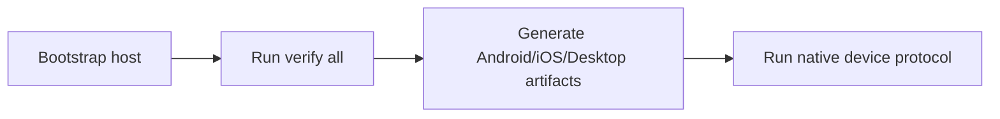
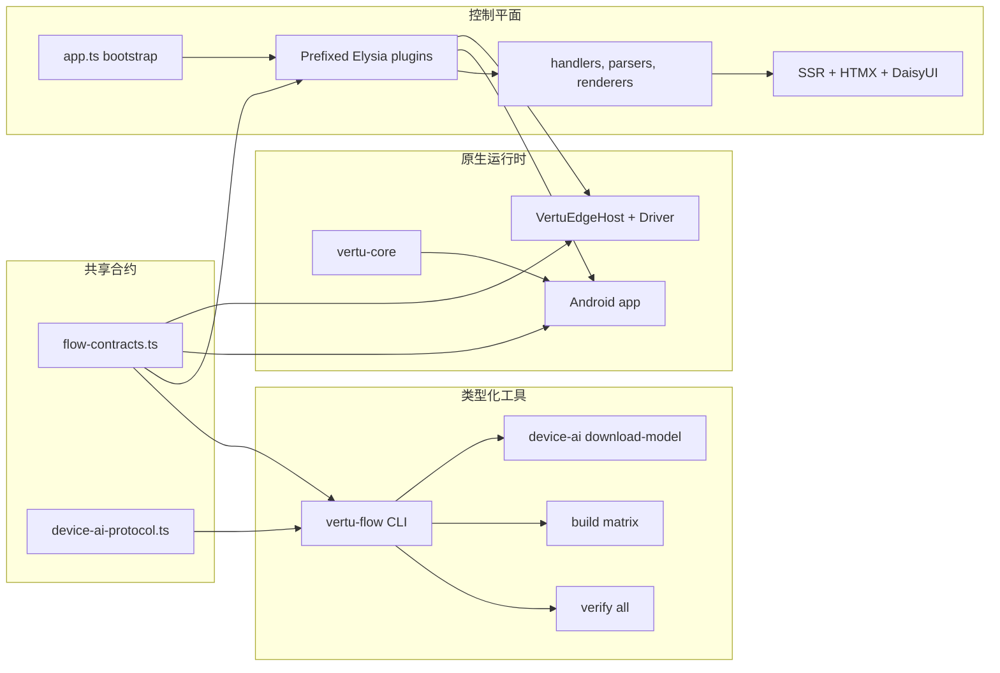

<p align="center">
  
</p>

<p align="center">
  <a href="#english">English</a> ·
  <a href="#%E4%B8%AD%E6%96%87">中文</a>
</p>

---

<p align="center">
  
  
  
  
  
  
</p>

---

<p align="center">
  <strong>Vertu Edge</strong> is a contract-first platform for AI workflow orchestration, 
  local/cloud model lifecycle management, and cross-platform Android/iOS application generation.
</p>

---

## English

### Features

| Area | Description |
|------|-------------|
| **AI Workflows** | Orchestrate flows with typed contracts, HTMX-driven UI, and server-side rendering |
| **Model Lifecycle** | Local and cloud model management via Hugging Face, Ollama, and Ramalama |
| **App Generation** | Build Android and iOS apps from a single typed CLI with device-readiness verification |
| **Automation** | Cross-platform RPA, flow commands, and device-AI protocol with schema-validated reports |

### Repository structure

| Module | Purpose |
|--------|---------|
| `control-plane/` | Bun + Elysia, SSR HTML, HTMX, DaisyUI, job orchestration |
| `contracts/` | Shared contracts for flow execution, runtime envelopes, device-AI protocol |
| `tooling/vertu-flow-kit/` | Typed CLI for verify/build/download/audit flows |
| `Android/` | Android runtime, model management, protocol runner, and UI |
| `iOS/VertuEdge/` | iOS runtime, host app, protocol runner, XCTest-separated automation |
| `vertu-core/` | Shared Kotlin Multiplatform models and parsing utilities |
| `docs/` | Architecture trace, env matrix, flow reference, capability audit, device-AI gap tracking |

### Architecture overview


## Control-plane composition

```mermaid
flowchart TB
  APP["app.ts bootstrap"]
  ERR["error-handler.ts"]
  CONST["runtime-constants.ts"]
  subgraph Plugins["Route owners"]
    HEALTH["health"]
    DASH["dashboard"]
    MODELS["model-management"]
    BUILDS["app-build"]
    READY["device-readiness"]
    FLOWS["flow-routes"]
    AIWF["ai-workflows"]
    AIP["ai-provider-management"]
    PREFS["preferences"]
    UCP["ucp-discovery"]
  end
  subgraph Shared["Shared modules"]
    FLOWH["flow-http-handlers.ts"]
    PROVIDER["provider-validation.ts"]
    PARSE["request-parsers.ts"]
    FLOWR["flow-renderers.ts"]
    AIR["ai-renderers.ts"]
    MODELR["model-build-renderers.ts"]
    HTTP["http-helpers.ts"]
  end

  APP --> ERR
  APP --> CONST
  APP --> Plugins
  HTTP --> Plugins
  PARSE --> MODELS
  PARSE --> BUILDS
  PARSE --> FLOWS
  PARSE --> AIP
  FLOWH --> FLOWS
  FLOWR --> FLOWS
  AIR --> AIWF
  AIR --> AIP
  MODELR --> MODELS
  MODELR --> BUILDS
  PROVIDER --> AIP
```



### Developer workflow



### Quick start

```bash
./scripts/dev_doctor.sh
./scripts/dev_bootstrap.sh
bun run --cwd tooling/vertu-flow-kit src/cli.ts verify all
```

### Canonical commands

### Bootstrap

```bash
./scripts/dev_doctor.sh
./scripts/dev_bootstrap.sh
bun run --cwd tooling/vertu-flow-kit src/cli.ts bootstrap
```

### Verify

```bash
bun run --cwd tooling/vertu-flow-kit src/cli.ts verify all
```

Wrapper:

```bash
./scripts/verify_all.sh
```

### Build Android + iOS + desktop artifacts

```bash
bun run --cwd tooling/vertu-flow-kit src/cli.ts build matrix
```

### Download pinned device-AI model

```bash
bun run --cwd tooling/vertu-flow-kit src/cli.ts device-ai download-model
```

### Run full native device gate

```bash
VERTU_VERIFY_DEVICE_AI_PROTOCOL=1 \
  bun run --cwd tooling/vertu-flow-kit src/cli.ts verify all
```

### Documentation

| Doc | Description |
|-----|-------------|
| [docs/README.md](docs/README.md) | Documentation index |
| [docs/SYSTEM_ARCHITECTURE_TRACE.md](docs/SYSTEM_ARCHITECTURE_TRACE.md) | Architecture trace |
| [docs/FLOW_REFERENCE.md](docs/FLOW_REFERENCE.md) | Flow and route reference |
| [docs/ENV.md](docs/ENV.md) | Environment variables |
| [docs/CAPABILITY_AUDIT.md](docs/CAPABILITY_AUDIT.md) | Capability inventory |
| [docs/DEVICE_AI_GAP_AUDIT.md](docs/DEVICE_AI_GAP_AUDIT.md) | Device-AI runtime gaps |
| [DEVELOPMENT.md](DEVELOPMENT.md) | Developer runbook |
| [control-plane/README.md](control-plane/README.md) | Control-plane service |
| [iOS/VertuEdge/README.md](iOS/VertuEdge/README.md) | iOS runtime |

### Verification

Before handing off work:

Before handing off work, run:

```bash
bun run typecheck
bun run lint
bun run test
bun run audit:code-practices
bun run audit:capability-gaps
```

If build or runtime paths changed:

```bash
bun run --cwd tooling/vertu-flow-kit src/cli.ts verify all
```

---

## 中文

### 功能概览

| 领域 | 说明 |
|------|------|
| **AI 工作流** | 类型化合约编排、HTMX 驱动 UI、服务端渲染 |
| **模型生命周期** | 通过 Hugging Face、Ollama、Ramalama 管理本地与云端模型 |
| **应用构建** | 单一类型化 CLI 构建 Android 与 iOS 应用，含设备就绪验证 |
| **自动化** | 跨平台 RPA、流程命令、Device AI 协议与 schema 校验报告 |

### 仓库结构

| 模块 | 用途 |
|------|------|
| `control-plane/` | Bun + Elysia、SSR、HTMX、DaisyUI、任务编排 |
| `contracts/` | Flow、错误 envelope、Device AI 协议等共享合约 |
| `tooling/vertu-flow-kit/` | 统一的 verify/build/download/audit CLI |
| `Android/` | Android 运行时、模型管理与设备协议执行 |
| `iOS/VertuEdge/` | iOS 运行时、Host App 与 XCTest 分离的自动化 |
| `vertu-core/` | 共享 KMP 模型与解析能力 |
| `docs/` | 架构、环境变量、能力审计、流程参考、设备缺口文档 |

### 规范架构



### 控制平面组成

```mermaid
flowchart TB
  APP["app.ts bootstrap"]
  ERR["error-handler.ts"]
  CONST["runtime-constants.ts"]
  subgraph Plugins["路由所有者"]
    HEALTH["health"]
    DASH["dashboard"]
    MODELS["model-management"]
    BUILDS["app-build"]
    READY["device-readiness"]
    FLOWS["flow-routes"]
    AIWF["ai-workflows"]
    AIP["ai-provider-management"]
    PREFS["preferences"]
    UCP["ucp-discovery"]
  end
  subgraph Shared["共享模块"]
    FLOWH["flow-http-handlers.ts"]
    PROVIDER["provider-validation.ts"]
    PARSE["request-parsers.ts"]
    FLOWR["flow-renderers.ts"]
    AIR["ai-renderers.ts"]
    MODELR["model-build-renderers.ts"]
    HTTP["http-helpers.ts"]
  end

  APP --> ERR
  APP --> CONST
  APP --> Plugins
  HTTP --> Plugins
  PARSE --> MODELS
  PARSE --> BUILDS
  PARSE --> FLOWS
  PARSE --> AIP
  FLOWH --> FLOWS
  FLOWR --> FLOWS
  AIR --> AIWF
  AIR --> AIP
  MODELR --> MODELS
  MODELR --> BUILDS
  PROVIDER --> AIP
```



### 开发者工作流


### 规范命令

```bash
./scripts/dev_doctor.sh
./scripts/dev_bootstrap.sh
bun run --cwd tooling/vertu-flow-kit src/cli.ts bootstrap
bun run --cwd tooling/vertu-flow-kit src/cli.ts verify all
bun run --cwd tooling/vertu-flow-kit src/cli.ts build matrix
bun run --cwd tooling/vertu-flow-kit src/cli.ts device-ai download-model
```

### 文档入口

- 文档索引：[docs/README.md](docs/README.md)
- 架构追踪：[docs/SYSTEM_ARCHITECTURE_TRACE.md](docs/SYSTEM_ARCHITECTURE_TRACE.md)
- 流程与接口参考：[docs/FLOW_REFERENCE.md](docs/FLOW_REFERENCE.md)
- 环境变量：[docs/ENV.md](docs/ENV.md)
- 能力审计：[docs/CAPABILITY_AUDIT.md](docs/CAPABILITY_AUDIT.md)
- Device AI 缺口：[docs/DEVICE_AI_GAP_AUDIT.md](docs/DEVICE_AI_GAP_AUDIT.md)
- 开发指南：[DEVELOPMENT.md](DEVELOPMENT.md)

### 验证预期

提交前请运行：

```bash
bun run typecheck
bun run lint
bun run test
bun run audit:code-practices
bun run audit:capability-gaps
```

若构建或运行时路径有变更，还需运行：

```bash
bun run --cwd tooling/vertu-flow-kit src/cli.ts verify all
```
