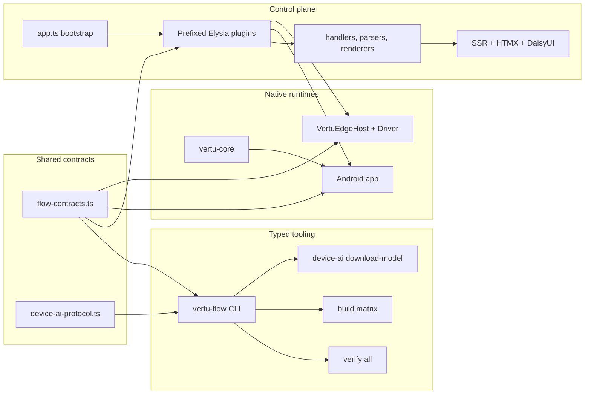
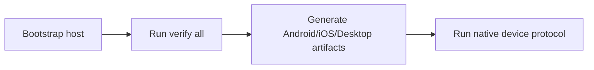
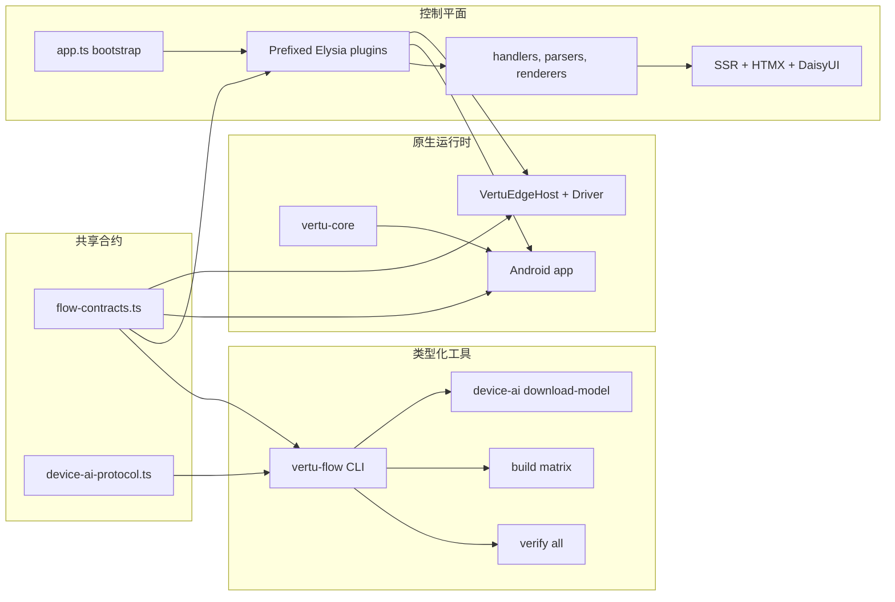

# Vertu Edge

[English](#english) · [中文](#中文)

## English

Vertu Edge is a contract-first platform for:

- AI workflow orchestration
- local/cloud model lifecycle management
- Android and iOS application generation
- cross-platform automation and device-readiness verification

The repository is organized around a small set of canonical owners:

- `control-plane/`: Bun + Elysia control-plane, SSR HTML, HTMX, DaisyUI, job orchestration
- `contracts/`: shared contracts for flow execution, runtime envelopes, and device-AI protocol
- `tooling/vertu-flow-kit/`: typed CLI for verify/build/download/audit flows
- `Android/`: Android runtime, model management, protocol runner, and UI
- `iOS/VertuEdge/`: iOS runtime, host app, protocol runner, and XCTest-separated automation
- `vertu-core/`: shared Kotlin Multiplatform models and parsing utilities
- `docs/`: architecture trace, env matrix, flow reference, capability audit, and device-AI gap tracking

## Canonical architecture



## Control-plane composition

```mermaid
flowchart TB
  APP["app.ts bootstrap"]
  ERR["error-handler.ts"]
  CONST["runtime-constants.ts"]
  subgraph Plugins["Route owners"]
    HEALTH["health"]
    DASH["dashboard"]
    MODELS["model-management"]
    BUILDS["app-build"]
    READY["device-readiness"]
    FLOWS["flow-routes"]
    AIWF["ai-workflows"]
    AIP["ai-provider-management"]
    PREFS["preferences"]
    UCP["ucp-discovery"]
  end
  subgraph Shared["Shared modules"]
    FLOWH["flow-http-handlers.ts"]
    PROVIDER["provider-validation.ts"]
    PARSE["request-parsers.ts"]
    FLOWR["flow-renderers.ts"]
    AIR["ai-renderers.ts"]
    MODELR["model-build-renderers.ts"]
    HTTP["http-helpers.ts"]
  end

  APP --> ERR
  APP --> CONST
  APP --> Plugins
  HTTP --> Plugins
  PARSE --> MODELS
  PARSE --> BUILDS
  PARSE --> FLOWS
  PARSE --> AIP
  FLOWH --> FLOWS
  FLOWR --> FLOWS
  AIR --> AIWF
  AIR --> AIP
  MODELR --> MODELS
  MODELR --> BUILDS
  PROVIDER --> AIP
```



## Developer workflow



## Canonical commands

### Bootstrap

```bash
./scripts/dev_doctor.sh
./scripts/dev_bootstrap.sh
bun run --cwd tooling/vertu-flow-kit src/cli.ts bootstrap
```

### Verify

```bash
bun run --cwd tooling/vertu-flow-kit src/cli.ts verify all
```

Wrapper:

```bash
./scripts/verify_all.sh
```

### Build Android + iOS + desktop artifacts

```bash
bun run --cwd tooling/vertu-flow-kit src/cli.ts build matrix
```

### Download pinned device-AI model

```bash
bun run --cwd tooling/vertu-flow-kit src/cli.ts device-ai download-model
```

### Run full native device gate

```bash
VERTU_VERIFY_DEVICE_AI_PROTOCOL=1 \
  bun run --cwd tooling/vertu-flow-kit src/cli.ts verify all
```

## Source-of-truth docs

- Docs index: [docs/README.md](docs/README.md)
- Architecture: [docs/SYSTEM_ARCHITECTURE_TRACE.md](docs/SYSTEM_ARCHITECTURE_TRACE.md)
- Flow and route reference: [docs/FLOW_REFERENCE.md](docs/FLOW_REFERENCE.md)
- Environment variables: [docs/ENV.md](docs/ENV.md)
- Capability inventory: [docs/CAPABILITY_AUDIT.md](docs/CAPABILITY_AUDIT.md)
- Device-AI runtime gaps: [docs/DEVICE_AI_GAP_AUDIT.md](docs/DEVICE_AI_GAP_AUDIT.md)
- Developer runbook: [DEVELOPMENT.md](DEVELOPMENT.md)
- Control-plane service doc: [control-plane/README.md](control-plane/README.md)
- iOS runtime doc: [iOS/VertuEdge/README.md](iOS/VertuEdge/README.md)

## Verification expectations

Before handing off work, run:

```bash
bun run typecheck
bun run lint
bun run test
bun run audit:code-practices
bun run audit:capability-gaps
```

If build or runtime paths changed, also run:

```bash
bun run --cwd tooling/vertu-flow-kit src/cli.ts verify all
```

## 中文

Vertu Edge 是一个以合约为中心的平台，覆盖：

- AI 工作流编排
- 本地/云模型生命周期管理
- Android 与 iOS 应用构建
- 跨端自动化与设备就绪性验证

仓库的规范入口如下：

- `control-plane/`：Bun + Elysia 控制平面、SSR、HTMX、DaisyUI、任务编排
- `contracts/`：Flow、错误 envelope、Device AI 协议等共享合约
- `tooling/vertu-flow-kit/`：统一的 verify/build/download/audit CLI
- `Android/`：Android 运行时、模型管理与设备协议执行
- `iOS/VertuEdge/`：iOS 运行时、Host App 与 XCTest 分离的自动化实现
- `vertu-core/`：共享 KMP 模型与解析能力
- `docs/`：架构、环境变量、能力审计、流程参考、设备缺口文档

### 规范架构



### 控制平面组成

```mermaid
flowchart TB
  APP["app.ts bootstrap"]
  ERR["error-handler.ts"]
  CONST["runtime-constants.ts"]
  subgraph Plugins["路由所有者"]
    HEALTH["health"]
    DASH["dashboard"]
    MODELS["model-management"]
    BUILDS["app-build"]
    READY["device-readiness"]
    FLOWS["flow-routes"]
    AIWF["ai-workflows"]
    AIP["ai-provider-management"]
    PREFS["preferences"]
    UCP["ucp-discovery"]
  end
  subgraph Shared["共享模块"]
    FLOWH["flow-http-handlers.ts"]
    PROVIDER["provider-validation.ts"]
    PARSE["request-parsers.ts"]
    FLOWR["flow-renderers.ts"]
    AIR["ai-renderers.ts"]
    MODELR["model-build-renderers.ts"]
    HTTP["http-helpers.ts"]
  end

  APP --> ERR
  APP --> CONST
  APP --> Plugins
  HTTP --> Plugins
  PARSE --> MODELS
  PARSE --> BUILDS
  PARSE --> FLOWS
  PARSE --> AIP
  FLOWH --> FLOWS
  FLOWR --> FLOWS
  AIR --> AIWF
  AIR --> AIP
  MODELR --> MODELS
  MODELR --> BUILDS
  PROVIDER --> AIP
```



### 开发者工作流


### 规范命令

```bash
./scripts/dev_doctor.sh
./scripts/dev_bootstrap.sh
bun run --cwd tooling/vertu-flow-kit src/cli.ts bootstrap
bun run --cwd tooling/vertu-flow-kit src/cli.ts verify all
bun run --cwd tooling/vertu-flow-kit src/cli.ts build matrix
bun run --cwd tooling/vertu-flow-kit src/cli.ts device-ai download-model
```

### 文档入口

- 文档索引：[docs/README.md](docs/README.md)
- 架构追踪：[docs/SYSTEM_ARCHITECTURE_TRACE.md](docs/SYSTEM_ARCHITECTURE_TRACE.md)
- 流程与接口参考：[docs/FLOW_REFERENCE.md](docs/FLOW_REFERENCE.md)
- 环境变量：[docs/ENV.md](docs/ENV.md)
- 能力审计：[docs/CAPABILITY_AUDIT.md](docs/CAPABILITY_AUDIT.md)
- Device AI 缺口：[docs/DEVICE_AI_GAP_AUDIT.md](docs/DEVICE_AI_GAP_AUDIT.md)
- 开发指南：[DEVELOPMENT.md](DEVELOPMENT.md)

### 验证预期

提交前请运行：

```bash
bun run typecheck
bun run lint
bun run test
bun run audit:code-practices
bun run audit:capability-gaps
```

若构建或运行时路径有变更，还需运行：

```bash
bun run --cwd tooling/vertu-flow-kit src/cli.ts verify all
```
