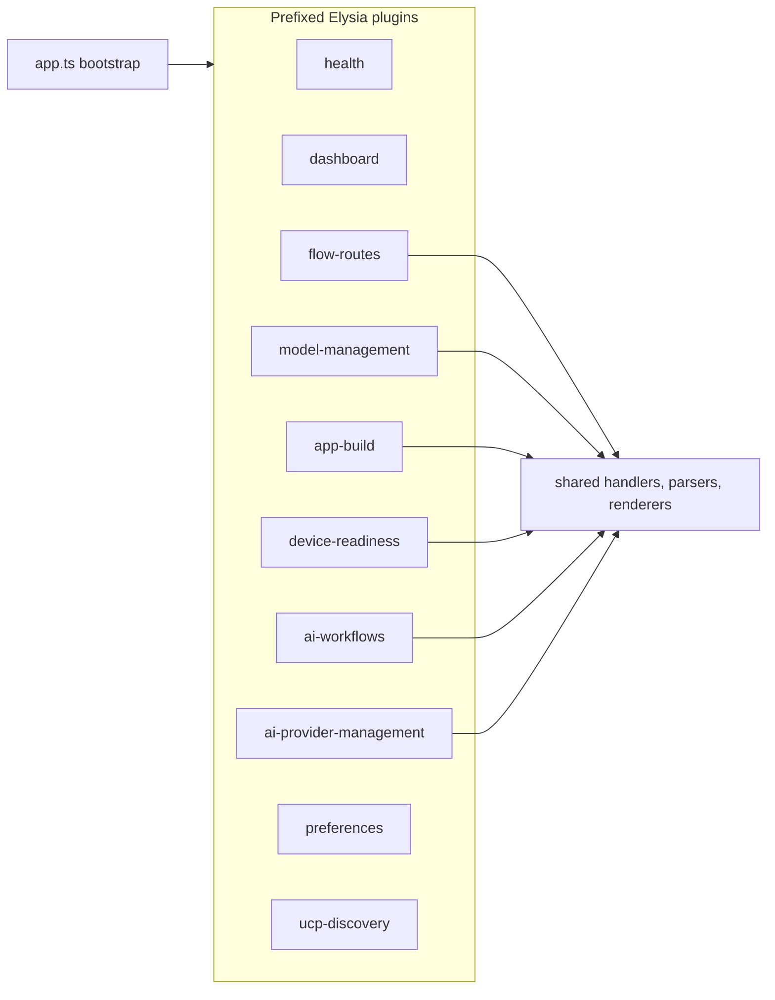

# control-plane

[English](#english) · [中文](#中文)

Concierge AI Control Plane dashboard for Vertu Edge. Uses Elysia, HTMX, DaisyUI, and Tailwind.

## English

## Service composition



## Runtime defaults

| Variable | Default | Description |
|---------|---------|-------------|
| `CONTROL_PLANE_PORT` | `CONTROL_PLANE_DEFAULT_PORT` (`3310` from `control-plane/src/config.ts`) | TCP port for the HTTP server |
| `PORT` | (same as `CONTROL_PLANE_DEFAULT_PORT`) | Alternative to `CONTROL_PLANE_PORT` |

Bun automatically loads `.env` if present.

## Implemented capability baseline

| Capability | Status | Contract | Runtime | Test |
|-----------|--------|----------|---------|------|
| `GET /` renders persisted theme and preference state | implemented | `control-plane/src/app.ts` | `control-plane/src/app.ts` + `control-plane/src/layout.ts` | `flow run` and `ai chat` UI surfaces |
| `/api/flows/run` parse + execute FlowV1 with typed envelopes | implemented | `contracts/flow-contracts.ts` + `contracts/flow-parser.ts` | `control-plane/src/plugins/flow-routes.plugin.ts` + `control-plane/src/flow-engine.ts` | `control-plane/test/http-model-build-routes.test.ts` |
| `/api/flows/trigger` executes same path as run | implemented | `contracts/flow-contracts.ts` + `contracts/flow-parser.ts` | `control-plane/src/plugins/flow-routes.plugin.ts` + `control-plane/src/flow-engine.ts` | `control-plane/test/http-model-build-routes.test.ts` |
| `/api/models/pull` asynchronous Ramalama pull with typed envelope | implemented | `contracts/flow-contracts.ts` | `control-plane/src/plugins/model-management.plugin.ts` + `control-plane/src/model-manager.ts` + `control-plane/src/model-jobs.ts` | `control-plane/test/http-model-build-routes.test.ts` |
| `/api/models/pull/:jobId` returns typed model pull state transitions | implemented | `contracts/flow-contracts.ts` | `control-plane/src/plugins/model-management.plugin.ts` + `control-plane/src/model-manager.ts` + `control-plane/src/model-jobs.ts` | `control-plane/test/http-model-build-routes.test.ts` |
| `/api/models/sources` returns typed source registry envelope | implemented | `contracts/flow-contracts.ts` | `control-plane/src/plugins/model-management.plugin.ts` + `control-plane/src/config.ts` | `control-plane/test/http-model-build-routes.test.ts` |
| `/api/apps/build` asynchronous Android/iOS build orchestration | implemented | `contracts/flow-contracts.ts` | `control-plane/src/plugins/app-build.plugin.ts` + `control-plane/src/app-builds.ts` + `scripts/run_android_build.sh`/`scripts/run_ios_build.sh` | `control-plane/test/http-model-build-routes.test.ts` |
| `/api/apps/build/:jobId` returns typed build state transitions | implemented | `contracts/flow-contracts.ts` | `control-plane/src/plugins/app-build.plugin.ts` + `control-plane/src/app-builds.ts` | `control-plane/test/http-model-build-routes.test.ts` |
| `/api/device-ai/readiness` host/runtime readiness fragment for the build dashboard | implemented | `contracts/flow-contracts.ts` | `control-plane/src/plugins/device-readiness.plugin.ts` + `control-plane/src/device-ai-readiness.ts` + `control-plane/src/device-readiness-renderers.ts` | `control-plane/test/http-model-build-routes.test.ts` |
| iOS generation capability guard on non-mac hosts | unsupported-by-design (explicit runtime guard) | `contracts/flow-contracts.ts` | `control-plane/src/plugins/app-build.plugin.ts` + `control-plane/src/app-builds.ts` | `control-plane/test/http-model-build-routes.test.ts` |
| `/api/prefs` persists theme/model with mismatch reporting | implemented | `contracts/flow-contracts.ts` | `control-plane/src/plugins/preferences.plugin.ts` + `control-plane/src/db.ts` | `control-plane/test/http-model-build-routes.test.ts` |
| `/api/ai/workflows/run` local-first workflow job dispatch | implemented | `contracts/flow-contracts.ts` | `control-plane/src/plugins/ai-workflows.plugin.ts` + `control-plane/src/ai-workflows/orchestrator.ts` | `control-plane/test/http-model-build-routes.test.ts` |
| `/api/ai/workflows/capabilities` workflow capability matrix | implemented | `contracts/flow-contracts.ts` | `control-plane/src/plugins/ai-workflows.plugin.ts` + `control-plane/src/ai-renderers.ts` | `control-plane/test/http-model-build-routes.test.ts` |
| `/api/ai/providers/validate` provider validation summary | implemented | `contracts/flow-contracts.ts` | `control-plane/src/plugins/ai-provider-management.plugin.ts` + `control-plane/src/provider-validation.ts` | `control-plane/test/http-model-build-routes.test.ts` |
| `/api/ai/chat` retired-route envelope | implemented | `contracts/flow-contracts.ts` | `control-plane/src/plugins/ai-provider-management.plugin.ts` | `control-plane/test/http-model-build-routes.test.ts` |

See [`docs/CAPABILITY_AUDIT.md`](/Users/brandondonnelly/Downloads/vertu-edge/docs/CAPABILITY_AUDIT.md) for the full capability inventory and gap classification.

## Single-owner modules

- `src/app.ts` owns bootstrap, locale sync, and plugin composition only.
- `src/flow-http-handlers.ts` owns shared flow route handlers.
- `src/provider-validation.ts` owns provider connectivity/configuration validation.
- `src/request-parsers.ts` owns capability-safe body/query coercion.
- `src/model-build-renderers.ts` owns model/app-build SSR fragments.
- `src/device-ai-readiness.ts` owns host/runtime readiness evaluation plus latest build artifact summary.
- `src/device-readiness-renderers.ts` owns the device-readiness SSR fragment.
- `src/flow-renderers.ts` owns flow SSR fragments.
- `src/ai-renderers.ts` owns workflow/provider SSR fragments.

## Install

```bash
bun install
```

## Run

```bash
bun run dev
```

Or directly: `bun run src/index.ts`

## Optional: ramalama + ollama

The Model Management card uses `ramalama` for model pulls and can target source adapters like Hugging Face and Ollama from `config/model-sources.json` (or `MODEL_SOURCE_REGISTRY_JSON`). If `ramalama` is not installed, the card shows a graceful fallback with install instructions.

**Install ramalama** (pick one):

```bash
pip install ramalama
```

```bash
curl -fsSL https://ramalama.ai/install.sh | bash
```

```bash
brew install ramalama   # macOS
```

Repo bootstrap no longer installs optional CLIs for you. Install `ramalama` explicitly, then run `./scripts/dev_bootstrap.sh` or `bun run --cwd tooling/vertu-flow-kit src/cli.ts bootstrap`.

For local Ollama model pulls, install Ollama from <https://ollama.com/download> and verify with:

```bash
ollama --version
```

---

## 中文

Vertu Edge 的 Concierge AI 控制平面仪表盘，使用 Elysia、HTMX、DaisyUI 和 Tailwind。

### 运行

```bash
bun install
bun run dev
```

### 文档

完整能力清单与缺口分类见 [docs/CAPABILITY_AUDIT.md](../docs/CAPABILITY_AUDIT.md)。
