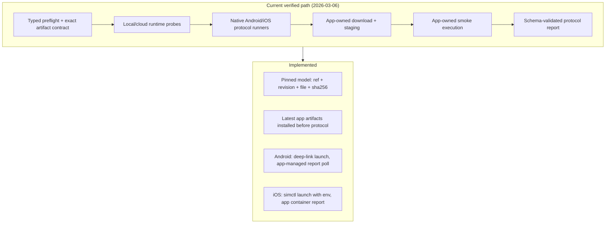

# Device AI Gap Audit

Last updated: 2026-03-07

## Source Inputs

- Context7 `/huggingface/huggingface_hub`: `hf download --local-dir`, `--cache-dir`, `HF_TOKEN`, `HF_HOME`, `HF_HUB_CACHE`.
- Context7 `/bazelbuild/rules_apple`: Apple-platform builds can be orchestrated cross-platform, but iOS app packaging still depends on Apple toolchains and Xcode execution on macOS.

## Confirmed Working

- Android debug app build completes and emits a verified APK artifact through the typed flow-kit owner [`orchestration.ts`](/Users/brandondonnelly/Downloads/vertu-edge/tooling/vertu-flow-kit/src/orchestration.ts), exposed by [`scripts/run_android_build.sh`](/Users/brandondonnelly/Downloads/vertu-edge/scripts/run_android_build.sh) as a wrapper.
- iOS package tests complete through [`iOS/VertuEdge/Package.swift`](/Users/brandondonnelly/Downloads/vertu-edge/iOS/VertuEdge/Package.swift).
- Host-aware build orchestration exists through [`scripts/run_app_build_matrix.sh`](/Users/brandondonnelly/Downloads/vertu-edge/scripts/run_app_build_matrix.sh#L1) and the typed verification/build commands in [`tooling/vertu-flow-kit/src/cli.ts`](/Users/brandondonnelly/Downloads/vertu-edge/tooling/vertu-flow-kit/src/cli.ts).
- The native device protocol is now owned by [`device-ai-protocol.ts`](/Users/brandondonnelly/Downloads/vertu-edge/tooling/vertu-flow-kit/src/device-ai-protocol.ts) and exposed through `vertu-flow device-ai run-protocol`; [`scripts/run_device_ai_protocol.sh`](/Users/brandondonnelly/Downloads/vertu-edge/scripts/run_device_ai_protocol.sh) is a wrapper only.
- Native Hugging Face download managers exist on Android and iOS:
  - [`HuggingFaceModelManager.kt`](/Users/brandondonnelly/Downloads/vertu-edge/Android/src/app/src/main/java/com/google/ai/edge/gallery/data/HuggingFaceModelManager.kt)
  - [`HuggingFaceModelManager.swift`](/Users/brandondonnelly/Downloads/vertu-edge/iOS/VertuEdge/Sources/VertuEdgeDriver/HuggingFaceModelManager.swift)

## Current vs target protocol ownership

## Resolved (2026-03-06)

The following gaps were closed by the local-first device AI protocol refactor:

| Gap | Resolution |
|-----|------------|
| **Pinned model identity** | `device-ai-profile.json` now requires `revision`, `requiredModelFile`, and `requiredModelSha256`. `vertu-flow device-ai download-model` uses exact artifact contract. |
| **Control-plane profile fallback removed** | `control-plane/src/config/device-ai-profile.ts` now fails closed when the canonical profile file is missing or invalid instead of silently restoring an embedded fallback contract. |
| **Android app-managed staging** | Protocol launches Android app via deep link (`device_ai_protocol/run`); app performs native download, staging, and smoke. Report polled from app-managed storage. |
| **iOS app-managed staging** | Protocol installs latest iOS artifact, launches app with `SIMCTL_CHILD_*` env vars; app performs native download, staging, and smoke. Report polled from app container. |
| **Native downloaders** | Both Android and iOS use in-app `HuggingFaceModelManager` for download; protocol no longer relies on host-side `hf download` for runtime proof. |
| **Capability proof** | Android and iOS native reports now emit resolved `model.capabilities` evidence alongside `artifact.path`, `artifact.sha256`, and `artifact.sizeBytes`; the typed host builder consumes native capability proof before any fallback logic. |

## Remaining gaps

### 1. macOS builder provisioning remains an external prerequisite

Severity: low

Evidence:
- [`tooling/vertu-flow-kit/src/ios-build-preflight.ts`](/Users/brandondonnelly/Downloads/vertu-edge/tooling/vertu-flow-kit/src/ios-build-preflight.ts) is now the canonical typed owner for Xcode destination probing.
- [`tooling/vertu-flow-kit/src/orchestration.ts`](/Users/brandondonnelly/Downloads/vertu-edge/tooling/vertu-flow-kit/src/orchestration.ts) now owns iOS destination validation, build execution, packaging, and artifact metadata emission through `vertu-flow build ios`, with [`scripts/run_ios_build.sh`](/Users/brandondonnelly/Downloads/vertu-edge/scripts/run_ios_build.sh) reduced to a wrapper only.
- [`scripts/run_app_build_matrix.sh`](/Users/brandondonnelly/Downloads/vertu-edge/scripts/run_app_build_matrix.sh#L67) still delegates iOS builds when the host is not macOS-capable or when delegation is explicitly requested.

Impact:
- The repo no longer mutates host Xcode assets during builds.
- A macOS builder still must be provisioned ahead of time with the required Xcode simulator/device content.
- Linux and Windows can participate in the build protocol, but cannot be the final native iOS builder.
- When provisioning is missing, the latest canonical build report and the control-plane readiness/build surfaces now expose a typed failure code instead of requiring raw log inspection.

Why this matters:
- Context7 Apple build documentation confirms Apple-platform build rules still depend on Apple toolchains even when a cross-platform orchestrator is used.

Required fix:
- Provision the macOS builder image with required Xcode simulator/runtime assets ahead of protocol execution.
- Keep the repo-side behavior fail-closed so missing Apple assets surface as explicit preflight failures instead of ad hoc installer work.

## Minimum Closure Set

To claim true end-to-end model download and runtime readiness on both platforms, the repo still needs all of the following:

1. Exact required artifact contract: `modelRef + revision + file + sha256`.
2. Pre-provisioned macOS builder/runtime environment for native iOS builds.
