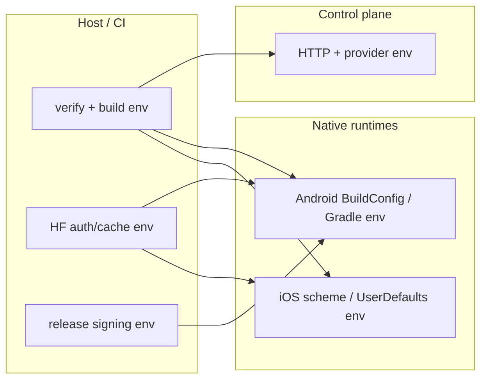

# Environment Variables

Last updated: 2026-03-06

## Control-plane
- `CONTROL_PLANE_PORT` or `PORT`: HTTP server port. Default comes from `CONTROL_PLANE_DEFAULT_PORT` in `control-plane/src/config.ts`; env parsing is centrally owned by `control-plane/src/config/env.ts`.
- `MODEL_SOURCE_REGISTRY_JSON`: Optional JSON override for `control-plane/config/model-sources.json`. Must remain an object with `defaultSource?` plus a non-empty `sources` array; legacy top-level array payloads are rejected.
- `MODEL_PULL_SOURCES`: Optional comma-separated/JSON list used by pull forms.
- `DEFAULT_MODEL_SOURCE`: Optional default source id used when pull payload omits source.
- `MODEL_PULL_PRESETS`: Optional pull preset list (comma-separated or JSON array).
- `MODEL_PULL_MODEL_REF_PLACEHOLDER`: Optional global model-ref placeholder override.
- `MODEL_PULL_TIMEOUT_MAX_MS`: Max allowed pull timeout.
- `AI_PROVIDER_REGISTRY_JSON`: Optional JSON override for `control-plane/config/providers.json`. Must remain a non-empty provider array with unique `id` values.
- `DEFAULT_CHAT_MODEL`: Optional explicit default chat model override. If unset, startup resolves the default from the canonical provider registry + model-source default and fails closed when no provider declares a default model.
- `VERTU_ENCRYPTION_KEY`: Required to persist cloud-provider API keys. Must decode to exactly 32 bytes (64-char hex or base64).
- `AI_PROVIDER_REQUEST_TIMEOUT_MS`: Provider model-list/chat timeout.
- `AI_CHAT_MAX_TOKENS`: Max tokens for chat completion requests.
- `UCP_DISCOVERY_TIMEOUT_MS`: Timeout for UCP discovery calls.

Checked-in config files under `control-plane/config/` are canonical required inputs. The control-plane no longer carries embedded fallback registries or preset payloads when those files are malformed or missing.

## Verify / build orchestration
- `VERTU_VERIFY_DEVICE_AI_PROTOCOL`: Set to `1` to run the full native Android+iOS device protocol during `vertu-flow verify all`.
- `VERTU_IOS_BUILD_MODE`: Host policy for iOS builds. Use `delegate` to rely on the remote/macOS CI builder.
- `VERTU_REQUIRED_MODEL_REF`: Override the required Hugging Face model ref for the device-AI protocol.
- `VERTU_REQUIRED_MODEL_REVISION`: Override the required Hugging Face revision for the device-AI protocol.
- `VERTU_REQUIRED_MODEL_FILE`: Override the exact required Hugging Face artifact file name.
- `VERTU_REQUIRED_MODEL_SHA256`: Override the expected SHA-256 for the required Hugging Face artifact.
- `VERTU_DEVICE_AI_PROTOCOL_TIMEOUT_MS`: Overall timeout for device-AI protocol execution.
- `VERTU_DEVICE_AI_REPORT_MAX_AGE_MINUTES`: Freshness bound for `device-readiness` audit reports.

## Hugging Face / model acquisition
- `HF_TOKEN` or `HUGGINGFACE_HUB_TOKEN`: Hugging Face auth token for CLI and native download flows.
- `HF_HOME`: Hugging Face local state root.
- `HF_HUB_CACHE`: Hugging Face artifact cache root.
- `VERTU_HF_CLIENT_ID`: Hugging Face OAuth client ID used by Android runtime flows.

## Android (Gradle / BuildConfig)
Set via `Android/src/vertu.local.properties` or shell env:
- `VERTU_CONTROL_PLANE_BASE_URL`
- `VERTU_CONTROL_PLANE_CONNECT_TIMEOUT_MS`
- `VERTU_CONTROL_PLANE_READ_TIMEOUT_MS`
- `VERTU_CONTROL_PLANE_POLL_INTERVAL_MS`
- `VERTU_CONTROL_PLANE_POLL_ATTEMPTS`
- `VERTU_CONTROL_PLANE_DEFAULT_PULL_TIMEOUT_MS`
- `VERTU_CONTROL_PLANE_DEFAULT_MODEL_SOURCE` (optional; if unset/blank, the source registry default is used)
- `VERTU_CONTROL_PLANE_MODEL_STATE_ID_PREFIX`
- `VERTU_REQUIRED_MODEL_REF`
- `VERTU_REQUIRED_MODEL_REVISION`
- `VERTU_REQUIRED_MODEL_FILE`
- `VERTU_REQUIRED_MODEL_SHA256`
- `VERTU_DEVICE_AI_MODEL_DIRECTORY`
- `VERTU_DEVICE_AI_PROTOCOL_TIMEOUT_MS`
- `VERTU_DEVICE_AI_REPORT_MAX_AGE_MINUTES`
- `VERTU_DEVICE_AI_DOWNLOAD_MAX_ATTEMPTS`
- `VERTU_DEVICE_AI_HF_TOKEN`
- `VERTU_TINY_GARDEN_ASSET_BASE_URL`
- `VERTU_TINY_GARDEN_ASSET_PATH`
- `VERTU_HF_CLIENT_ID`

## Android release signing
- `VERTU_RELEASE_KEYSTORE_FILE`
- `VERTU_RELEASE_KEYSTORE_PASSWORD`
- `VERTU_RELEASE_KEY_ALIAS`
- `VERTU_RELEASE_KEY_PASSWORD`

## iOS (runtime)
Set via Xcode scheme env vars or `UserDefaults`:
- `VERTU_CONTROL_PLANE_BASE_URL`
- `VERTU_CONTROL_PLANE_POLL_INTERVAL_MS`
- `VERTU_CONTROL_PLANE_POLL_ATTEMPTS`
- `VERTU_CONTROL_PLANE_DEFAULT_PULL_TIMEOUT_MS`
- `VERTU_CONTROL_PLANE_DEFAULT_MODEL_SOURCE` (optional override of control-plane registry default)
- `VERTU_CONTROL_PLANE_REQUEST_TIMEOUT_SECONDS`
- `VERTU_CONTROL_PLANE_MODEL_STATE_ID_PREFIX`
- `VERTU_REQUIRED_MODEL_REF`
- `VERTU_REQUIRED_MODEL_REVISION`
- `VERTU_REQUIRED_MODEL_FILE`
- `VERTU_REQUIRED_MODEL_SHA256`
- `VERTU_DEVICE_AI_MODEL_DIRECTORY`
- `VERTU_DEVICE_AI_REPORT_DIRECTORY`
- `VERTU_DEVICE_AI_PROTOCOL_TIMEOUT_MS`
- `VERTU_DEVICE_AI_REPORT_MAX_AGE_MINUTES`
- `VERTU_DEVICE_AI_DOWNLOAD_MAX_ATTEMPTS`
- `VERTU_DEVICE_AI_HF_TOKEN`
