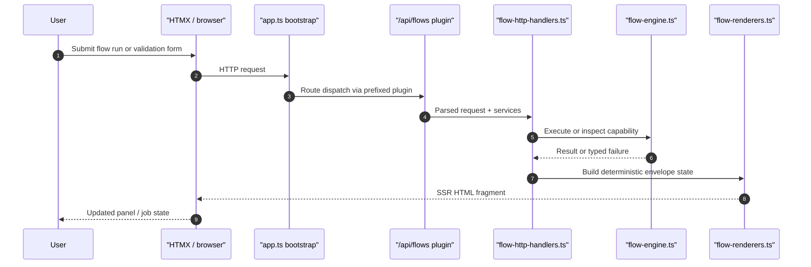
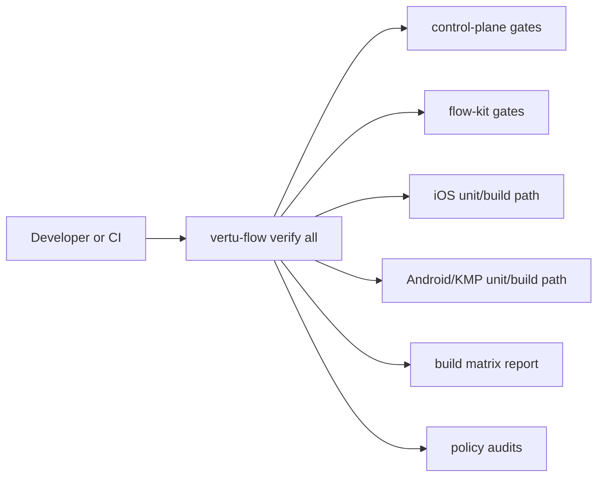

# Flow Reference

Last updated: 2026-03-07

## Supported commands
- `launchApp`
- `tapOn`
- `inputText`
- `assertVisible`
- `assertNotVisible`
- `assertText`
- `selectOption`
- `scroll`
- `swipe`
- `screenshot`
- `clipboardRead`
- `clipboardWrite`
- `windowFocus`
- `hideKeyboard`
- `waitForAnimation`

## Per-platform command support

Not all commands are available on every target platform. The matrix below shows which
commands are implemented in the control-plane adapters and the native RPA drivers.

| Command | Android | iOS | Desktop (macOS/Linux/Windows) |
| --- | --- | --- | --- |
| `launchApp` | yes | yes | yes |
| `tapOn` | yes (x/y coordinates) | yes (x/y coordinates) | no |
| `inputText` | yes | yes | no |
| `assertVisible` | yes | no | no |
| `assertNotVisible` | yes | no | no |
| `assertText` | yes | no | no |
| `selectOption` | yes | no | no |
| `scroll` | yes | no | no |
| `swipe` | yes | no | no |
| `screenshot` | yes | yes | yes |
| `clipboardRead` | no | no | yes |
| `clipboardWrite` | no | no | yes |
| `windowFocus` | no | no | yes |
| `hideKeyboard` | yes | no | no |
| `waitForAnimation` | yes | yes | yes |

### Notes

- **Android adapter** uses `adb` for all commands. `tapOn` requires x/y coordinates;
  the native Android RPA driver (`vertu-android-rpa`) supports text/resourceId/contentDescription selectors.
- **iOS adapter** in the control-plane supports 5 commands via `xcrun simctl`.
  The app-linked `VertuEdgeDriver` module now exposes build-safe report types and a default
  adapter only. The broader `IosXcTestDriver` implementation lives in the separate
  `VertuEdgeDriverXCTest` module so XCUITest stays outside the generated iOS app bundle.
- **Desktop adapter** supports clipboard and window management commands via platform-native
  tools (`pbcopy`/`pbpaste` on macOS, `xclip`/`wmctrl` on Linux, PowerShell on Windows).

## API routes
- `/api/health`
- `/api/flows/validate`
- `/api/flows/validate/automation`
- `/api/flows/capabilities`
- `/api/flows/run`
- `/api/flows/trigger`
- `/api/flows/runs`
- `/api/flows/runs/:runId`
- `/api/flows/runs/:runId/cancel`
- `/api/flows/runs/:runId/pause`
- `/api/flows/runs/:runId/resume`
- `/api/flows/runs/:runId/replay-step`
- `/api/flows/runs/:runId/logs`
- `/api/models/pull`
- `/api/models/pull/:jobId`
- `/api/models/sources`
- `/api/apps/build`
- `/api/apps/build/:jobId`
- `/api/device-ai/readiness`
- `/api/ai/workflows/form-fields`
- `/api/ai/workflows/run`
- `/api/ai/workflows/jobs/:jobId`
- `/api/ai/workflows/jobs/:jobId/logs`
- `/api/ai/workflows/capabilities`
- `/api/ai/providers/validate`

## Request flow

## Control-plane route composition

- Route groups with stable ownership should be defined as prefixed Elysia plugins and composed into the app with `.use()`.
- `/api/models` is owned by `control-plane/src/plugins/model-management.plugin.ts`.
- `/api/apps/build` is owned by `control-plane/src/plugins/app-build.plugin.ts`.
- `/api/device-ai/readiness` is owned by `control-plane/src/plugins/device-readiness.plugin.ts`.
- `/api/flows` is owned by `control-plane/src/plugins/flow-routes.plugin.ts`.
- `/api/ai/workflows` is owned by `control-plane/src/plugins/ai-workflows.plugin.ts`.
- `/api/ai` provider/config routes are owned by `control-plane/src/plugins/ai-provider-management.plugin.ts`.
- `/api/prefs` is owned by `control-plane/src/plugins/preferences.plugin.ts`.
- `/api/ucp` is owned by `control-plane/src/plugins/ucp-discovery.plugin.ts`.
- `control-plane/src/app.ts` is now primarily the bootstrap owner for shared config, locale bootstrap state, and plugin composition.
- `control-plane/src/middleware/error-handler.ts` is the single owner for root Elysia error registration and deterministic envelope mapping.
- `control-plane/src/http-helpers.ts` is the shared owner for request normalization, content negotiation, and log-query parsing helpers used by the plugins and the bootstrap.
- `control-plane/src/contracts/http.ts` is the shared owner for route-level flow and AI body/query schemas used by both the app bootstrap and pluginized route modules.
- `control-plane/src/flow-automation.ts` is the shared owner for preflight flow-automation YAML parsing and compatibility analysis.
- `control-plane/src/flow-http-handlers.ts` is the shared owner for flow run execution, YAML validation, automation validation, and capability-matrix route handlers consumed by the `/api/flows` plugin.
- `control-plane/src/flow-renderers.ts` is the shared owner for flow SSR fragments: run state, async job lifecycle, validation, and capability matrix views.
- `control-plane/src/ai-renderers.ts` is the shared owner for AI workflow, provider validation, and provider model-selection SSR fragments.
- `control-plane/src/request-parsers.ts` is the shared owner for capability-safe request/body coercion used by flow, model, app-build, and provider validation routes.
- `control-plane/src/model-build-renderers.ts` is the shared owner for model-pull, model-search, and app-build SSR fragments.
- `control-plane/src/device-readiness-renderers.ts` is the shared owner for the device-AI readiness HTMX fragment rendered in the build section.
- `control-plane/src/device-ai-readiness.ts` is the shared owner for host/runtime readiness evaluation + latest build-artifact summary used by `/api/device-ai/readiness`.
- `control-plane/src/job-log-stream.ts` is the shared owner for live job-log table rendering and SSE tailing.
- `control-plane/src/capability-errors.ts` is the shared owner for capability-error normalization across model/build/flow/workflow route surfaces.
- `control-plane/src/provider-validation.ts` is the shared owner for provider connectivity/configuration validation used by `/api/ai/providers/validate`.

## Verification flow

## AI workflow composer

- The floating AI workflow composer is SSR-first and HTMX-driven.
- Mode-specific workflow fields are server-rendered from `/api/ai/workflows/form-fields` instead of being toggled by client-only DOM logic.
- Capability status is hydrated from `/api/ai/workflows/capabilities` whenever mode, provider, or model changes.
- Pending workflow jobs self-poll with HTMX until they reach a terminal state; operators still retain an explicit refresh control.
- Composer copy and ARIA labels are sourced from `control-plane/src/locales/*.json`; do not add hardcoded strings to the modal shell.

## Dashboard shell

- The main dashboard is SSR-first and organized as a staged operator flow:
  - `#section-overview`
  - `#section-runtime`
  - `#section-build`
  - `#section-automation`
  - `#section-system`
- `control-plane/src/pages.ts` owns the page-level information architecture and section layout, while individual cards remain responsible only for their local form/status content.
- The build section now pairs application generation with a separate native device-readiness card, so operators can see build output and host/device gating in one place before attempting automation.
- The shell uses HTMX-compatible progressive enhancement and DaisyUI `card`, `stats`, `steps`, and alert patterns so navigation, loading states, and section hierarchy stay coherent without client-side layout state.

## Build host policy

- Android, Bun tooling, and the control-plane build on macOS and Linux hosts with the repo build scripts.
- Windows developers should use WSL2 for the Bun/Android script path; native iOS builds are not available on Windows.
- iOS app builds require a macOS host with Xcode and simulator/device runtimes installed.
- `vertu-flow build ios` is the canonical iOS app-build owner. It resolves a working Xcode toolchain, validates shared schemes and destinations through the typed preflight, builds the host app when an Xcode project/workspace exists, falls back to SwiftPM only when no host app project exists, packages the artifact as ZIP, and emits typed artifact metadata. `./scripts/run_ios_build.sh` is now a thin wrapper over the same Bun command.
- `vertu-flow ios-build preflight` is the canonical typed Xcode destination probe. The shell build path calls that command and fails closed instead of mutating the host with `xcodebuild -downloadPlatform iOS`.
- `vertu-flow verify all` is the canonical host-aware verification entrypoint. `./scripts/verify_all.sh` is now a thin wrapper over that typed Bun command.
- The verification flow runs control-plane type/lint/test, flow-kit type/lint/test/doctor, control-plane boot smoke, Android/iOS unit tests for the active host policy, the canonical app build matrix, and then the policy audits/device protocol gates.
- `vertu-flow doctor` is the canonical typed host-readiness owner. It now reports Bun/Swift/Brew/Python availability, Java 21 resolution, Android SDK/`sdkmanager`/`adb` readiness, device-AI protocol readiness rows (`device_ai_protocol`, `hf_token`, `ios_macos_host`, `ios_xcrun`, `ios_simctl`), required contract files, and fails when the control-plane database contains plaintext provider credentials, encrypted credentials without a valid `VERTU_ENCRYPTION_KEY`, or encrypted rows that cannot be decrypted with the configured key. `./scripts/dev_doctor.sh` is a thin wrapper over that Bun command.
- The control-plane device-readiness card uses the same shared readiness owners as `vertu-flow doctor` and `vertu-flow verify all`: `shared/device-ai-readiness.ts` for policy and `shared/host-tooling.ts` for `adb` / `xcrun simctl` discovery. SSR readiness can no longer disagree with the verifier when `adb` is only reachable through `ANDROID_SDK_ROOT` / `ANDROID_HOME` or when `DEVELOPER_DIR` overrides the active Xcode toolchain.
- The verification policy runs shared checks everywhere, runs iOS package/app builds on macOS, and leaves the full Android+iOS device AI protocol gate to macOS CI or an explicit local run with `VERTU_VERIFY_DEVICE_AI_PROTOCOL=1`.
- When the full device gate is explicitly requested, `vertu-flow verify all` now performs a fast typed preflight for required protocol prerequisites (`HF_TOKEN`/`HUGGINGFACE_HUB_TOKEN`, `adb`, `xcrun`, and `xcrun simctl` on macOS) before spending time on the full verification pipeline. The `adb` check resolves from `PATH` and known Android SDK roots (`ANDROID_SDK_ROOT` / `ANDROID_HOME` / Homebrew SDK defaults).
- `vertu-flow bootstrap` is the canonical repo bootstrap entrypoint. `./scripts/dev_bootstrap.sh` is now a thin wrapper over that typed Bun command.
- `vertu-flow verify smoke-control-plane` is the canonical control-plane boot smoke test for targeted smoke runs outside the full verification path.
- `vertu-flow build matrix` is the canonical platform-agnostic app-build entrypoint and now emits Android, iOS, and desktop results from one typed report. `./scripts/run_app_build_matrix.sh` is a thin wrapper over the same Bun command.
- The app-build matrix report now carries typed `failureCode` / `failureMessage` fields for structured platform failures. The control-plane readiness surface and app-build polling envelope reuse those fields instead of forcing operators to inspect raw logs for iOS preflight failures.
- The matrix report schema, `latest.json` path resolution, and latest-report parser now live in `shared/app-build-matrix-report.ts`. Flow-kit writes the canonical report, the device-AI protocol installs from the same typed reader, and the control-plane SSR readiness card consumes the exact same parser instead of shadowing the report shape locally.
- The control-plane `/api/apps/build` route now uses the same typed app-build failure taxonomy for pre-queue validation failures and queued job failures. Operators see localized SSR failure labels for invalid `outputDir`, unsupported host/tooling, missing schemes, and other deterministic build-start failures without opening logs.
- `vertu-flow build android` is the canonical Android app-build owner. It resolves/provisions Java 21 and Android SDK packages through the shared typed host-tooling owner in `shared/host-tooling.ts`, writes `Android/src/local.properties`, and performs one automatic clean-cache retry for known Kotlin/KAPT incremental cache corruption signatures. `./scripts/run_android_build.sh` is now a thin wrapper over the same typed Bun command.
- The control-plane `/api/apps/build` pre-queue validation path uses that same shared host-tooling owner for Java, Bun, and Xcode/scheme readiness so request-time validation cannot drift from `vertu-flow doctor`, `vertu-flow build *`, or `vertu-flow verify all`.
- `vertu-flow build ios` is the canonical iOS app-build owner. `./scripts/run_ios_build.sh` is now a thin wrapper over the same typed Bun command.
- `vertu-flow build desktop` is the canonical desktop app-build owner. `./scripts/run_desktop_build.sh` is now a thin wrapper over the same typed Bun command.
- `control-plane/src/runtime-constants.ts` owns the repo-relative flow-kit workdir/CLI paths used by background app-build jobs so the control-plane runner and repository audits share the same entrypoint contract.
- `tooling/vertu-flow-kit/src/orchestration.ts` is now the owner for artifact SHA-256 + metadata emission for Android, iOS, and desktop builds.
- Set `VERTU_IOS_BUILD_MODE=delegate` when a macOS developer intentionally wants to skip the native Apple build and rely on the remote/macOS CI builder instead.

## Device AI model acquisition

- `vertu-flow device-ai download-model` is the canonical pinned Hugging Face model download entrypoint.
- The command resolves the exact model identity from `control-plane/config/device-ai-profile.json`, downloads the pinned revision/file, verifies the SHA-256 digest, and writes a deterministic report to `.artifacts/model-downloads`.
- `./scripts/download_device_ai_model.sh` is now a thin wrapper over the same typed Bun command.

## Native device protocol

- `vertu-flow device-ai run-protocol` is the canonical Android+iOS native smoke runner.
- `./scripts/run_device_ai_protocol.sh` is a thin wrapper over the same typed Bun command.
- The protocol now consumes the latest canonical app-build report from `.artifacts/app-builds/latest.json`.
- Before launching native Android/iOS protocol runners, it installs the latest Android APK onto the connected device and installs the latest iOS app artifact onto the booted simulator when those artifacts are available.
- This removes the earlier assumption that the target apps were already preinstalled before the device protocol started.
