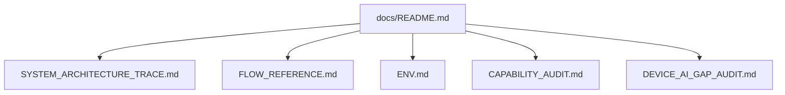
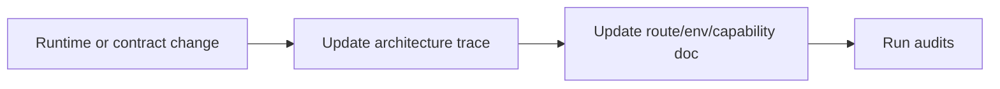

# Documentation Index

[English](#english) · [中文](#中文)

Last updated: 2026-03-06

## English

This directory is the canonical documentation hub for Vertu Edge.

Use this file as the entrypoint when you need to understand or update:

- architecture ownership
- route and workflow behavior
- environment variables
- capability coverage
- unresolved device/runtime gaps



### Reading order

1. [`SYSTEM_ARCHITECTURE_TRACE.md`](SYSTEM_ARCHITECTURE_TRACE.md)
   - current runtime topology
   - single-owner boundaries
   - verification matrix
2. [`FLOW_REFERENCE.md`](FLOW_REFERENCE.md)
   - flow commands
   - route contracts
   - control-plane route composition
   - verification flow
3. [`ENV.md`](ENV.md)
   - control-plane env
   - build/verify env
   - Android/iOS runtime env
4. [`CAPABILITY_AUDIT.md`](CAPABILITY_AUDIT.md)
   - implemented capability inventory
   - evidence and tests
   - fixed gap register
5. [`DEVICE_AI_GAP_AUDIT.md`](DEVICE_AI_GAP_AUDIT.md)
   - remaining device/runtime gaps
   - current vs target device-AI protocol ownership

### Ownership rules

- Do not duplicate architecture narratives across docs.
- Keep the root [`README.md`](../README.md) short and point here.
- Keep [`DEVELOPMENT.md`](../DEVELOPMENT.md) focused on runbook steps, not architecture restatement.
- When a module owner changes, update:
  - [`SYSTEM_ARCHITECTURE_TRACE.md`](SYSTEM_ARCHITECTURE_TRACE.md)
  - and any route/env/capability doc directly affected

### Update checklist



- Architecture/module ownership: update [`SYSTEM_ARCHITECTURE_TRACE.md`](SYSTEM_ARCHITECTURE_TRACE.md)
- API/flow behavior: update [`FLOW_REFERENCE.md`](FLOW_REFERENCE.md)
- Env/config keys: update [`ENV.md`](ENV.md)
- Capability evidence or closure: update [`CAPABILITY_AUDIT.md`](CAPABILITY_AUDIT.md)
- Remaining device/runtime gap state: update [`DEVICE_AI_GAP_AUDIT.md`](DEVICE_AI_GAP_AUDIT.md)

### Validation

After doc changes, run:

```bash
bun run audit:capability-gaps
bun run audit:code-practices
```

---

## 中文

本目录为 Vertu Edge 的规范文档中心。

### 阅读顺序

1. [`SYSTEM_ARCHITECTURE_TRACE.md`](SYSTEM_ARCHITECTURE_TRACE.md) — 运行时拓扑、单一所有者边界、验证矩阵
2. [`FLOW_REFERENCE.md`](FLOW_REFERENCE.md) — 流程命令、路由合约、控制平面路由组成、验证流程
3. [`ENV.md`](ENV.md) — 控制平面、构建/验证、Android/iOS 运行时环境变量
4. [`CAPABILITY_AUDIT.md`](CAPABILITY_AUDIT.md) — 能力清单、证据与测试、已修复缺口登记
5. [`DEVICE_AI_GAP_AUDIT.md`](DEVICE_AI_GAP_AUDIT.md) — 剩余设备/运行时缺口、当前与目标 Device AI 协议所有权

### 文档入口

- 文档索引：本文件
- 架构追踪：[SYSTEM_ARCHITECTURE_TRACE.md](SYSTEM_ARCHITECTURE_TRACE.md)
- 流程与接口参考：[FLOW_REFERENCE.md](FLOW_REFERENCE.md)
- 环境变量：[ENV.md](ENV.md)
- 能力审计：[CAPABILITY_AUDIT.md](CAPABILITY_AUDIT.md)
- Device AI 缺口：[DEVICE_AI_GAP_AUDIT.md](DEVICE_AI_GAP_AUDIT.md)
- 开发指南：[../DEVELOPMENT.md](../DEVELOPMENT.md)

### 验证

文档变更后运行：

```bash
bun run audit:capability-gaps
bun run audit:code-practices
```
