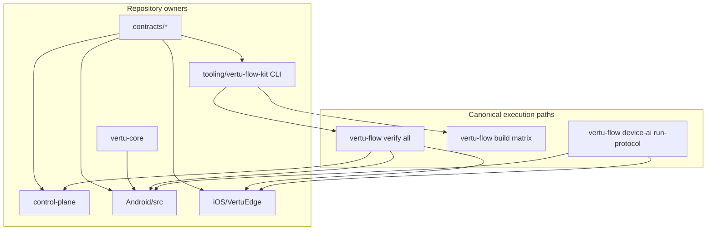
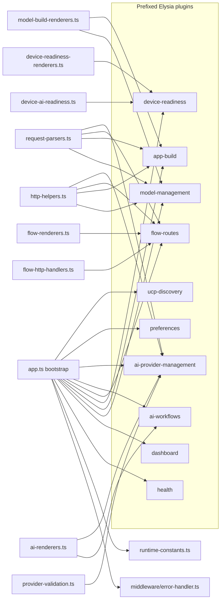

# System Architecture Trace

Last updated: 2026-03-07

## Documentation Verification Inputs

- Context7 `/elysiajs/documentation`: lifecycle hooks, prefixed plugin composition via `new Elysia({ prefix })` + `.use()`, schema validation, centralized `onError` handling.
- Context7 `/saadeghi/daisyui`: component + theme usage patterns, semantic classes with Tailwind utility composition, accessibility-first component usage.
- Context7 `/oven-sh/bun`: script orchestration (`bun run`) and process lifecycle handling (`Bun.spawn`) for deterministic tool execution.
- Context7 `/huggingface/huggingface_hub`: `hf download --local-dir`, `HF_HOME` / `HF_HUB_CACHE`, token env precedence, and deterministic cache/local-dir behavior for device staging flows.
- Current unresolved platform/runtime gaps are tracked in `docs/DEVICE_AI_GAP_AUDIT.md`.
- DaisyUI Blueprint MCP: used `daisyUI-Snippets` for FAB, modal, chat, select, textarea, button, alert, and card composition guidance while tightening the floating workflow composer.
- Context7 `/bigskysoftware/htmx`: progressive enhancement, request coordination (`hx-sync`), and loading-state patterns for server-driven dashboard updates.
- DaisyUI Blueprint MCP: used `daisyUI-Snippets` for stats, steps, alert, button, card, badge, and navbar layout guidance while restructuring the dashboard shell.

## Runtime Topology

- Root orchestration: `tooling/vertu-flow-kit/src/cli.ts` owns typed repo-wide bootstrap/verify/build/download entrypoints; `scripts/dev_bootstrap.sh`, `scripts/verify_all.sh`, `scripts/run_app_build_matrix.sh`, and `scripts/download_device_ai_model.sh` are wrappers only.
- Pinned device-model acquisition: `vertu-flow device-ai download-model` resolves the required Hugging Face artifact from `control-plane/config/device-ai-profile.json`, downloads by exact revision/file, verifies the pinned SHA-256, and emits a deterministic report. `scripts/download_device_ai_model.sh` is a wrapper only.
- Cross-platform app build orchestration: `vertu-flow build matrix` emits a single host-aware Android/iOS/desktop report and delegates iOS to macOS builders when the local host is not Apple-capable. `scripts/run_app_build_matrix.sh` is a wrapper only.
- Native device-AI protocol orchestration: `tooling/vertu-flow-kit/src/device-ai-protocol.ts` performs runtime probes, installs the latest canonical Android/iOS app artifacts onto the target device/simulator when available, then launches the native runners; `scripts/run_device_ai_protocol.sh` is a wrapper only, and Android and iOS own model staging, smoke execution, and report persistence inside the apps.
- Verification policy is host-aware: shared/Bun/Android checks run cross-platform, native iOS builds run on macOS hosts, and the mandatory Android+iOS device-AI gate is enforced by the macOS CI protocol job.
- Web control plane: Elysia + SSR HTML + HTMX + DaisyUI assets in `control-plane/`.
- Shared contracts: `contracts/` used by control-plane, tooling, Android, and iOS.
- Tooling CLI: `tooling/vertu-flow-kit` for schema/flow validation.
- Native clients:
  - iOS package in `iOS/VertuEdge`
  - Android app + modules in `Android/src`
  - Kotlin multiplatform core in `vertu-core`

## Single-Owner Boundaries

| Concern | Primary owner | Notes |
| --- | --- | --- |
| HTTP request lifecycle and route composition | `control-plane/src/app.ts` + `control-plane/src/plugins/*.plugin.ts` | `app.ts` owns shared bootstrap and plugin composition; prefixed Elysia plugins own modular route groups |
| Control-plane authentication boundary | `control-plane/src/middleware/auth.ts` | One guard owner for bearer/API-key/cookie/query-token auth plus deterministic HTML/HTMX/JSON unauthorized responses |
| Dashboard information architecture + section layout | `control-plane/src/pages.ts` | SSR-first overview shell, staged operator sections, and page-level layout ownership |
| Root error registration + deterministic error envelopes | `control-plane/src/middleware/error-handler.ts` | Root `onError` registration and framework-wide `NOT_FOUND`/runtime envelope mapping |
| HTTP request normalization + content negotiation helpers | `control-plane/src/http-helpers.ts` | Shared request/query coercion, log-query parsing, route inference, and JSON/HTML negotiation helpers |
| Capability error normalization | `control-plane/src/capability-errors.ts` | Shared mismatch extraction + failure normalization for route/plugin surfaces |
| Flow automation compatibility analysis | `control-plane/src/flow-automation.ts` | Native YAML parsing, command-shape validation, and target compatibility analysis for flow preflight routes |
| Flow HTTP route execution/validation handlers | `control-plane/src/flow-http-handlers.ts` | Shared route-level flow run, YAML validation, automation validation, and capability-matrix handlers consumed by the `/api/flows` plugin |
| Flow SSR envelope rendering | `control-plane/src/flow-renderers.ts` | Shared HTMX/DaisyUI rendering for flow run, validation, capability matrix, and async job lifecycle fragments |
| AI/provider SSR envelope rendering | `control-plane/src/ai-renderers.ts` | Shared workflow, provider validation, and model-selection fragment rendering for the floating composer and provider management surfaces |
| Provider validation orchestration | `control-plane/src/provider-validation.ts` | Shared provider connectivity/configuration validation used by `/api/ai/providers/validate` |
| Request/body parser normalization | `control-plane/src/request-parsers.ts` | Shared coercion and capability-safe parsing for flow, model-pull, app-build, provider-validation, and preference-adjacent request values |
| Model/build SSR envelope rendering | `control-plane/src/model-build-renderers.ts` | Shared model-pull, model-search, and app-build HTMX fragment rendering with inline job-log integration |
| Device readiness evaluation | `control-plane/src/device-ai-readiness.ts` | Shared host/runtime readiness evaluation plus latest build-artifact summary for the build dashboard surface |
| Device readiness SSR rendering | `control-plane/src/device-readiness-renderers.ts` | Shared HTMX fragment rendering for `/api/device-ai/readiness` |
| Job-log HTML/SSE rendering | `control-plane/src/job-log-stream.ts` | Shared DaisyUI log table rendering plus terminal-state-aware SSE streaming helpers |
| Model management HTTP routes | `control-plane/src/plugins/model-management.plugin.ts` | Prefixed Elysia plugin for `/api/models` with injected parse/render dependencies |
| App build HTTP routes | `control-plane/src/plugins/app-build.plugin.ts` | Prefixed Elysia plugin for `/api/apps/build` with shared SSE log streaming and deterministic envelopes |
| Device readiness HTTP routes | `control-plane/src/plugins/device-readiness.plugin.ts` | Prefixed Elysia plugin for `/api/device-ai/readiness` with one host/runtime readiness owner |
| Flow HTTP routes | `control-plane/src/plugins/flow-routes.plugin.ts` | Prefixed Elysia plugin for `/api/flows` with injected execution/validation helpers and shared SSE log streaming |
| AI workflow HTTP routes | `control-plane/src/plugins/ai-workflows.plugin.ts` | Prefixed Elysia plugin for `/api/ai/workflows` with HTMX field hydration, workflow job execution/polling, and capability rendering |
| AI provider/config HTTP routes | `control-plane/src/plugins/ai-provider-management.plugin.ts` | Prefixed Elysia plugin for `/api/ai` provider validation, key management, model option hydration, and retired chat route handling |
| Preference HTTP routes | `control-plane/src/plugins/preferences.plugin.ts` | Prefixed Elysia plugin for `/api/prefs` with injected preference persistence and deterministic SSR envelope rendering |
| UCP discovery HTTP routes | `control-plane/src/plugins/ucp-discovery.plugin.ts` | Prefixed Elysia plugin for `/api/ucp` with shared JSON/HTML negotiation helpers and manifest rendering |
| UCP discovery manifest fetch/validation | `control-plane/src/ucp-discovery.ts` | Canonical typed `.well-known/ucp` fetch, schema validation, and deterministic error classification consumed by the UCP plugin |
| Runtime constants and config decode | `control-plane/src/config.ts` + `control-plane/src/config/env.ts` | `config.ts` owns exported runtime defaults/registries; `config/env.ts` is the single owner for environment readers and JSON/JSONC parsing helpers |
| Provider transport + AI adapters | `control-plane/src/ai-providers.ts` | OpenAI-compatible chat/STT/TTS and provider model discovery |
| Async job persistence | `control-plane/src/db/index.ts` | Job tables, events, preferences, API keys |
| Provider credential storage | `control-plane/src/ai-keys.ts` + `control-plane/src/services/encryption.ts` | Encrypted provider key persistence, secure-storage state, and dashboard/provider status projection |
| Provider credential integrity audit | `control-plane/src/provider-credential-integrity.ts` | Canonical database audit for plaintext/unreadable provider credentials consumed by `vertu-flow doctor` and repository policy audits |
| Flow execution and capability matrix | `control-plane/src/flow-engine.ts` | Target adapters and policy-driven command execution |
| Contract schemas/types | `contracts/flow-contracts.ts` + `contracts/ucp-contracts.ts` | Canonical cross-platform wire contract |
| Android cloud model manager state | `Android/src/app/.../ModelManagerViewModel.kt` | Provider/source state selection |
| Android Tiny Garden asset bundle contract | `Android/src/app/.../customtasks/tinygarden/TinyGardenAssetBundle.kt` + `Android/src/app/src/main/assets/tinygarden/asset-manifest.json` | One owner for Tiny Garden WebView entrypoints, stable asset filenames, and runtime-config-backed asset URLs |
| Android device AI protocol capability binding | `Android/src/app/.../data/DeviceAiProtocolRunner.kt` + `Android/src/app/.../ModelAllowlist.kt` + `Android/src/app/.../Model.kt` | Native Android owns deep-link launch parsing, app-managed staging, smoke checks, and persisted protocol reports |
| iOS flow runner cloud selection | `iOS/VertuEdge/Sources/VertuEdgeDriver/ControlPlaneClient.swift` + `iOS/VertuEdge/Sources/VertuEdgeUI/FlowRunnerView.swift` | Canonical model-source normalization in the driver layer with SwiftUI consuming the shared selection policy |
| iOS app-linked driver surface | `iOS/VertuEdge/Sources/VertuEdgeDriver/*.swift` | Build-safe report types, default runtime adapter, and device-AI protocol execution that can ship inside the host app bundle |
| iOS external XCTest automation surface | `iOS/VertuEdge/Sources/VertuEdgeDriverXCTest/IosXcTestDriver.swift` | External XCUITest-backed automation implementation kept out of the generated app bundle |
| iOS device AI readiness UI + execution | `iOS/VertuEdge/Sources/VertuEdgeDriver/DeviceAiProtocolRunner.swift` + `iOS/VertuEdge/VertuEdgeHostApp/VertuEdgeHostApp.swift` + `iOS/VertuEdge/Sources/VertuEdgeUI/FlowRunnerView.swift` | Native iOS owns request validation, Application Support staging, smoke execution, and persisted protocol reports |
| Device AI host protocol orchestrator | `tooling/vertu-flow-kit/src/device-ai-protocol.ts` | Typed host preflight, native launch/report polling, and canonical report synthesis that prefers Android/iOS native capability proof and falls back only for legacy or malformed platform reports |
| Pinned device-AI model source of truth | `control-plane/config/device-ai-profile.json` + `control-plane/src/config/device-ai-profile.ts` | Canonical model ref, revision, artifact file, SHA-256, and capability contract for download/build/test flows; control-plane startup fails closed if the canonical profile is missing or invalid |
| Artifact hashing and metadata emission | `tooling/vertu-flow-kit/src/orchestration.ts` | Typed SHA-256 computation and artifact metadata for Android, iOS, and desktop build outputs |
| Background build CLI entrypoint constants | `control-plane/src/runtime-constants.ts` | Canonical route constants and repo-relative flow-kit CLI paths used by control-plane background build jobs |

## Control-plane Composition

## Reliability and Performance Fixes Applied

- Removed module init fragility by repairing mixed type/value imports in config.
- Bound log-stream query validation to one shared route schema (`commandLogQuerySchema`) across flow/build log endpoints.
- Removed duplicated SSE loop logic by centralizing log streaming in a shared generator.
- Hardened chat TTS output parsing with deterministic format validation + MIME alias normalization.
- Removed silent dependency-install suppression in vendored asset pipeline.
- Removed the remaining Bash-owned Java/Android setup helpers by moving Java 21 resolution, Android SDK provisioning, `adb` lookup, `local.properties` preparation, and shared Xcode scheme discovery into `shared/host-tooling.ts`; flow-kit Android build/test/doctor/device-protocol paths and control-plane pre-queue app-build validation now consume that same typed owner directly and Android SDK license acceptance remains fail-fast.
- Removed residual build-script failure masking in iOS/Xcode discovery and control-plane smoke-process teardown paths.
- Removed route-layer model-search type casts by parsing to exported `HfSort` contract values.
- Removed remaining flow-kit `unknown`-typed manifest parsing/index signatures and tightened the repository code-practice gate accordingly.
- Removed `unknown`-typed API-key row decoding in control-plane credential storage by switching to typed Bun SQLite query rows.
- Removed flow-run result `try/catch` JSON parsing and `unknown` payload guards by using shared config JSON parsing (`safeParseJson`) with typed JSON record guards.
- Removed `unknown`-typed jobs/events/preference DB row decoding in control-plane persistence by switching to typed Bun SQLite query rows with deterministic normalization.
- Removed residual `unknown` object-guard typing in provider adapters and tightened code-practice unknown-type allowlist coverage.
- Removed `unknown`-typed app-build failure normalization and tightened code-practice unknown-type allowlist coverage for `app-builds`.
- Removed `unknown`-typed UCP discovery payload guards by reusing shared typed JSON parsing (`safeParseJson`) and config JSON types, then tightened unknown-type allowlist coverage for `ucp-discovery`.
- Localized chat transcript/TTS ARIA labels in control-plane rendering to close i18n + WCAG language drift.
- Refactored the floating workflow composer to HTMX-driven server hydration (`/api/ai/workflows/form-fields` + `/api/ai/workflows/capabilities`), removed client-side mode toggling drift, added localized workflow hints, and enabled automatic HTMX job polling for pending workflow runs.
- Refactored the dashboard shell into staged SSR sections (`overview -> runtime -> build -> automation -> system`) backed by DaisyUI `card`, `stats`, `steps`, and alert patterns, keeping the operator flow anchored and navigable without client-side state management.
- Added a dedicated device-readiness route/card so the build stage now exposes host/device gating and latest artifact availability from the same deterministic policy used by the verifier.
- Removed native device-protocol installation drift by making the typed flow-kit runner consume `.artifacts/app-builds/latest.json` and install the latest Android/iOS artifacts before launching native smoke runners.
- Removed app-build report schema drift by moving the matrix report contract, latest-report path resolution, and typed `latest.json` parser into `shared/app-build-matrix-report.ts`, then rewiring flow-kit, the device-AI protocol runner, and the control-plane SSR readiness card to use that single owner.
- Removed shell-owned device protocol drift by moving runtime probes, native launch orchestration, report polling, and final report synthesis into `tooling/vertu-flow-kit/src/device-ai-protocol.ts`; `scripts/run_device_ai_protocol.sh` is now a thin wrapper only.
- Removed Tiny Garden bundle drift by replacing hashed checked-in entry filenames with stable `main.js` / `styles.css`, adding a source-owned `asset-manifest.json`, and resolving Android WebView entry URLs from runtime config instead of hardcoded source constants.
- Added canonical `/api/health` route and corrected `NOT_FOUND` handling to deterministic 404 envelopes (instead of generic 500 failures).
- Hardened online dependency freshness checks with npm lookup retries and per-package cache to reduce transient registry/network variance.
- Updated vendored DaisyUI assets and pin annotations to latest stable (`5.5.19`) and validated with online freshness mode.
- Fixed iOS and Android compile blockers uncovered by full-stack verification.
- Removed host-side model staging drift in the device-AI shell protocol by switching Android/iOS execution to app-owned native runners and report polling.
- Removed misleading iOS app-build fallback behavior: when an Xcode host project exists, `vertu-flow build ios` now requires a working Xcode/iOS toolchain instead of silently packaging a SwiftPM archive as if it were a testable app.
- Removed the `/api/flows` route monolith from `control-plane/src/app.ts` by moving execution, validation, polling, and replay endpoints into a prefixed Elysia plugin backed by the shared `flowRequestBodySchema` contract in `control-plane/src/contracts/http.ts`.
- Removed the `/api/ai` route monolith from `control-plane/src/app.ts` by splitting workflow execution/capability routes from provider/configuration routes, then backing both with shared AI route schemas in `control-plane/src/contracts/http.ts`.
- Removed the remaining inline `/api/prefs` and `/api/ucp` groups from `control-plane/src/app.ts` by moving them into dedicated plugins and backing them with shared request contracts in `control-plane/src/contracts/http.ts`.
- Removed request/query/content-negotiation helper drift by moving shared normalization and route-inference logic from `control-plane/src/app.ts` into `control-plane/src/http-helpers.ts`, then importing it directly from the route plugins.
- Removed duplicate global error-handling drift by moving the root `error()` + `onError()` implementation into `control-plane/src/middleware/error-handler.ts` and binding it once at the top-level app.
- Removed shared flow-analysis and job-log helper drift from `control-plane/src/app.ts` by extracting them into dedicated modules (`flow-automation.ts`, `job-log-stream.ts`, `capability-errors.ts`) and wiring the plugins/bootstrap through those single owners.
- Removed remaining flow/workflow/provider render-state drift from `control-plane/src/app.ts` by extracting SSR HTMX fragments into `flow-renderers.ts` and `ai-renderers.ts`, keeping `app.ts` focused on bootstrap, route orchestration, and shared runtime helpers.
- Removed remaining request-parser and model/build renderer drift from `control-plane/src/app.ts` by extracting capability-safe parsing into `request-parsers.ts` and model/build HTMX fragments into `model-build-renderers.ts`, leaving `app.ts` as orchestration and runtime bootstrap only.
- Removed remaining flow route-handler and provider-validation drift from `control-plane/src/app.ts` by extracting shared flow route execution/validation handlers into `flow-http-handlers.ts` and provider connectivity orchestration into `provider-validation.ts`, reducing `app.ts` to a thin 275-line bootstrap.
- Removed verification/build-path drift by routing `vertu-flow verify all` through the canonical control-plane smoke test and the canonical `vertu-flow build matrix` command instead of invoking per-platform build scripts independently.
- Removed invalid iOS production linkage to XCTest by splitting shared driver report types from the XCUITest implementation and moving the latter into `VertuEdgeDriverXCTest`, keeping generated app bundles buildable.
- Removed ad hoc Xcode platform installer drift by adding the typed `vertu-flow ios-build preflight` owner and routing `vertu-flow build ios` through that command; missing simulator/device platform assets now fail deterministically instead of invoking `xcodebuild -downloadPlatform iOS` during the build.
- Removed build-failure visibility drift by standardizing `APP_BUILD_FAILURE_CODE` / `APP_BUILD_FAILURE_MESSAGE` metadata across the typed iOS preflight, the canonical app-build matrix report, the control-plane app-build envelope, and the device-readiness SSR card.
- Closed the remaining pre-queue app-build drift by moving deterministic control-plane validation/build-start failures onto the same typed `AppBuildFailureCode` contract used by the build matrix and queued job envelopes. The app-build SSR renderer now localizes `error.code` when a build fails before any job is queued.
- Removed the remaining iOS flow-runner migration shims by deleting backward-compatibility typealiases from `FlowRunnerView.swift` and moving model-source resolution into the shared driver owner (`ControlPlaneClient.swift`) with dedicated Swift test coverage.
- Removed the remaining UCP discovery compatibility API by promoting `control-plane/src/ucp-discovery.ts` to the only public typed result contract and deleting the null-return legacy helper.
- Removed log-stream pagination compatibility fallbacks by standardizing `/api/*/logs` on the `cursor` query parameter plus the composite `<createdAt>|<id>` token format end to end.
- Removed control-plane auth drift by moving route protection to a single Elysia `guard(...)` boundary that reads bearer, API-key, cookie, and SSE query tokens at request time and emits deterministic SSR/HTMX/JSON unauthorized responses.
- Removed static asset registration drift by awaiting `@elysiajs/static` at module bootstrap so the canonical app factory registers `/public/*` assets deterministically for both runtime listeners and in-process `app.handle(...)` verification.
- Removed Ollama capability inference drift by switching `/api/show` to the documented `model` request contract and trusting provider-declared `capabilities` instead of synthesizing chat support from heuristic metadata or failed probes.
- Removed unused and wrapper barrel exports from the control-plane/tooling core so contracts and schema tables now have one direct import surface instead of alternate re-export paths.
- Removed embedded control-plane registry/preset fallbacks by sourcing providers, model sources, and model-pull presets from Bun-native JSON imports of the checked-in `control-plane/config/*.json` files, rejecting malformed env overrides at startup, and deleting the unused config wrapper modules.
- Removed shell-owned Android/desktop build drift by moving build execution, artifact staging, and Kotlin cache recovery into `tooling/vertu-flow-kit/src/orchestration.ts`; `scripts/run_android_build.sh` and `scripts/run_desktop_build.sh` are now wrappers over the typed build commands, and control-plane background build jobs invoke the same flow-kit owner instead of per-platform shell scripts.
- Removed shell-owned iOS build drift by moving Xcode toolchain resolution, shared-scheme selection, destination preflight, host-app/SwiftPM build execution, ZIP packaging, and artifact metadata emission into `tooling/vertu-flow-kit/src/orchestration.ts`; `scripts/run_ios_build.sh` is now a wrapper over the typed build command.

## Verification Matrix

- `bun run typecheck`: pass
- `bun run lint`: pass
- `bun run test`: pass
- `bun run --cwd tooling/vertu-flow-kit src/cli.ts audit version-freshness --online`: pass
- Repo bootstrap (`vertu-flow bootstrap`, wrapper: `./scripts/dev_bootstrap.sh`): pass
- Full stack verification (`vertu-flow verify all`, wrapper: `./scripts/verify_all.sh`): pass on macOS with native iOS build enabled; pass on Linux/Windows for the host-supported subset with the device-AI gate delegated to macOS CI
