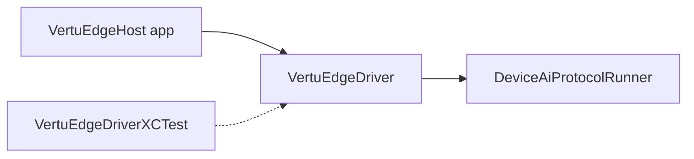

# VertuEdge iOS

[English](#english) · [中文](#中文)

Chat-first Vertu operator host built with SwiftUI and XCTest-backed runtime validation.

## English

## Host requirements

- iOS builds require macOS with Xcode installed.
- Linux and Windows hosts cannot produce native iOS app binaries; use the shared repo verification path there and rely on the macOS CI/device protocol gate for Apple-platform validation.

## Build tests

```bash
cd iOS/VertuEdge
swift test
```

## Xcode workspace

Generate the host app project, then open the workspace to run on simulator/device and attach XCUITest flows.

```bash
ruby ../../scripts/generate_ios_host_project.rb
open VertuEdge.xcworkspace
```



The generated `VertuEdgeHost` app target is the runnable shell used by `scripts/run_ios_build.sh`.
The production app bundle links `VertuEdgeDriver` only. The XCUITest-backed automation
implementation lives in `Sources/VertuEdgeDriverXCTest/IosXcTestDriver.swift` so XCTest
does not leak into generated iOS application artifacts.

---

## 中文

基于 SwiftUI 与 XCTest 运行时验证的 Vertu 操作员主机。

### 构建与测试

```bash
cd iOS/VertuEdge
swift test
ruby ../../scripts/generate_ios_host_project.rb
open VertuEdge.xcworkspace
```

- iOS 构建需 macOS 与 Xcode
- 生成的 `VertuEdgeHost` 为可运行外壳
- 生产包仅链接 `VertuEdgeDriver`，XCUITest 自动化位于 `VertuEdgeDriverXCTest`
